第一部分：开班说明

# 信息系统项目管理师-精讲班-整合管理 1

| 信息系统项目管理师（第四版：734 页）适合做参考资料 |                                                                         |                                                                          |                                                                                                                                                                                                                             |
| -------------------------------------------------- | ----------------------------------------------------------------------- | ------------------------------------------------------------------------ | --------------------------------------------------------------------------------------------------------------------------------------------------------------------------------------------------------------------------- |
| 教材章节                                           | 第 1 章 ` `第 2 章 ` `第 3 章 ` `第 4 章 ` `第 5 章 | 信息化发展 信息技术发展信息系统治理信息系统管理信息系统工程              | 第 8 章 项目整合管理第 9 章 项目范围管理第 10 章 项目进度管理第 11 章 项目成本管理第 12 章 项目质量管理第 13 章 项目资源管理第 14 章 项目沟通管理第 15 章 项目风险管理第 16 章 项目采购管理 ` `第 17 章 项目干系人管理 |
|                                                    | 第 6 章 ` `第 7 章                                                 | 项目管理概论 ` `项目立项管理                                        | 第 18 章 项目绩效域 ` `第 19 章 配置与变更管理                                                                                                                                                                         |
|                                                    | 共 24 章                                                                | 第 20 章 高级项目管理第 22 章 组织通用治理 ` `第 23 章 组织通用管理 |                                                                                                                                                                                                                             |
|                                                    |                                                                         | 第 21 章 项目管理科学基础 ` `第 24 章 法律法规与标准规范            |                                                                                                                                                                                                                             |

模块化教学：

| 模块   | 内容     | 章节               | 章节数   | 学习顺序       |
| ------ | -------- | ------------------ | -------- | -------------- |
| 模块一 | 技术部分 | 第 1-5 章          | 共 5 章  | 模块二三四五一 |
| 模块二 | 十大管理 | 第 8-17 章         | 共 10 章 |                |
| 模块三 | 管理基础 | 第 6、7、18、19 章 | 共 4 章  |                |
| 模块四 | 高级管理 | 第 20、22、23 章   | 共 3 章  |                |
| 模块五 | 科学管理 | 第 21、24 章       | 共 2 章  |                |

课程学习建议：

精讲录播课程→带学测评试卷→直播带学课程学习注意事项：

1. 提前打印课程讲义，拿着讲义听课；
2. 边听课，边在讲义上做笔记，标画重难点；
3. 做题巩固：快题库+习题集；
4. 滚动复习；
5. 根据个人习惯，选择 0.75 倍速、1 倍速、1.5 倍速听课。十大管理知识体系

   十大管理知识领域，基于美国项目管理协会 PMI 2021 年第七版项目管理 49 个管理过程。

   - PMBOK：Project Management Body Of Knowledge

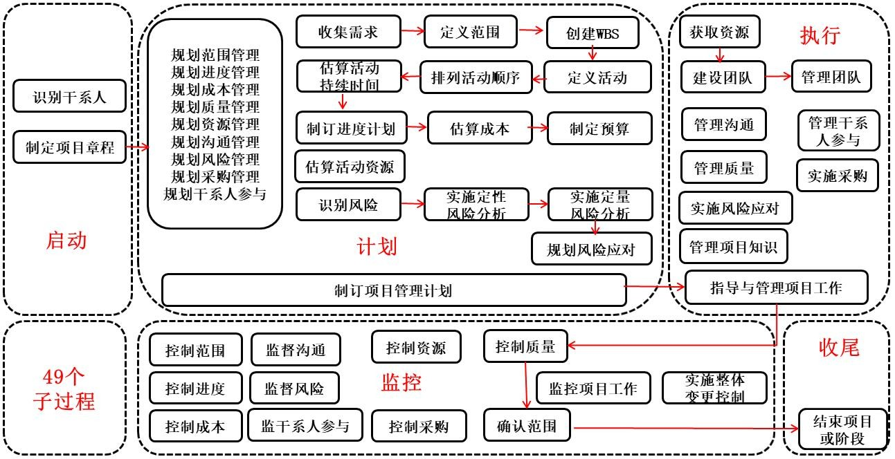

49 个过程：

按过程发生的时间顺序：五大过程组

- 启动过程组
- 计划过程组
- 执行过程组
- 监控过程组
- 收尾过程组

  按同类知识领域合并：十大管理知识领域
- 整合管理
- 范围管理
- 进度管理
- 成本管理
- 质量管理
- 资源管理
- 沟通管理
- 采购管理
- 风险管理
- 干系人管理

  每个管理过程学什么？
- 每个过程的含义
- 输入、输出、工具与技术

  \---输入：参考什么

  \---工具与技术：用什么技术

  \---输出：得到什么成果

  十大管理 49 个过程基础理念总结：

1. 以人为本
2. 根据环境剪裁
3. 相关文件可以是概括或详细的，可以是正式的或非正式的
4. 滚动式规划
5. 渐进明细
6. 每个过程所有人参与
7. 每个过程在整个项目期间定期开展

   本过程仅开展一次或仅在项目的预定义时开展：

   - 制定项目章程
   - 规划范围管理
   - 规划进度管理
   - 规划资源管理
   - 规划采购管理
   - 收集需求
   - 创建 WBS
   - 结束项目或阶段第二部分：考点精讲

     第 8 章 项目整合管理

项目整合管理包括识别、定义、组合、统一和协调项目管理过程组的各个过程和项目管理活动。在项目管理中，整合管理兼具统一、合并、沟通和建立联系的性质，项目整合管理贯穿项目始终。

项目整合管理目标： 1.资源分配；

1. 平衡竞争性需求；
2. 研究各种备选方法；
3. 裁剪过程以实现项目目标；
4. 管理各个项目管理知识领域之间的依赖关系。管理基础

   一、执行整合

项目整合管理由项目经理负责，项目整合管理的责任不能被授权或转移，项目经理必须对整个项目承担最终责任。

- 组织层面：项目经理与项目发起人携手合作，了解战略目标并确保项目目标和成果与项目组合、项目集以及业务领域保持一致。
  - 项目层面：项目经理负责指导团队关注真正重要的事务并协同工作。为此，项目经理需要整合过程、知识和人员。

1. 过程层面执行整合

项目管理过程中有些过程可能只发生一次（例如项目章程的初始创建），但很多过程在整个项目期间会相互重叠并重复发生多次，比如需求变更。在整个项目期间实施整体变更控制过程是为了整合变更请求。

2. 认知层面执行整合

管理项目有多种方法，方法的选择通常取决于项目的具体特点，包括规模、项目或组织的复杂性，以及组织文化。项目经理应尽量熟练掌握所有项目管理知识领域。

3. 背景层面执行整合

随着新技术的不断涌现，组织和项目所处的环境发生了很大变化。项目经理需要意识到项目背景和这些新因素，决定如何在项目中最好地利用这些新环境因素，以获得项目成功。

二、整合的复杂性

项目的复杂性来源于组织的系统行为、人类行为以及组织或环境中的不确定性。

复杂性含义：

1. 包含多个部分；
2. 不同部分之间存在一系列关联；
3. 不同部分之间的动态交互作用；
4. 这些交互作用所产生的行为远远大于各部分简单的相加。三、管理新实践

- 使用信息化工具
- 使用可视化管理工具
- 项目知识管理
- 项目经理在项目以外的职责
- 混合型方法

四、项目管理计划和项目文件项目管理计划：

| 十个管理计划   | 其他管理计划 | 三个基准 | 其他             |
| -------------- | ------------ | -------- | ---------------- |
| 范围管理计划   | 变更管理计划 | 范围基准 | 绩效测量基准     |
| 需求管理计划   | 配置管理计划 | 进度基准 | 项目生命周期描述 |
| 进度管理计划   |              | 成本基准 | 开发方法         |
| 成本管理计划   |              |          |                  |
| 质量管理计划   |              |          |                  |
| 资源管理计划   |              |          |                  |
| 沟通管理计划   |              |          |                  |
| 风险管理计划   |              |          |                  |
| 采购管理计划   |              |          |                  |
| 干系人参与计划 |              |          |                  |

项目文件：

| 干系人登记册风险登记册 ` `经验教训登记册 | 需求文件 ` `需求跟踪矩阵 项目范围说明书         | 活动属性 活动清单 里程碑清单成本估算 ` `持续时间估算 ` `估算依据 | 质量控制测量结果质量测量指标                 |
| --------------------------------------------- | ---------------------------------------------------- | -------------------------------------------------------------------------- | -------------------------------------------- |
| 项目日历资源日历                              | 项目进度计划 项目进度网络图进度数据 ` `进度预测 | 资源需求 ` `资源分解结构 物质资源分配单项目团队派工单                 | 团队章程 ` `项目沟通记录 测试与评估文件 |
| 假设日志变更日志 ` `问题日志             |                                                      |                                                                            | 质量报告 风险报告                            |

项目整合管理过程：一、制定项目章程

二、制订项目管理计划 三、指导与管理项目工作四、管理项目知识

五、监控项目工作

六、实施整体变更控制七、结束项目或阶段

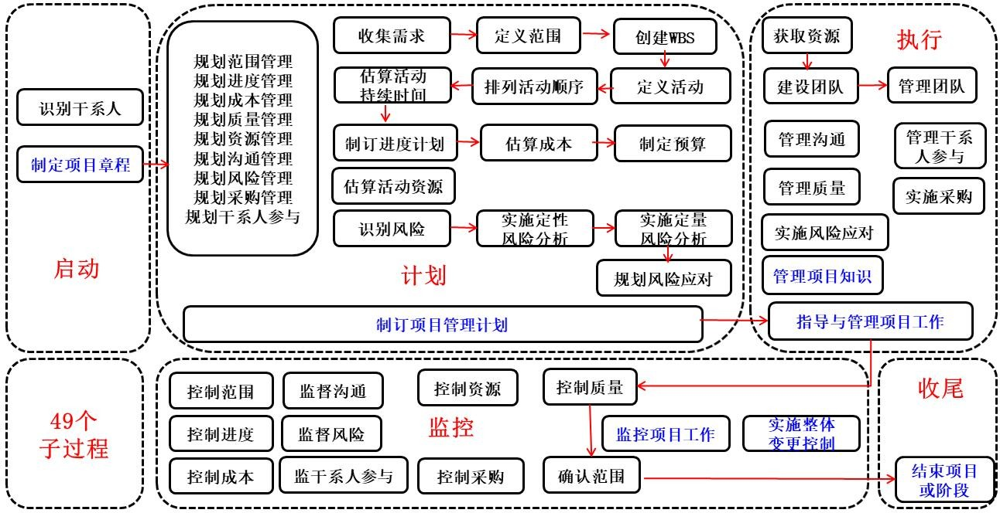

一、制定项目章程

# 信息系统项目管理师-精讲班-整合管理 2

制定项目章程是编写一份正式批准项目并授权项目经理在项目活动中使用组织资源的文件的过程。

- 批准项目的合法地位
  - 授权项目经理在项目活动中使用组织资源本过程的主要作用：

1. 明确项目与组织战略目标之间的直接联系；
2. 确立项目的正式地位；
3. 展示组织对项目的承诺。项目章程细节：
4. 项目章程不能当作合同，合同用来达成外部合作协议，项目章程用于建立组织内部的合作关系；
5. 项目章程在项目执行和项目需求之间建立了联系；
6. 项目章程可以由发起人编制，也可由项目经理与发起机构合作编制；
7. 项目由项目以外的机构来启动，例如发起人、项目集或项目管理办公室（PMO）、项目组合治理委员会主席或其授权代表；
8. 项目经理应在规划开始之前任命项目经理，最好在制定项目章程时就任命。输入&输出：

| 输入            | 输出        |
| --------------- | ----------- |
| 1、立项管理文件 | 1、项目章程 |
| 2、协议         | 2、假设日志 |
| 3、事业环境因素 |             |
| 4、组织过程资产 |             |

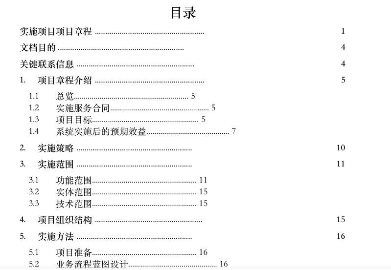【输出-1】项目章程

项目章程内容：

- 项目目的；可测量的项目目标和相关的成功标准
- 高层级需求、高层级项目描述、边界定义以及主要可交付成果；整体项目风险；总体里程碑进度计划；预先批准的财务资源；关键干系人名单
- 项目审批要求、项目退出标准
- 委派的项目经理及其职责和职权；发起人或其他批准项目章程的人员的姓名和职权

  【输出-2】假设日志

  假设日志用于记录整个项目生命周期中的所有假设条件和制约因素。

在项目启动之前进行可行性研究和论证时，即开始识别高层级的战略和运营假设条件与制约因素。这些假设条件与制约因素应纳入项目章程。较低层级的活动和任务假设条件在项目期间随着诸如定义技

术规范、估算、进度和风险等项目活动开展而生成。

【输入-1】立项管理文件

立项管理包括商业需求和成本效益分析，论证项目的合理性并确定项目边界。立项管理文件不是项目 文件，项目经理不可以对它们进行更新或修改，只可以提出相关建议。虽然立项管理文件是在项目之前制定的，但需要定期审核。

立项管理文件：

- 项目建议书、可行性研究报告、项目评估报告

  【输入-2】协议

协议有多种形式，包括合同、谅解备忘录、服务水平协议、协议书、意向书、口头协议或其他书面协议。

- 为外部客户做项目时，通常需要签订合同

  【输入-3】事业环境因素
- 政府或行业标准（如产品标准、质量标准、安全标准和工艺标准）
- 法律法规要求和相关制约因素
- 市场条件
- 组织文化和氛围
- 组织治理框架
- 干系人的期望和风险临界值

  【输入-4】组织过程资产
- 组织的标准政策、流程和程序
- 项目组合、项目集和项目的治理框架
- 监督和报告的方法
- 模板
- 历史信息与经验教训知识库

  【例题】能够影响“制订项目管理计划”过程的组织过程资产包括（ ）。

  ①组织的标准政策

  ②变更控制程序

  ③历史项目进度网络图

  ④特定行业的项目管理知识体系

  ⑤法律法规和安全标准

  ⑥历史信息和经验教训知识库

  A. ①②③⑥

  B. ①③⑤⑥

  C. ①③④⑥

  D. ①②④⑤

  【答案】A

  【解析】本题考查制订项目管理计划的输入的相关内容，必须会。

能够影响制订项目管理计划过程的组织过程资产主要包括：组织的标准政策、流程和程序；项目管理计划模板；变更控制程序，包括修改正式的组织标准、政策、计划、程序或项目文件，以及批准和确认变更所须遵循的步骤；监督和报告方法、风险控制程序以及沟通要求；以往类似项目的相关信息（如范围、成本、进度与绩效测量基准、项目日历、项目进度网络图和风险登记册）；历史信息和经验教训知识库等。

小结：

- 事业环境因素、组织过程资产是所有过程的输入
- 教材中提到的输入、输出、工具与技术并不全，更加关注输出
- 如果考核输入输出题目，会有明显的错误工具与技术：

  本教材中，工具集合有：数据收集、数据分析、数据表现、人际关系与团队技能、决策。

| 数据收集                                                                            | 数据分析                                                                                                                                                 | 数据表现                                                                                       | 人际关系与团队技能                                                                                                                              | 决策                                               |
| ----------------------------------------------------------------------------------- | -------------------------------------------------------------------------------------------------------------------------------------------------------- | ---------------------------------------------------------------------------------------------- | ----------------------------------------------------------------------------------------------------------------------------------------------- | -------------------------------------------------- |
| 头脑风暴 ` `焦点小组 ` `核对单 ` `访谈 ` `标杆对照 ` `…… | 成本效益分析 ` `备选方案分析 ` `根本原因分析 ` `文件分析 ` `过程分析 ` `挣值分析 ` `绩效审查 ` `趋势分析 ` `…… | 亲和图 ` `因果图 ` `流程图 ` `直方图 ` `矩阵图 ` `散点图 ` `…… | 冲突管理 ` `影响力 ` `激励 ` `谈判 ` `团队建设 ` `积极倾听 ` `引导 ` `领导力 ` `人际交际 ` `大局观 | 投票 ` `独裁型决策制定 ` `多标准决策分析 |

【工具-1】专家判断

制定项目章程过程中，应征求具备如下领域相关专业知识或接受过相关培训的个人或小组的意见，涉及领域包括：

- 组织战略
- 效益管理
- 项目所在的行业以及项目关注的领域的技术知识
- 持续时间和预算的估算
- 风险识别等领域

  【工具-2】数据收集

1. 头脑风暴

   用于在短时间内获得大量创意，包括：创意产生和创意分析。
2. 焦点小组

   召集干系人和主题专家讨论项目风险、成功标准和其他议题，比一对一访谈更有利于互动交流。
3. 访谈

   通过与干系人直接交谈，了解高层级需求、假设条件、制约因素、审批标准以及其他信息。

   【工具-3】人际关系与团队技能
4. 冲突管理

   有助于干系人就目标、成功标准、高层级需求、项目描述、总体里程碑和其他内容达成一致意见。
5. 引导

   有效引导团队活动成功达成决定、解决方案或结论。
6. 会议管理

   准备议程、确保邀请每个关键干系人代表，以及准备和发送后续的会议纪要和行动计划。

   【工具-4】会议

在制定项目章程过程中，与关键干系人举行会议的目的是识别项目目标、成功标准、主要可交付成果、高层级需求、总体里程碑和其他概述信息。

二、制订项目管理计划

制订项目管理计划是定义、准备和协调项目计划的所有组成部分，并把它们整合为一份综合项目管理计划的过程。

输入&输出：

| 输入                                              | 输出            |
| ------------------------------------------------- | --------------- |
| 1、项目章程 ` `2、其他知识领域规划过程的输出 | 1、项目管理计划 |

1. 为什么要做计划？
   - 为项目绩效考核和控制提供基线 2.计划赶不上变化怎么办？
   - 变化后要及时更新计划，但更新要走整体变更流程 3.计划是否做得越细越好？
   - 并非越细越好，只对眼前阶段做详细的计划，远期做粗略（滚动式规划）
   - 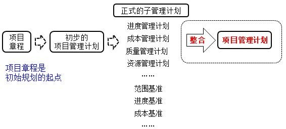项目的不确定性，不能期待计划一步到位（渐进明细）

     【输出】项目管理计划

| 十个管理计划   | 其他管理计划 | 三个基准 | 其他         |
| -------------- | ------------ | -------- | ------------ |
| 范围管理计划   | 变更管理计划 | 范围基准 | 绩效测量基准 |
| 需求管理计划   | 配置管理计划 | 进度基准 | 项目生命周期 |
| 进度管理计划   |              | 成本基准 | 开发方法     |
| 成本管理计划   |              |          | 管理审查     |
| 质量管理计划   |              |          |              |
| 资源管理计划   |              |          |              |
| 沟通管理计划   |              |          |              |
| 风险管理计划   |              |          |              |
| 采购管理计划   |              |          |              |
| 干系人参与计划 |              |          |              |

项目管理计划确定项目的执行、监控和收尾方式，其内容会根据项目所在的应用领域和复杂程度的不同而不同。

- 确定基准之后，只能通过变更请求，来更新项目管理计划
- 项目管理计划需要通过不断更新来渐进明细

  【例题】关于制定项目管理计划的描述，正确的是（ ）。

1. 项目管理计划具有统筹作用，包括了项目管理与控制过程的所有文件
2. 项目管理计划确定了执行、监控和结束项目的方式和方法
3. 项目管理计划包括了项目绩效信息
4. 项目经理应基于实施细节制定项目管理计划

   【答案】B

【解析】A 错误：项目管理计划记录了计划过程组的各个计划子过程的全部成果，不包括管理与控制过程的所有文件。

D 错误：制定项目管理计划时还不能确定实施细节，应该随着项目的推进，实施细节才逐步出现。工具与技术：

【工具-1】核对单

很多组织基于自身经验制定了标准化的核对单，或者采用所在行业的核对单。核对单可以指导项目经理制订计划或帮助检查项目管理计划是否包含所需的全部信息。

【工具-2】焦点小组

召集干系人讨论项目管理方法以及项目管理计划各个组成部分的整合方式。

【工具-3】会议

利用项目开工会议来明确项目规划阶段工作的完成并宣布开始项目执行阶段，目的是传达项目目标、获得团队对项目的承诺，以及阐明每个干系人的角色和职责。

- 小型项目：项目在启动之后就会开工
- 大型项目：开工会议在执行阶段开始时召开
- 多阶段项目：每个阶段开始时都要召开一次开工会议

三、指导与管理项目工作

# 信息系统项目管理师-精讲班-整合管理 3

为实现项目目标而领导和执行项目管理计划中所确定的工作，并实施已批准变更的过程。本过程的主要作用：

对项目工作和可交付成果开展综合管理，以提高项目成功的可能性。 “指导与管理项目工作”干什么活儿？

1. 实施已计划好的项目活动
2. 实施已批准的变更输入&输出：

| 输入              | 输出                |
| ----------------- | ------------------- |
| 1、项目管理计划   | 1、可交付成果       |
| 2、批准的变更请求 | 2、工作绩效数据     |
| 3、变更日志       | 3、变更请求         |
| 4、项目进度计划   | 4、问题日志         |
| 5、项目沟通记录   | 5、项目管理计划更新 |
| 6、需求跟踪矩阵   | 6、项目文件更新     |
| 7、风险登记册     |                     |
| 8、经验教训登记册 |                     |
| 9、风险报告       |                     |
| 10、里程碑清单    |                     |

 指导与管理项目工作，唯一输出“可交付成果”、“工作绩效数据”、“问题日志”的过程！  项目管理计划（更新）和项目文件（更新）是大多数过程的输出。

- 项目管理计划（更新）

  项目管理计划的任何变更都以变更请求的形式提出，且通过组织的变更控制过程进行处理。

  - 项目文件（更新）

    在指导与管理项目工作过程中更新的项目文件包括：活动清单、假设日志、经验教训登记册、需求文件、风险登记册、干系人登记册

    【输出-1】可交付成果

在某一过程、阶段或项目完成时，必须产出的任何独特并可核实的产品、成果或服务能力，通常是项目的结果，也包括项目管理计划的组成部分。

【输出-2】工作绩效数据

工作绩效数据是在执行项目工作的过程中，从每个正在执行的活动中收集到的原始观察结果和测量 值。

工作绩效数据包括已完成的工作、关键绩效指标（KPI）、技术绩效测量结果、进度活动的实际开始日期和完成日期、已完成的故事点、可交付成果状态、进度进展情况、变更请求的数量、缺陷的数量、实际发生的成本、实际持续时间等。

【输出-3】问题日志

问题日志是一种记录和跟进所有问题的项目文件，所需记录和跟进的内容主要包括：问题类型、问题提出者和提出时间、问题描述、问题优先级、解决问题负责人、目标解决日期、问题状态和最终解决情况等。

【输出-4】变更请求

变更请求是关于修改任何文件、可交付成果或基准的正式提议。变更请求源自项目内部或外部，可能来自项目需求，也可能是法律（合同）强制要求。

变更请求分类：

- 纠正措施：（纠偏差）为使项目工作绩效重新与项目管理计划一致
  - 预防措施：（防风险）为确保项目工作未来绩效符合项目管理计划
  - 缺陷补救：（补质量）为了修正不一致产品或产品组件
  - 更新：对正式受控的项目文件或计划进行的变更，以反映修改、增加的意见或内容

    【例题】

1. 项目落后了一个月了，提交变更请求，要求增加资源，让项目恢复正常，属于哪种变更请求？
   - 纠正措施
2. 项目有可能会延期，提交变更请求，要求增加一个人，以保证项目按时完成，属于哪种变更请求？
   - 预防措施
3. 做质量控制的时候，发现产品存在某些问题，提出变更请求，修复这些问题，属于哪种变更请求？
   - 缺陷补救

【例题】在接到一涉密系统集成项目后，项目经理要求信息技术部按公司规定，为每个项目组成员配置并安装数据防泄漏工具的笔记本电脑。该项目经理采用的是（ ）。

1. 批准的纠正措施
2. 批准的预防措施
3. 批准的缺陷补救措施
4. 批准的变更请求

   【答案】B

【解析】根据题干描述为每个项目组成员配置并安装数据防泄漏工具的笔记本电脑属于批准的预防措施。

工具与技术：

【工具-1】项目管理信息系统

如进度计划软件工具、工作授权系统、配置管理系统、信息收集与发布系统，以及进入其他在线信息系统（如知识库）的登录界面，支持自动收集和报告关键绩效指标（KPI）。

【工具-2】会议

会议类型一般包括：开工会议、技术会议、敏捷或迭代规划会议、每日站会、指导小组会议、问题解决会议、进度跟进会议以及回顾会议。

四、管理项目知识

管理项目知识是使用现有知识并生成新知识，以实现项目目标并且帮助组织学习的过程。管理项目知识在整个项目期间开展。

本过程的主要作用：

1. 利用已有的组织知识来创造或改进项目成果；
2. 使当前项目创造的知识可用于支持组织运营和未来的项目或阶段。

知识管理指的是确保项目团队和其他干系人的技能、经验和专业知识在项目开始之前、开展期间和结 束之后都能够得到运用。

知识管理最重要的环节就是营造一种相互信任的氛围，激励人们分享知识和关注他人的知识。

输入&输出：

| 输入              | 输出                |
| ----------------- | ------------------- |
| 1、项目管理计划   | 1、项目管理计划更新 |
| 2、资源分解结构   | 2、项目文件更新     |
| 3、项目团队派工单 | （经验教训登记册）  |
| 4、供方选择标准   |                     |
| 5、干系人登记册   |                     |
| 6、可交付成果     |                     |

【输出】经验教训登记册

经验教训登记册可以包含执行情况的类别和详细的描述，还可包括与执行情况相关的影响。

- 项目早期创建
- 可以作为很多过程的输入，也可以作为输出而不断更新
- 个人和团队可以通过视频、图片、音频或其他合适的方式记录知识
- 项目或阶段结束时，把相关信息归入经验教训知识库，作为组织过程资产一部分工具与技术：

【工具-1】知识管理

知识管理工具和技术包括：人际交往、实践社区和特别兴趣小组、会议、工作跟随和跟随指导、讨论论坛、知识分享活动、研讨会、讲故事、创造力和创意管理技术、知识展会和茶座、交互式培训等。

【工具-2】信息管理

信息管理工具和技术用于创建人们与知识之间的联系，可以有效促进简单、明确的显性知识的分享。

1. 编撰显性知识的方法
2. 经验教训登记册
3. 图书馆服务
4. 信息收集
5. 项目管理信息系统五、监控项目工作

监控项目工作是跟踪、审查和报告整体项目进展，以实现项目管理计划中确定的绩效目标的过程。监控项目工作在整个项目期间开展。

本过程的主要作用：

1. 让干系人了解项目的当前状态并认可为处理绩效问题而采取的行动；
2. 通过成本和进度预测，让干系人了解项目的未来状态。监控项目工作过程关注：

   ①把项目的实际绩效与项目管理计划进行比较；

   ②定期评估项目绩效，决定是否需要采取纠正或预防措施，并推荐采取必要的措施；

   ③检查单个项目风险的状态；

   ④在整个项目期间，维护一个准确且及时更新的信息库，以反映产品及文件的情况；

   ⑤为状态报告、进展测量和预测提供信息；

   ⑥作出预测，以更新当前的成本与进度信息；

   ⑦监督已批准变更的实施情况；

⑧如果项目是项目集的一部分，还应向项目集管理层报告项目进展和状态；

⑨确保项目与商业需求保持一致。输入&输出：

| 输入            | 输出            |
| --------------- | --------------- |
| 1、项目管理计划 | 1、工作绩效报告 |
| 2、进度预测     | 2、变更请求     |
| 3、成本预测     |                 |
| 4、工作绩效信息 |                 |
| 5、质量报告     |                 |

 监控项目工作，唯一输出“工作绩效报告”的过程!

【输入】工作绩效信息&【输出】工作绩效报告

- 工作绩效数据：原始观察结果和测量值
- 工作绩效信息：进行整合分析得到的绩效数据
- 工作绩效报告：为制定决策、采取行动或引起关注汇编工作绩效信息形成的，用于正式汇报的文件

  工作绩效报告一般包括状态报告和进展报告。

工作绩效报告可以包含挣值图表和信息、趋势线和预测、储备燃尽图、缺陷直方图、合同绩效信息和风险情况概述，也可以表示为引起关注、制定决策和采取行动的仪表指示图、热点报告、信号灯图或其他形式。

工具与技术：

1. 备选方案分析：用于在出现偏差时选择要执行的纠正措施或纠正措施和预防措施的组合；
2. 成本效益分析：有助于出现偏差时确定最节约成本的纠正措施；
3. 挣值分析：对范围、进度和成本绩效进行了综合分析；
4. 根本原因分析：关注识别问题的主要原因，它可用于识别出现偏差的原因以及项目经理为达成项目目标应重点关注的领域；
5. 趋势分析：根据以往结果预测未来绩效，它可以预测项目的进度延误，提前让项目经理意识到，按照既定趋势发展，后期进度可能出现的问题；
6. 偏差分析：审查目标绩效与实际绩效之间的差异，可涉及持续时间估算，可以在每个知识领域，针对特定变量开展偏差分析。

   六、实施整体变更控制

实施整体变更控制是审查所有变更请求，批准变更，管理对可交付成果、项目文件和项目管理计划的变更，并对变更处理结果进行沟通的过程。基准确定前，变更无须正式受控，一旦确定了项目基准，就必须通过实施整体变更控制过程来处理变更请求。实施整体变更控制过程贯穿项目始终，项目经理 对此承担最终责任。

本过程的主要作用：

确保对项目中已记录在案的变更作出综合评审。

输入&输出：

| 输入                                                        | 输出                                  |
| ----------------------------------------------------------- | ------------------------------------- |
| 1、项目管理计划 ` `2、变更请求 ` `3、工作绩效报告 | 1、批准的变更请求 ` `2、变更日志 |

小结：

 实施整体变更控制，唯一输出“批准的变更请求”的过程

 所有变更请求都需要记录在变更日志中，被否决的变更请求也应该记录在变更日志中

【工具】变更控制工具

- 配置控制：重点关注可交付成果及各个过程的技术规范
- 变更控制：识别、记录、批准或否决对项目文件、可交付成果或基准的变更七、结束项目或阶段

结束项目或阶段是终结项目、阶段或合同的所有活动的过程。它仅开展一次或仅在项目或阶段的结束点开展。

本过程的主要作用：

1. 存档项目或阶段信息，完成计划的工作；
2. 释放组织团队资源以展开新的工作。结束项目或阶段所需执行的活动：

   ①为达成阶段或项目的完工或退出标准所必须的行动和活动；

   ②为关闭项目合同协议或项目阶段合同协议所必须开展的活动；

③为完成收集项目或阶段记录、审计项目成败、管理知识分享和传递、总结经验教训、存档项目信息以供组织未来使用等工作所必须开展的活动；

④为向下一个阶段，或者向生产和（或）运营部门移交项目的产品、服务或成果所必须开展的行动和活动；

⑤收集关于改进或更新组织政策和程序的建议，并将它们发送给相应的组织部门；

⑥测量干系人的满意程度等。输入&输出：

| 输入                                                                                                                                                | 输出                                                                        |
| --------------------------------------------------------------------------------------------------------------------------------------------------- | --------------------------------------------------------------------------- |
| 1、验收的可交付成果 ` `2、项目管理计划 ` `3、立项管理文件 ` `4、采购文档 ` `5、协议 ` `6、组织过程资产 ` `7、项目文件 | 1、最终产品、服务或成果 ` `2、项目最终报告 ` `3、组织过程资产更新 |

【输入】验收的可交付成果

包括批准的产品规范、交货收据和工作绩效文件。对于分阶段实施的项目或提前取消的项目，还可能包括未全部完成的可交付成果或中间可交付成果。

【输出-1】最终的可交付成果

正式验收与移交授权项目提交的最终产品、服务与成果。

【输出-2】项目最终报告

1. 项目或阶段的概述；
2. 范围目标、范围的评估标准，证明达到完工标准的证据；
3. 质量目标、项目和产品质量的评估标准、相关核实信息和实际里程碑交付日期以及偏差原因；
4. 成本目标、包括可接受的成本区间、实际成本、产生任何偏差的原因等；
5. 最终产品、服务或成果的确认信息的总结；
6. 进度计划目标，包括成果是否实现项目预期效益：如果在项目结束时未能实现效益，则指出效益实现程度并预计未来实现情况；
7. 关于最终产品、服务和成果如何满足业务需求的概述；如果项目结束时未能满足业务需求，则指出需求满足程度并预计业务需求何时能得到满足；
8. 关于项目过程中发生的风险或问题及其解决情况的概述等。工具与技术：

# 信息系统项目管理师-精讲班-范围管理 1

第 9 章 项目范围管理

管理基础

项目范围管理包括确保项目做且只做所需的全部工作，以成功完成项目。一、产品范围和项目范围

- 产品范围：某项产品、服务或成果所具有的特征和功能。产品范围的完成情况是根据产品需求来衡量的。“需求”是指根据特定协议或其他强制性规范，产品、服务或成果必须具备的条件或能力
- 项目范围：包括产品范围，是为交付具有规定特性与功能的产品、服务或成果而必须完成的工作。项目范围的完成情况是根据项目管理计划来衡量的

  二、管理新实践

项目范围管理的新趋势和新兴实践更加注重与商业分析师一起合作，以便确定问题并识别商业需要。项目经理与商业分析师之间应该是伙伴式合作关系。

- 商业分析师：该角色的职责还应包括需求管理相关的活动
- 项目经理：负责确保这些活动列入项目管理计划，并且在预算内按时完成，同时能够创造价值三、范围管理敏捷与适应方法

1. 适应型或敏捷型生命周期
   - 应对大量变更，需要干系人（发起人和客户代表等）持续参与项目
   - 通过多次迭代来开发可交付成果，并在每次迭代开始时定义和批准详细的范围
   - 使用未完成项（包括产品需求和用户故事）反映当前需求
   - 在每次迭代中，都会重复开展的过程：收集需求、定义范围、创建 WBS、确认范围和控制范围 2.预测型生命周期

经过批准的项目范围说明书、WBS 和 WBS 词典构成项目范围基准。只有经过正式变更控制程序，才能 进行基准变更。在开展确认范围、控制范围及其他控制过程时，基准被用作比较的基础。

项目范围管理过程：一、规划范围管理 二、收集需求

三、定义范围四、创建 WBS五、确认范围六、控制范围

一、规划范围管理

规划范围管理是为了记录如何定义、确认和控制项目范围及产品范围，而创建范围管理计划的过程。本过程仅开展一次或仅在项目的预定义点开展。

本过程的主要作用：在整个项目期间对如何管理范围提供指南和方向。输入&输出：

| 输入                                | 输出                                    |
| ----------------------------------- | --------------------------------------- |
| 1、项目章程 ` `2、项目管理计划 | 1、范围管理计划 ` `2、需求管理计划 |

【输出-1】范围管理计划

范围管理计划是项目管理计划的组成部分，描述将如何定义、制定、监督、控制和确认项目范围。范围管理计划包含：

1. 制定项目范围说明书；
2. 根据详细项目范围说明书创建 WBS；
3. 确定如何审批和维护范围基准；
4. 正式验收已完成的项目可交付成果。 1.范围管理计划里有具体项目范围么？

- 范围管理计划无范围 2.具体项目范围在哪里？
- 范围基准

   XX 管理计划无 XX

  【输出-2】需求管理计划

  需求管理计划描述如何分析、记录和管理项目和产品需求。

  - 需求管理计划无需求（需求在需求文件中）需求管理计划主要内容：

1. 如何规划、跟踪和报告各种需求活动；
2. 配置管理活动，例如，如何启动变更，如何分析其影响，如何进行追溯、跟踪和报告，以及变更审批权限；
3. 需求优先级排序过程；
4. 测量指标及使用这些指标的理由；
5. 反映哪些需求属性将被列入跟踪矩阵等。

   【例题】关于范围管理的描述，正确的是（ ）。

   1. 定义范围管理是为了记录如何定义、确认和控制项目范围及产品范围，而创建范围管理计划的过程
   2. 范围管理计划包含配置管理活动和需求优先级排序过程
   3. 范围管理计划是非常详细的正式的计划
   4. 规划范围管理的作用是在整个项目期间对如何管理范围提供指南和方向

      【答案】D

【解析】本题考查范围管理的相关内容，必须会。选项 A：应该是规划范围管理；

选项 B：应该是需求管理计划；

选项 C：范围管理计划可以正式可以非正式、可以概括可以详细。

规划范围管理是为了记录如何定义、确认和控制项目范围及产品范围，而创建范围管理计划的过程。本过程的主要作用是在整个项目期间对如何管理范围提供指南和方向。

二、收集需求

# 信息系统项目管理师-精讲班-范围管理 2

收集需求是为实现目标而确定，记录并管理干系人的需要和需求的过程。本过程的主要作用：为定义产品范围和项目范围奠定基础。

什么是需求？

需求是根据特定协议或其他强制性规范，项目必须满足的条件或能力，或者产品、服务或成果必须具 备的条件或能力。需求包括发起人、客户和其他干系人的已量化且书面记录的需要和期望。

需求的分类：

| 序号 | 需求分类     | 含义                                                                      | 例如                                                                                                                                                                                                           |
| ---- | ------------ | ------------------------------------------------------------------------- | -------------------------------------------------------------------------------------------------------------------------------------------------------------------------------------------------------------- |
| 1    | 业务需求     | 整个组织的高层级需要                                                      | 解决业务问题或抓住业务机会，以及实施项 ` `目的原因                                                                                                                                                        |
| 2    | 干系人需求   | 干系人或干系人群体的需要                                                  |                                                                                                                                                                                                                |
| 3    | 解决方案需求 | 为满足业务需求和干系人需求，产品、服务或成果必须具备的特 性、功能和特征   | 功能需求：描述产品功能，如执行的行动、流程、数据和交互 ` `非功能需求：对功能需求的补充，是产品正常运行所需的环境条件或质量要求，如可靠性、保密性、性能、安全性、服务水 ` `平、可支持性、保留或清除等 |
| 4    | 过渡需求     | 当前状态过渡到将来状态所需 ` `的临时能力                             | 数据转换、培训需求                                                                                                                                                                                             |
| 5    | 项目需求     | 项目需要满足的行动、过程或其 ` `他条件                               | 里程碑日期、合同责任、制约因素                                                                                                                                                                                 |
| 6    | 质量需求     | 确认项目可交付成果的成功完成或其他项目需求的实现的任 ` `何条件或标准 | 测试、认证、确认                                                                                                                                                                                               |

输入&输出：

| 输入              | 输出            |
| ----------------- | --------------- |
| 1、项目章程       | 1、需求文件     |
| 2、范围管理计划   | 2、需求跟踪矩阵 |
| 3、需求管理计划   |                 |
| 4、干系人参与计划 |                 |
| 5、假设日志       |                 |
| 6、干系人登记册   |                 |
| 7、经验教训登记册 |                 |

【输出-1】需求文件

需求文件描述各种单一需求将如何满足与项目相关的业务需求。只有明确的（可测量和可测试的）、可跟踪的、完整的、相互协调的，且主要干系人愿意认可的需求，才能作为基准。

- 需求文件的格式多种多样
  - 既可以是简单文件，也可以是详细文件

Ex：需求清单

| 编号 | 需求名称         | 需求描述                                                         | 需求分类 | 需求来源 | 优先级 | 提出人 | 提出时间 | 需求负责人 |
| ---- | ---------------- | ---------------------------------------------------------------- | -------- | -------- | ------ | ------ | -------- | ---------- |
| 1    | 用户重新购买     | 超时支付的订单，用户可通过点击 “重新购买”再次 ` `一键下单 | 用户需求 | 用户研究 | P2     | XX     | XX       | XX         |
| 2    | 拼团流程优化     | 用户拼团时长、分享流程、售后服务 ` `优化                    | 用户需求 | 用户研究 | P2     | XX     | XX       | XX         |
| 3    | 商品搜索列表优化 | 将热搜榜加入搜索结果列 表，并优化商品呈 ` `现信息           | 用户需求 | 竞品分析 | P1     | XX     | XX       | XX         |

【输出-2】需求跟踪矩阵

需求跟踪矩阵是将产品需求从其来源连接到能满足需求的可交付成果的一种表格。跟踪需求的内容：

1. 业务需要、机会、目的和目标
2. 项目目标
3. 项目范围和 WBS 可交付成果
4. 产品设计
5. 产品开发
6. 测试策略和测试场景
7. 高层级需求到详细需求
   - 需求跟踪矩阵

| 项目名称： |          |          |                                      |          |                |          |          |          |
| ---------- | -------- | -------- | ------------------------------------ | -------- | -------------- | -------- | -------- | -------- |
| 成本中心： |          |          |                                      |          |                |          |          |          |
| 项目描述： |          |          |                                      |          |                |          |          |          |
| 标识       | 关联标识 | 需求描述 | 业务需 要、机会、目的和目 ` `标 | 项目目标 | WBS 可交付成果 | 产品设计 | 产品开发 | 测试案例 |
| 001        | 1.0      |          |                                      |          |                |          |          |          |
|            | 1.1      |          |                                      |          |                |          |          |          |
|            | 1.1.2    |          |                                      |          |                |          |          |          |
| 002        | 2.0      |          |                                      |          |                |          |          |          |
|            | 2.1      |          |                                      |          |                |          |          |          |

收集需求的工具： 1.专家判断

2. 数据收集

| 工具名称 | 关键词                                                                    |
| -------- | ------------------------------------------------------------------------- |
| 头脑风暴 | 产生多种创意的技术                                                        |
| 访谈     | 直接交谈、正式或非正式、一对一、多对多、获取机密信息                      |
| 焦点小组 | 预定的干系人和主题专家                                                    |
| 问卷调查 | 受众多样化、受访者地理位置分散、统计分析方法                              |
| 标杆对照 | 识别最佳实践、形成改进意见 ` `标杆可以是内部或外部、同行业或不同行业 |

3. 数据分析

文件分析：审核和评估任何相关的文件信息。可供分析的文档很多，包括：协议；商业计划；业务流程或接口文档；业务规则库；现行流程；市场文献；问题日志；政策和程序、法规文件，如法律、准则、法令等；建议邀请书；用例等。

4. 决策

| 工具名称       | 关键词                                 |
| -------------- | -------------------------------------- |
| 投票           | 生成、归类和排序产品需求               |
| 独裁型决策制定 | 一个人负责为整个集体制定决策           |
| 多标准决策分析 | 借助决策矩阵，对众多创意进行评估和排序 |

- 多标准决策分析 招投标：供方选择标准

|        | 公司规模 | 公司集成技术能力 | 曾经成功案例 | 团队成员持证人数 |
| ------ | -------- | ---------------- | ------------ | ---------------- |
| 公司 A |          |                  |              |                  |
| 公司 B |          |                  |              |                  |

5. 数据表现
   - 亲和图：对大量创意进行分组的技术，以便进一步审查和分析
   - 思维导图：用以反映创意之间的共性和差异，激发新创意 6.人际关系与团队技能

| 工具名称     | 关键词                                                       |
| ------------ | ------------------------------------------------------------ |
| 名义小组技术 | 通过投票排列最有用的创意，以便进一步开展头脑风暴或优先排序   |
| 观察和交谈   | 不愿清晰说明需求，挖掘隐藏的需求                             |
| 引导         | 引导与主题研讨会结合使用，把主要干系人召集在一起定义产品需求 |

1. 系统交互图

系统交互图是对产品范围的可视化描绘，可以直观显示业务系统及其与人和其他系统之间的交互方式。

2. 原型法

原型法是一种根据干系人初步需求，利用产品开发工具，快速地建立一个产品模型展示给干系人，在此基础上与干系人交流，最终实现干系人需求的产品快速开发的方法，减轻返工的风险。

故事板是一种原型技术，通过一系列的图像或图示来展示顺序或导航路径。

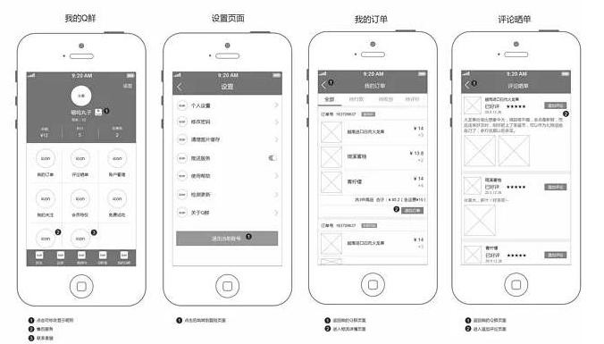

【例题】关于收集需求管理过程及相关技术的描述，正确的是（ ）。

1. 需求跟踪矩阵是把产品需求从其来源连接到能满足需求的可交付成果的一种表格
2. 原型法是一种结构化的头脑风暴形式，通过投票排列最有用的创意
3. 故事板是一种原型技术，是对产品范围的可视化描绘，可以直观显示业务系统的交互方式
4. 收集需求过程为规划范围管理过程奠定基础，需要反复开展，贯穿于整个项目生命周期

   【答案】A

【解析】A 选项正确，需求跟踪矩阵是把产品需求从其来源连接到能满足需求的可交付成果的一种表格。

B 选项错误：名义小组技术是一种结构化的头脑风暴形式。

C 选项错误：故事板是一种原型技术，通过一系列的图像或图示来展示顺序或导航路径。

系统交互图是对产品范围的可视化描绘，可以直观显示业务系统（过程、设备、计算机系统等）及其与人和其他系统（行动者）之间的交互方式。

D 选项错误：收集需求仅开展一次或仅在项目的预定义点开展。

三、定义范围

# 信息系统项目管理师-精讲班-范围管理 3

定义范围是制定项目和产品详细描述的过程。

本过程的主要作用：描述产品、服务或成果的边界和验收标准。输入&输出：

| 输入                                                                                              | 输出              |
| ------------------------------------------------------------------------------------------------- | ----------------- |
| 1、项目章程 ` `2、范围管理计划 ` `3、需求文件 ` `4、风险登记册 ` `5、假设日志 | 1、项目范围说明书 |

【输出】项目范围说明书

项目范围说明书是对项目范围、主要可交付成果、假设条件和制约因素的描述。项目范围说明书可明确指出哪些工作不属于本项目范围。

项目范围说明书包括：

- 产品范围描述
- 可交付成果
- 验收标准
- 除外责任工具与技术：

【工具-1】产品分析

把高层级的产品描述转变为有形的可交付成果。针对产品提问并回答，形成对将要开发的产品的用途、特征和其他方面的描述。

【工具-2】备选方案分析

备选方案分析可用于评估实现项目章程中所述的需求和目标的各种方法。四、创建 WBS

创建工作分解结构（WBS）是把项目可交付成果和项目工作分解成较小、更易于管理的组件的过程。它仅开展一次或仅在项目的预定义点开展。

本过程的主要作用：为所要交付的内容提供架构。

1. WBS 分解

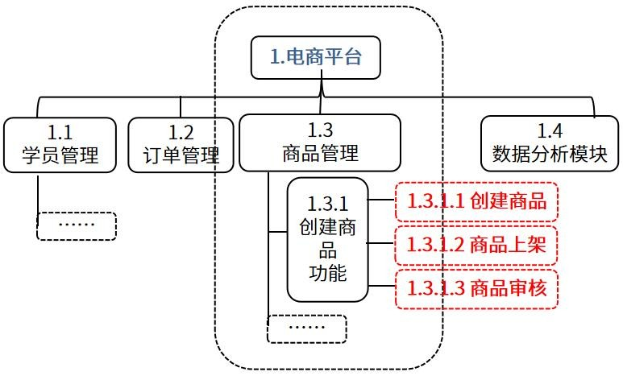

WBS 组织并定义了项目的总范围，代表着经批准的当前范围说明书中所规定的工作。

WBS 的最低层是带有独特标识号的工作包，其中包括计划的工作。工作包对相关活动进行归类。 “工作分解结构”中的“工作”是指作为活动结果的工作产品或可交付成果，而不是活动本身。 WBS 可以采用提纲式、组织结构图或能说明层级结构的其他形式。

不同的可交付成果可以分解到不同的层次。工作分解得越细致，对工作的规划、管理和控制越有力。但过细的分解会造成管理努力的无效耗费。

2. WBS 细节
3. WBS 必须是面向可交付成果的；
4. WBS 必须符合项目的范围，必须包括也仅包括为了完成项目的可交付成果的活动； 100%原则：下一级的元素之和必须 100%代表上一级元素
5. WBS 的底层应该支持计划和控制；
6. WBS 中的元素必须有人负责，而且只有一个人负责；
7. WBS 应控制在 4～6 层；
8. WBS 应包括项目管理工作，也要包括分包出去的工作；
9. WBS 的编制需要所有（主要）项目干系人的参与；
10. WBS 并非是一成不变的。

    【案例题】项目经理老陈分解项目工作，形成的完整 WBS 如图所示，请指出老陈编制的 WBS 不妥之处。

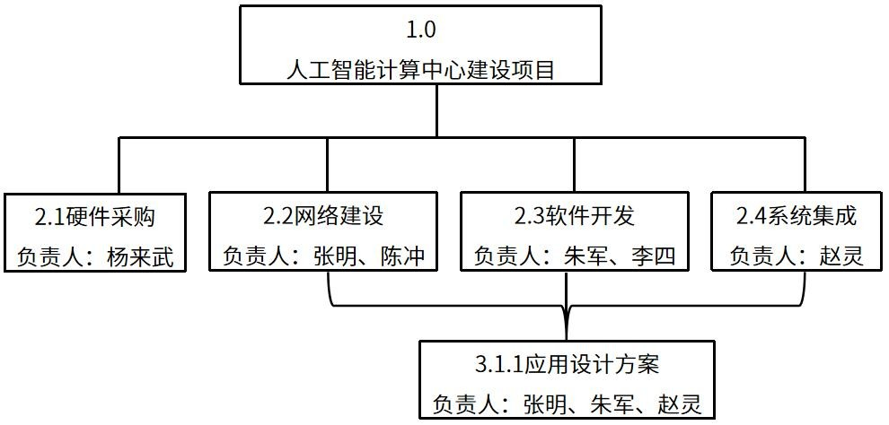

【解析】

1. WBS 没有面向交付成果。
2. 分解项目有遗漏（缺少平台软件采购）。
3. WBS 底层应该支持计划和控制，目前的 WBS 底层无支持计划和管理工作。
4. WBS 中的元素必须有人负责，而且只有一个人负责。目前的 WBS 出现多人负责的问题。
5. WBS 应控制在 4-6 层，目前 WBS 的分解层级过于简单。
6. 一个工作单元只能从属于某个上层单元，避免交叉。目前的 WBS 出现交叉从属。
7. WBS 应包括项目管理工作，也要包括分包出去的工作。目前的 WBS 没有体现管理工作。
8. WBS 的编制需要所有（主要）项目干系人的参与。目前 WBS 的编制没有体现多方参与的特征。
9. WBS 分解的 5 个步骤
10. 识别和分析可交付成果及相关工作；
11. 确定 WBS 的结构和编排方法；
12. 自上而下逐层细化分解；
13. 为 WBS 组成部分制定和分配标识编码；
14. 核实可交付成果分解的程度是否恰当。

WBS 分解结构，可以将生命周期作为第二层，也可以将主要可交付成果作为分解的第二层。 4.控制账户

控制账户是一个管理控制点，在该控制点上，把范围、预算和进度加以整合，并与挣值相比较来测量绩效。

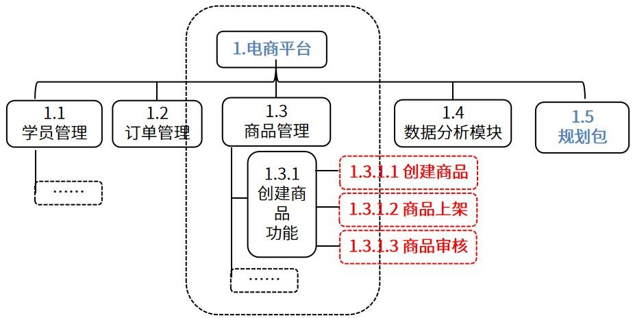控制账户包含两个或更多工作包，每个工作包只与一个控制账户关联。 5.规划包

规划包是一种低于控制账户而高于工作包的工作分解结构组件，工作内容已知，但详细的进度活动未知。

- 一个控制账户可以包含一个或多个规划包

6. WBS 字典

   WBS 字典是针对 WBS 中的每个组件，详细描述可交付成果、活动和进度信息的文件。

| 工作包             | 1.3.1 创建商品功能                         | 上层要素         | 1.3 商品管理 |
| ------------------ | ------------------------------------------ | ---------------- | ------------ |
| 负责人             | 石惠珠                                     | 协助人           | XXX          |
| 工作要求           | 可以创建课程类商品、图书类商品、套餐类商品 |                  |              |
| 质量要求           | 创建商品成功率 100%                        |                  |              |
| 项目经理（签字）： |                                            | 负责人（签字）： |              |

WBS 字典中大部分信息由其他过程创建，然后在后期添加到字典中。WBS 字典中的内容一般包括：账户编码标识、工作描述、假设条件和制约因素、负责的组织、进度里程碑、相关的进度活动、所需资源、成本估算、质量要求、验收标准、技术参考文献、协议信息等。

输入&输出：

| 输入                                                          | 输出        |
| ------------------------------------------------------------- | ----------- |
| 1、范围管理计划 ` `2、项目范围说明书 ` `3、需求文件 | 1、范围基准 |

 范围基准＝已批准的项目范围说明书＋WBS＋WBS 字典

五、确认范围

# 信息系统项目管理师-精讲班-范围管理 4

确认范围是正式验收已完成的项目可交付成果的过程。

- 确认范围属于监控过程组本过程的主要作用：

1. 使验收过程具有客观性；
2. 通过确认每个可交付成果来提高最终产品、服务或成果获得验收的可能性。

确认范围应根据需要在整个项目期间定期开展。由主要干系人，尤其是客户或发起人审查从控制质量过程输出的核实的可交付成果，确认这些可交付成果已经圆满完成并通过正式验收。

输入&输出：

| 输入                | 输出                |
| ------------------- | ------------------- |
| 1、项目管理计划     | 1、验收的可交付成果 |
| 2、需求文件         | 2、变更请求         |
| 3、需求跟踪矩阵     | 3、工作绩效信息     |
| 4、核实的可交付成果 |                     |
| 5、工作绩效数据     |                     |

【输出】验收的可交付成果

符合验收标准的可交付成果应该由客户或发起人正式签字批准。

应该从客户或发起人那里获得正式文件，证明干系人对项目可交付成果的正式验收。这些文件将提交给结束项目或阶段过程。

对已经完成但未通过正式验收的可交付成果及其未通过验收的原因，应该记录在案。可能需要针对这些可交付成果提出变更请求，开展相应的缺陷补救工作。

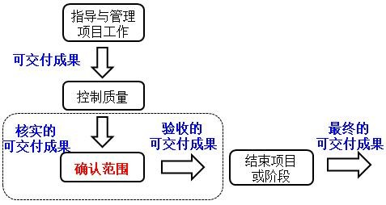

【工具-1】检查

检查是指开展测量、审查与确认等活动，来判断工作和可交付成果是否符合需求和产品验收标准。检查有时也被称为审查、产品审查和巡检等。

【工具-2】决策

比如投票，当由团队和其他干系人进行验收时，使用投票来形成结论。 1.确认范围的步骤：

1. 确定需要进行范围确认的时间；
2. 识别范围确认需要哪些投入；
3. 确定范围正式被接受的标准和要素；
4. 确定范围确认会议的组织步骤；
5. 组织范围确认会议。
6. 干系人在进行范围确认时，一般需要检查：
7. 可交付成果是否是确定的、可确认的；
8. 每个可交付成果是否有明确的里程碑；
9. 是否有明确的质量标准；
10. 审核和承诺是否有清晰的表达；
11. 项目范围是否覆盖了需要完成的产品或服务的所有活动；
12. 项目范围的风险是否太高。 3.质量控制与确认范围

|          | 质量控制                  | 确认范围                    |
| -------- | ------------------------- | --------------------------- |
| 先后顺序 | 先进行                    | 后进行                      |
| 进行阶段 | 不一定在阶段末尾          | 阶段末尾                    |
| 检查部门 | 内部检查 ` `质量部门 | 外部检查 ` `外部干系人 |
| 输出     | 核实的可交付成果          | 验收的可交付成果            |

4. 干系人关注点

| 干系人关注点 | 关注内容                                      | 含义                                                                                                    |
| ------------ | --------------------------------------------- | ------------------------------------------------------------------------------------------------------- |
| 管理层       | 项目范围                                      | 范围对项目的进度、资金和资源的影响，这些因素是否超过 ` `了组织承受范围，是否在投入产出上具有合理性 |
| 客户         | 产品范围                                      | 项目的可交付成果是否足够完成产品或服务                                                                  |
| 项目管理人员 | 项目制约因素                                  | 关心项目可交付成果是否足够和必须完成，时间、资金和资 ` `源是否足够，主要的潜在风险和预备解决的方法 |
| 项目团队成员 | 项目范围中自己参与 ` `的元素和负责的元素 | 检查自己的工作时间是否足够                                                                              |

【例题】关于确认范围管理过程的叙述，正确的是（ ）。

1. 项目团队成员主要关注项目范围中自己参与的元素和负责的元素
   1. 项目实施单位的管理层主要关注产品或服务范围，客户主要关注项目制约因素
   2. 确认范围过程的作用是为所要支付的内容提供架构
   3. 符合验收标准的可交付成果应由项目经理正式签字批准

      【答案】A

【解析】选项 A：项目团队成员主要关注项目范围中自己参与的元素和负责的元素，表述正确；选项 B：项目实施单位的管理层主要关注项目范围，客户主要关注产品范围，表述错误；

选项 C：确认范围过程的作用是使验收过程具有客观性，通过确认每个可交付成果来提高最终产品、服务或成果获得验收的可能性；

选项 D：符合验收标准的可交付成果应由客户或发起人正式签字批准。六、控制范围

控制范围是监督项目和产品的范围状态、管理范围基准变更的过程。本过程的主要作用：在整个项目期间保持对范围基准的维护。

控制项目范围确保所有变更请求、推荐的纠正措施或预防措施都通过实施整体变更控制过程进行处理。在变更实际发生时，也需要采用控制范围过程来控制这些变更。

未经控制的产品或项目范围的扩大被称为范围蔓延。

输入&输出：

| 输入            | 输出            |
| --------------- | --------------- |
| 1、项目管理计划 | 1、工作绩效信息 |
| 2、需求文件     | 2、变更请求     |
| 3、需求跟踪矩阵 |                 |
| 4、工作绩效数据 |                 |

【例题】请判断下面是工作绩效数据、还是工作绩效信息。

1. 收到的变更的分类
2. 识别的范围偏差和原因
3. 偏差对进度和成本的影响
4. 对将来范围绩效的预测

   【答案】1～4 全部是工作绩效信息。

   【输出】工作绩效信息

控制范围过程产生的工作绩效信息是有关项目和产品范围实施情况的相互关联且与各种背景相结合的信息。包括收到的变更的分类、识别的范围偏差和原因、偏差对进度和成本的影响，以及对将来范围 绩效的预测。

【工具】数据分析

1. 偏差分析

偏差分析用于将基准与实际结果进行比较，以确定偏差是否处于临界值区间内或是否有必要采取纠正或预防措施。

2. 趋势分析

   审查项目绩效随时间的变化情况，以判断绩效是正在改善还是正在恶化。

# 信息系统项目管理师-精讲班-进度管理 1

第 10 章 项目进度管理

项目进度管理过程：一、规划进度管理 二、定义活动

三、排列活动顺序

四、估算活动持续时间五、制订进度计划

六、控制进度

一、规划进度管理

规划进度管理是为规划、编制、管理、执行和控制项目进度而制定政策、程序和文档的过程。本过程仅开展一次或仅在项目的预定义点开展。

输入&输出：

| 输入                                                        | 输出            |
| ----------------------------------------------------------- | --------------- |
| 1、项目章程 ` `2、项目管理计划 ` `3、范围管理计划 | 1、进度管理计划 |

【输出】进度管理计划

进度管理计划是为编制、监督和控制项目进度建立准则和明确活动。

- 进度管理计划可以是正式或非正式的
- 非常详细或高度概括的进度管理计划包括：

1. 项目进度模型
2. 项目进度模型维护
3. 进度计划的发布和迭代长度
4. 准确度

   需要规定活动持续时间估算的可接受区间，如工期是 10±2 天
5. 计量单位

   用于测量时间的人时数、人天数
6. 工作分解结构（WBS）
7. 控制临界值

   采取某种措施前，允许出现的最大进度偏差
8. 绩效测量规则

   规定用于绩效测量的挣值管理（EVM）规则或其他测量规则
9. 报告格式

需要规定各种进度报告的格式和编制频率二、定义活动

定义活动是识别和记录为完成项目可交付成果而须采取的具体行动的过程。

本过程作用：将工作包分解为进度活动，作为对项目工作进行进度估算、规划、执行、监督和控制的基础。

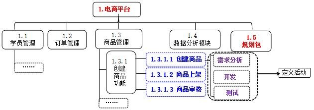

活动表示完成工作包所需的投入。

定义活动的最终输出是活动而不是可交付成果，可交付成果是指导与管理项目工作的输出。输入&输出：

| 输入                                | 输出                                                  |
| ----------------------------------- | ----------------------------------------------------- |
| 1、进度管理计划 ` `2、范围基准 | 1、活动清单 ` `2、活动属性 ` `3、里程碑清单 |

【输出-1】活动清单

活动清单是一份包含项目所需的进展活动。对于滚动式规划或敏捷技术的项目，活动清单会在项目进展过程中得到定期更新。

活动清单包括每个活动的标识及工作范围描述，使项目团队成员知道需要完成什么工作。 Ex：工作包：1.3.1.1 创建商品

| 活动 ID | 活动名称             | 描述                       | 负责人 |
| ------- | -------------------- | -------------------------- | ------ |
| 100001  | 创建商品功能需求分析 | 完成创建商品功能需求原型图 | 石     |
| 100002  | 创建商品功能开发     | 完成创建商品功能代码开发   | 王     |
| 100003  | 创建商品测试         | 完成创建商品功能测试       | 刘     |

【输出-2】活动属性

活动属性是指每项活动所具有的多重属性，用来扩充对活动的描述，活动属性随着项目进展情况演进并更新。

| 活动                        | 100002 商品创建功能需求分析              | 所属工作包                | 1.3.1 商品创建功能 |
| --------------------------- | ---------------------------------------- | ------------------------- | ------------------ |
| 负责人                      | 石惠珠                                   | 协助人                    | 王                 |
| 制约因素                    | 相关干系人参加 6.2 日的需求调研          | 资源需求                  | 产品工程师 2 名    |
| 工作描述                    | 完成商品创建功能的需求分析，完成原型设计 |                           |                    |
| 项目经理 ` `（签字）： |                                          | 负责人 ` `（签字）： |                    |

在项目初始阶段，活动属性包括唯一活动标识、WBS 标识和活动标签或名称，在活动属性编制完成时，活动属性可能包括活动描述、紧前活动、紧后活动、逻辑关系、提前量和滞后量、资源需求、强制日期、制约因素和假设条件。

活动属性还可用于编制进度计划。根据活动属性，可在报告中以各种方式对计划进度活动进行选择、排序和分类。

【输出-3】里程碑清单

- 里程碑是项目中的重要时点或事件
- 里程碑的持续时间为零，它们代表的只是一个重要时间点或事件
- 里程碑清单列出了所有项目里程碑，并指明每个里程碑是强制性的（如合同要求）还是选择性的

（如根据历史信息确定的） Ex：里程碑清单

| 里程碑名称     | 里程碑描述                                                          | 主要可交付物                | 计划截止日期 | 里程碑类型 |
| -------------- | ------------------------------------------------------------------- | --------------------------- | ------------ | ---------- |
| 需求分析完成   | 完成需求分析，需求规格说明书得到客户正式确 ` `认               | 需求规格说明书              | 20\*\*/2/1   | 合同强制   |
| 需求原型图完成 | 完成需求原型图                                                      | 需求原型图                  | 20\*\*/2/15  | 内部选择   |
| 详细设计完成   | 详细设计完成，包括模块设计、代码设计、数据库 ` `设计、界面设计 | 详细设计说明书              | 20\*\*/3/1   | 内部选择   |
| 代码开发工作   | 完成代码开发和单元测 ` `试工作                                 | 产品代码                    | 20\*\*/6/1   | 内部选择   |
| 测试完成       | 完成内部测试工作，发布 ` `测试报告                             | 测试报告                    | 20\*\*/7/1   | 内部选择   |
| 产品验收完成   | 在客户真实环境下，完成产品验收，得到客户正式 ` `确认签字       | 验收报告                    | 20\*\*/7/15  | 合同强制   |
| 产品上线       | 产品上线运行                                                        | 正式产品及支持文 ` `件 | 20\*\*/8/1   | 合同强制   |

三、排列活动顺序

# 信息系统项目管理师-精讲班-进度管理 2

排列活动顺序是识别和记录项目活动之间关系的过程.

本过程作用：定义工作之间的逻辑顺序，以便在既定的所有项目制约因素下获得最高的效率。排列活动顺序过程旨在将项目活动列表转化为图表，作为发布进度基准的第一步。

输入&输出：

| 输入                                  | 输出                              |
| ------------------------------------- | --------------------------------- |
| 1、进度管理计划                       | 1、项目进度网络图                 |
| 2、项目范围说明书 ` `3、活动清单 | 单代号网络图 ` `双代号网络图 |
| 4、活动属性                           |                                   |
| 5、里程碑清单                         |                                   |

【输出】项目进度网络图

项目进度网络图是表示项目进度活动之间的逻辑关系（也叫依赖关系）的图形。

- 可手工或借助项目管理软件来绘制
- 可包括项目的全部细节，也可只列出一项或多项概括性活动
- 项目进度网络图应附有简要文字说明，说明活动排序所使用的基本方法，还应该对任何异常的活动序列做详细说明

1. 单代号网络图
2. 七格图
3. 双代号网络图
4. 时标网络图
   - 依赖关系

| 强制性依赖关系 | 法律或合同要求的或工作的内在性质决定的依赖关系                                                                                                                                                                                |
| -------------- | ----------------------------------------------------------------------------------------------------------------------------------------------------------------------------------------------------------------------------- |
| 选择性依赖关系 | （首选逻辑关系、优先逻辑关系、软逻辑关系）` `是基于具体应用领域的最佳实践或者基于项目的某种特殊性质而设定，即便还有其他顺序可以选用，但项目团队却仍按照此种特殊的顺序安排活动 ` `如果想快速跟进，审查选择性依赖关系 |
| 外部依赖关系   | 项目活动与非项目活动之间的依赖关系，项目团队不可控                                                                                                                                                                            |
| 内部依赖关系   | 项目活动之间的紧前关系，项目团队可控                                                                                                                                                                                          |

单代号网络图 1.单代号网络图

单代号网络图（前导图、活动节点图 AON）。

- 节点代表活动，箭线代表依赖关系
  - 数字代表活动持续时间，即活动工期

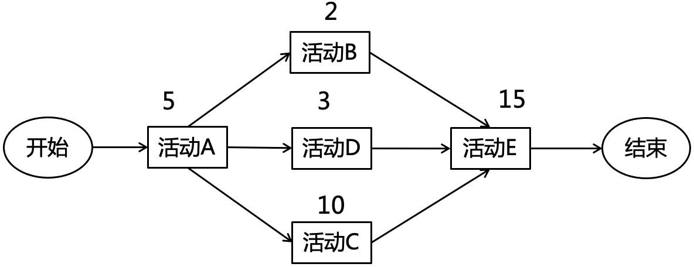

1. 紧前关系绘图法（PDM）
   - 紧前活动：进度计划的逻辑路径中，排在非开始活动前面的活动；
   - 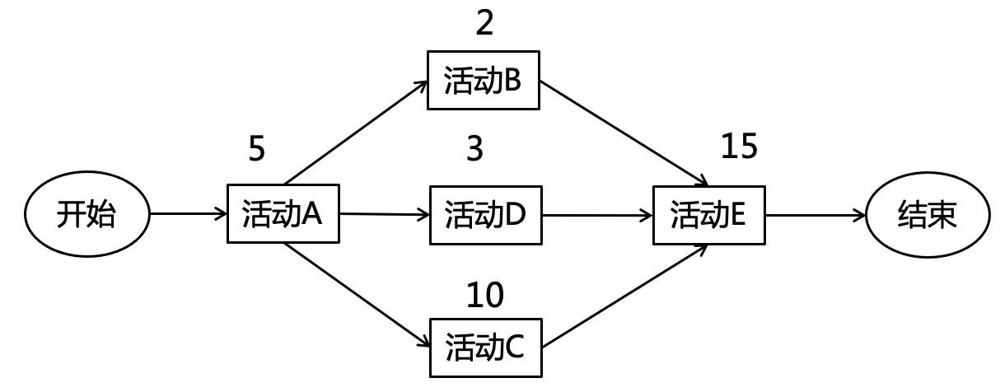紧后活动：进度计划的逻辑路径中，排在某个活动后面的活动。

     【例题】根据下表完成此项目的前导图（单代号网络图），标明各活动之间的逻辑关系。

| 工作代号 | 紧前活动 | 历时（天） |
| -------- | -------- | ---------- |
| A        | -        | 5          |
| B        | A        | 2          |
| C        | B        | 3          |
| D        | A        | 10         |
| E        | C、D     | 15         |

【答案】

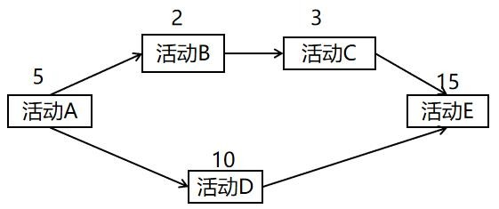

2. 依赖关系

   （1）F-S 型：结束到开始

   只有紧前活动结束，紧后活动才能开始

   （2）F-F 型：结束到结束

   只有紧前活动结束，紧后活动才能结束

（3）S-S 型：开始到开始

只有紧前活动开始，紧后活动才能开始

（4）S-F 型：开始到结束

只有紧前活动开始，紧后活动才能结束

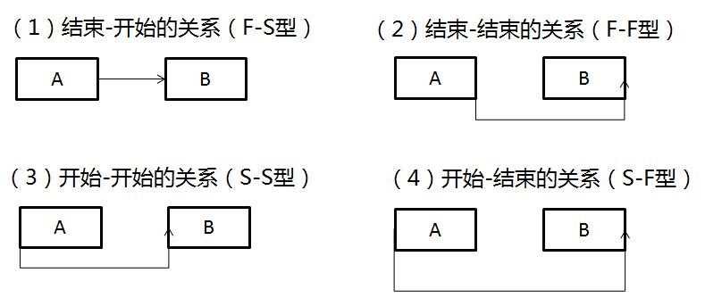

在 PDM 图中，FS 是最常用的逻辑关系图，SF 关系则很少使用。 4.提前量和滞后量

- 提前量：相对于紧前活动，紧后活动可以提前的时间量，一般用负值表示，如 FS-2
- 滞后量：相对于紧前活动，紧后活动可以推迟的时间量，一般用正值表示，如 SS+15

  

5. 关键路径和最短工期

关键路径：在不考虑任何资源限制的情况下，项目中时间最长的活动顺序，决定着项目最短工期。关键活动：关键路径上的活动为关键活动。

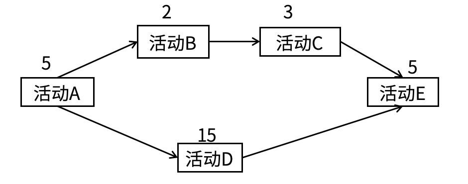

路径 A－B－C－E：5＋2＋3＋5＝15 （非关键路径）路径 A－D－E：5＋15＋5＝25 （关键路径）

工期：25

 关键路径是从开始到结束，耗时最长的路径 关键路径的时长，就是最短工期

关键路径可能有多条

在项目执行中，关键路径可能会发生变化 6.总浮动时间

在不延误项目完工时间且不违反进度制约因素的前提下，活动可以从最早开始时间推迟或拖延的时间量，就是该活动的进度灵活性，被称为“总浮动时间”。

 总浮动时间：

关键活动：总浮动时间为 0

非关键活动：工期－该活动所在的路径最大值 7.自由浮动时间

不延误任何紧后活动的最早开始时间且不违反进度制约因素的前提下，活动可以从最早开始时间推迟或拖延的时间量。

 自由浮动时间：

- 关键活动：自由浮动时间为 0
- 非关键活动：
- 该活动是紧后活动唯一的紧前活动：自由浮动时间为 0
- 该活动的紧后活动，有多个紧前活动：

  从开始到其紧后活动：最长路径－该活动所在路径最大值

【真题】某项目包含 ABCDEFGHIJ 一共 10 个活动，各活动历时估算与逻辑关系如下表所示，则该项目工期为（ ），活动 C 的总浮动时间是（ ）。

| 活动名称 | 活动历时（天） | 紧前活动 |
| -------- | -------------- | -------- |
| A        | 2              | -        |
| B        | 4              | A        |
| C        | 2              | A        |
| D        | 3              | A        |
| E        | 3              | B        |
| F        | 4              | D        |
| G        | 2              | E、C、F  |
| H        | 4              | G        |
| I        | 2              | G        |
| J        | 3              | H、I     |

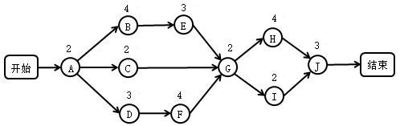

【答案】

关键路径：ABEGHJ，ADFGHJ工期：18 天

C 总浮动时间：5 天

 关键路径法总结：

1. 根据表格中给出的依赖关系，画出单代号网络图
2. 找出关键路径、计算总工期
3. 计算活动总浮动时间、自由浮动时间
4. 直接给出七格图，计算总浮动时间和自由浮动时间七格图
5. 七格图

| 最早开始时间 ES | 工期 DU    | 最早完成时间 EF |
| --------------- | ---------- | --------------- |
| 活动名称        |            |                 |
| 最迟开始时间 LS | 总浮动时间 | 最迟完成时间 LF |

1. ES（Early Start）：最早开始时间
2. EF（Early Finish）：最早完成时间
3. LS（Late Start）：最迟开始时间
4. LF（Late Finish）：最迟完成时间
5. DU（Duration）：工期 EF＝ES＋工期；LS＝LF－工期

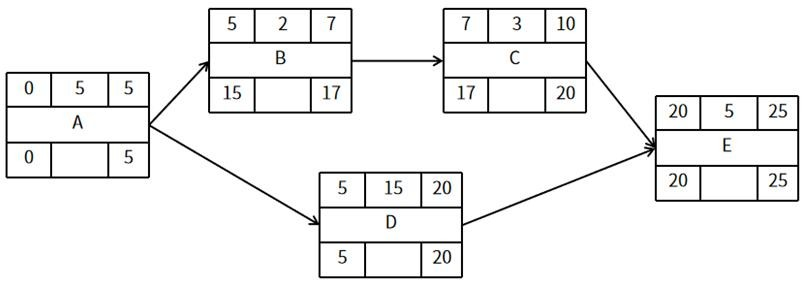

 可以画出七格图： ES 顺推、取最大 LF 逆推、取最小

2. 关键路径

关键路径：A-D-E

- 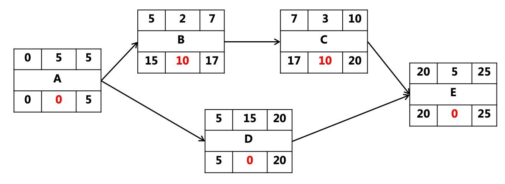最早开始时间和最晚开始时间相等的活动称为关键活动 3.总浮动时间

总浮动时间＝本活动的最迟完成时间－本活动的最早完成时间

＝本活动的最迟开始时间－本活动的最早开始时间

3. 自由浮动时间

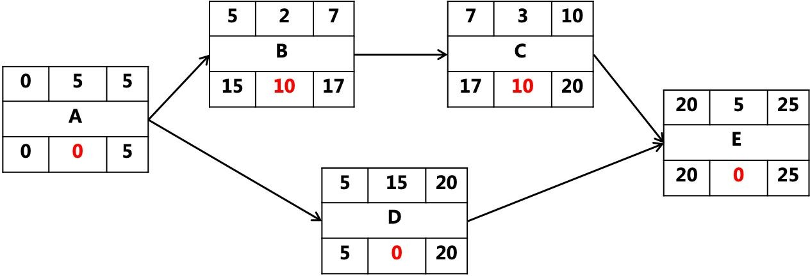

自由浮动时间＝紧后活动最早开始时间的最小值－本活动的最早完成时间

＝紧后 ES 最小值－本活动 EF

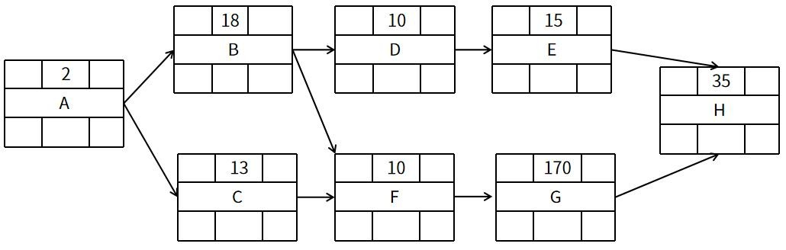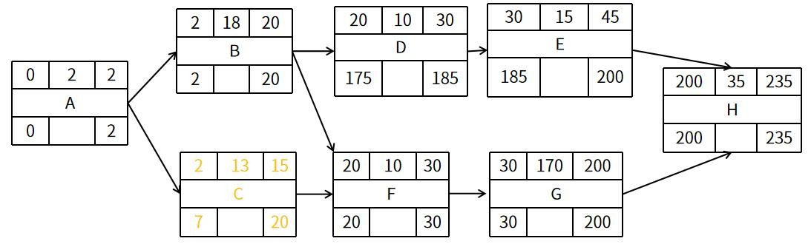【例题】在下面的项目网络图中（时间单位为天），活动 C 的自由浮动时间和总浮动时间分别为（ ）。

【答案】

C 的总浮动时间是 5，自由浮动时间是 5。

双代号网络图

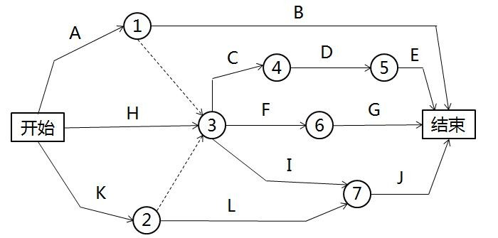双代号网络图（箭线图法）：节点表示事件，箭线表示活动

虚箭头：虚活动，既不消耗时间，也不消耗资源，只是为了弥补箭线图在表达活动依赖关系方面的不足。

箭线图法中：

1. 网络图中每一活动和每一事件都必须有唯一的一个代号，即网络图中不会有相同的代号；
2. 任两项活动的紧前事件和紧后事件代号至少有一个不相同，节点代号沿箭线方向越来越大；
3. 流入（流出）同一节点的活动，均有共同的紧后活动（或紧前活动）。

【例题】某项目的网络图如下所示，因天气情况，活动 G 的工期变成了 8 天，活动 J 和 N 依赖关系变为 FS＋2。

1. 该项目的总工期。
2. 变化后，活动 F 的总浮动时间和自由浮动时间。

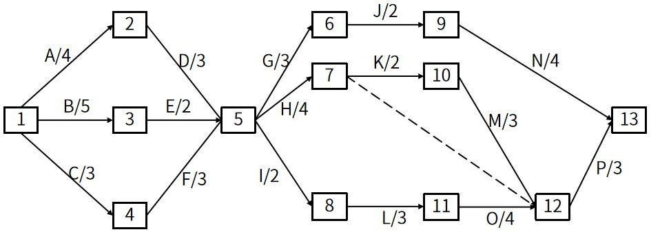

【答案】

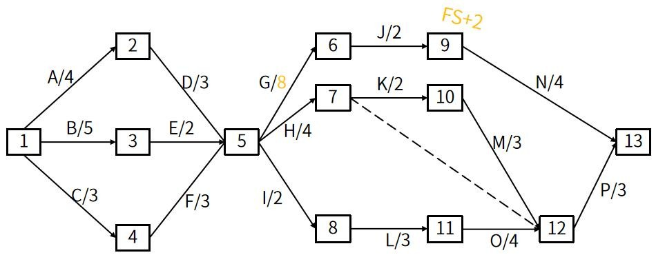

1. 该项目的总工期。

   G 没发生变化前，关键路径有 4 条：ADHKMP、ADILOP、BEHKMP、BEILOP，它们的工期都是 19。

由于 G 的工期变成了 8 天，关键路径发生改变，变为：ADGJN，BEGJN，关键路径有两条，总工期是 21天。活动 J 和 N 依赖关系变为 FS＋2，总工期为 23 天。

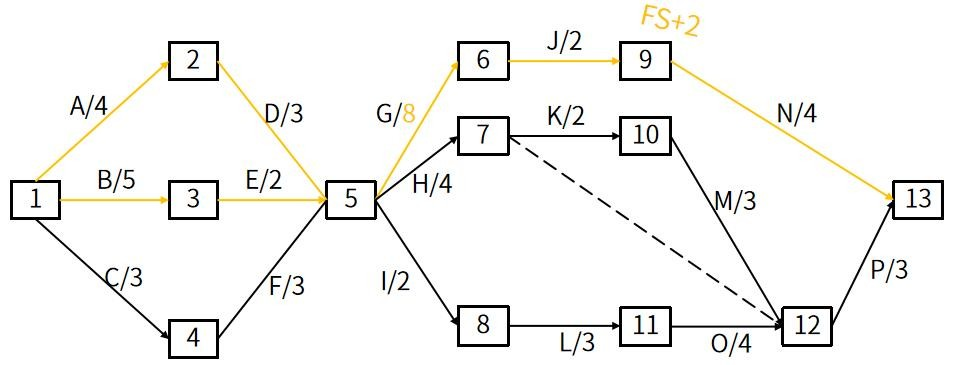

2. 变化后，活动 F 的总浮动时间和自由浮动时间。

活动 F 所有在路径最长为 22，活动 F 总浮动时间＝工期－活动 F 所有在路径最长值＝23－22＝1； 活动 F 的紧后活动，有多个紧前活动：活动F 自由浮动时间＝从开始到其紧后活动：最长路径－该活动所在路径最大值＝7－6＝1。

时标网络图

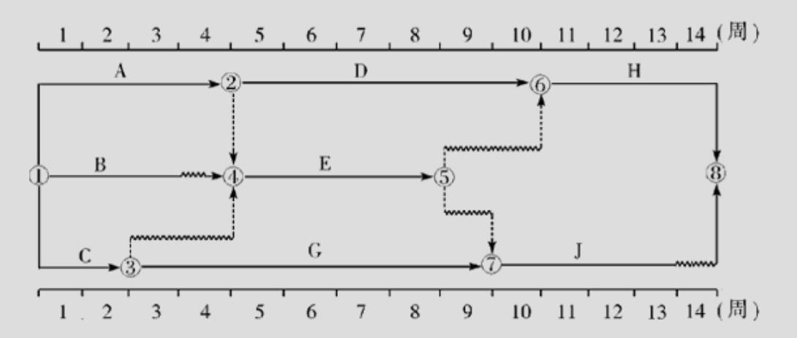

- 画时标网络图

1. 先画出双代号网络图：箭线代表活动；
2. 算出每个活动的最早开始时间；
3. 准备时间轴，标注时间刻度；
4. 把节点放在最早开始时间上；
5. 以节点为起点，按工作持续时间画实箭线，箭线长度不足时，用波形线补充。

   【例题】

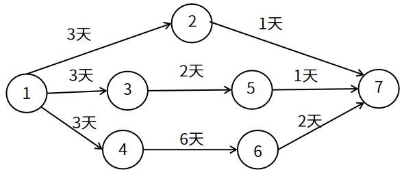

【答案】

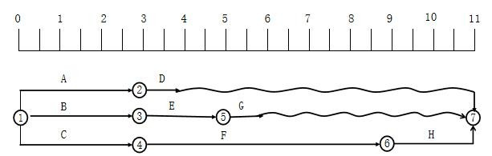

- 关键路径：

  从开始到结束，不包含波形线的所有路径。

  - 总浮动时间：

1. 以该活动为起点工作，寻找通过该活动的所有线路；
2. 计算各条线路的波形线的长度和，波形线长度和的最小值就是该活动的总时差。
   - 自由浮动时间：
3. 该活动箭线上有波形线，自由浮动时间为箭线上波形线的长度；
4. 该活动箭线上没有波形线，自由浮动时间为活动与其紧后活动工作时间间隔的最小值。

四、估算活动持续时间

# 信息系统项目管理师-精讲班-进度管理 3

估算活动持续时间是根据资源估算的结果，估算完成单项活动所需工作时段数的过程。本过程作用：是确定完成每个活动所需花费的时间量。

估算持续时间时需要考虑的因素包括：

1. 收益递减规律：在保持其他因素不变的情况下，增加一个用于确定单位产出所需投入的因素 （如资源）会最终达到一个临界点，在该点之后的产出或输出会随着增加这个因素而递减。
2. 资源数量：增加资源数量，比如两倍投入资源但完成工作的时间不一定能缩短一半，因为投入资源可能会增加额外的风险，比如如果增加太多活动资源，可能会因知识传递、学习曲线、额外合作等其他相关因素而造成持续时间增加。
3. 技术进步：在确定持续时间估算时，技术进步因素可能发挥重要作用。例如，通过采购最新技术，制造工厂可以提高产量，而这可能会影响持续时间和资源需求。
4. 员工激励：项目经理还需要了解拖延症和帕金森定律。前者指出，人们只有在最后一刻，即快到期限时才会全力以赴；后者指出，只要还有时间，工作就会不断扩展，直到用完所有的时间。应该把活动持续时间估算所依据的全部数据与假设都记录在案。

   输入&输出：

| 输入            | 输出            |
| --------------- | --------------- |
| 1、进度管理计划 | 1、持续时间估算 |
| 2、活动清单     | 2、估算依据     |
| 3、活动属性     |                 |
| 4、资源需求     |                 |
| 5、资源日历     |                 |
| 6、资源分解结构 |                 |
| 7、范围基准     |                 |
| 8、风险登记册   |                 |

【输出-1】持续时间估算

持续时间估算是对完成某项活动、阶段或项目所需的工作时段数的定量评估，其中并不包括任何滞后量，但可指出一定的变动区间。例如：2 周±2 天，表明活动至少需要 8 天，最多不超过 12 天（假定每周工作 5 天）。

【输出-2】估算依据

持续时间估算的支持信息可包括：

1. 关于估算依据的文件（如估算是如何编制的）。
2. 关于全部假设条件的文件。
3. 关于各种已知制约因素的文件。
4. 对估算区间的说明（如“±10%”），以指出预期持续时间的所在区间。
5. 对最终估算的置信水平的说明。
6. 有关影响估算的单个项目风险的文件等。

工具与技术：

1. 类比估算

类比估算是一种使用相似活动或项目的历史数据来估算当前活动或项目的持续时间或成本的技术。类比估算通常成本较低、耗时较少，但准确性也较低。

2. 参数估算

基于历史数据和项目参数、准确性取决于参数模型的成熟度和基础数据的可靠性。 3.自下而上估算

自下而上估算是一种估算项目持续时间或成本的方法，通过从下到上逐层汇总 WBS 组成部分的估算而得到项目估算。

4.储备分析

考虑应急储备、纳入进度管理计划、应对不确定性。

五、制订进度计划

# 信息系统项目管理师-精讲班-进度管理 4

制订进度计划的关键步骤：

1. 定义项目里程碑，识别活动并排列活动顺序，估算持续时间，并确定活动的开始和完成日期。
2. 由分配至各个活动的项目人员审查其被分配的活动。
3. 项目人员确认开始和完成日期与资源日历和其他项目或任务没有冲突，从而确认计划日期的有效性。
4. 分析进度计划，确定是否存在逻辑关系冲突，以及在批准进度计划并将其作为基准之前是否需要资源平衡，并同步修订和维护项目进度模型，确保进度计划在整个项目期间一直切实可行。

   输入&输出：

| 输入               | 输出            |
| ------------------ | --------------- |
| 1、进度管理计划    | 1、进度基准     |
| 2、活动清单        | 2、项目进度计划 |
| 3、活动属性        | 3、进度数据     |
| 4、资源需求        | 4、项目日历     |
| 5、资源日历        |                 |
| 6、范围基准        |                 |
| 7、风险登记册      |                 |
| 8、项目进度网络图  |                 |
| 9、持续时间估算    |                 |
| 10、项目团队派工单 |                 |

【输出-1】进度基准

进度基准——已批准的项目进度计划

【输出-2】项目进度计划

项目进度计划是进度模型的输出，为各个相互关联的活动标注了计划日期、持续时间、里程碑和所需资源等。

- 至少要包括每个活动的计划开始日期与计划完成日期项目进度计划形式：
- 里程碑图

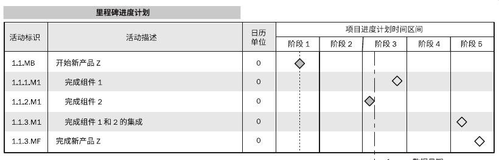

- 横道图（甘特图）

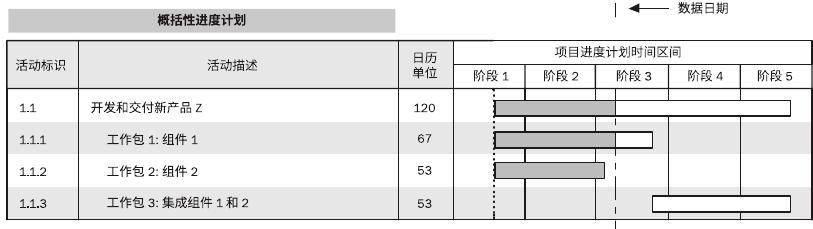

- 详细进度计划

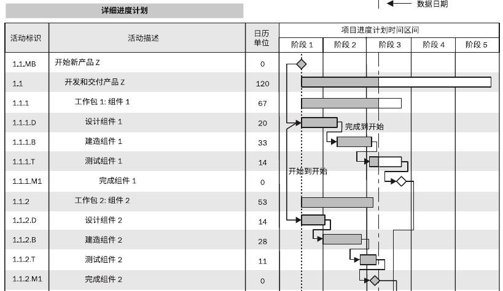

【输出-3】进度数据

用以描述和控制进度计划的信息集合。进度数据包括：

1. 按时段列的资源需求，往往以资源直方图表示；
2. 备选的进度计划，如最好情况或最坏情况下的进度计划、经资源平衡或未经资源平衡的进度计划、有强制日期或无强制日期的进度计划；
3. 使用的进度储备；

   进度数据还可以包括资源直方图、现金流预测、以及订购与交付进度安排等其他相关信息。

   【输出-4】项目日历

   在项目日历中规定可以开展进度活动的可用工作日和工作班次，它把可用于开展进度活动的时间段与

不可用的时间段区分开来。

在一个进度模型中，可能需要采用不止一个项目日历来编制项目进度计划。

- 项目进度管理新实践

1. 具有未完成项的迭代型进度计划适应型生命周期多采用这种方法。

将需求记录在用户故事中，然后在建造之前按优先级排序并优化用户故事，最后在规定的时间内开发产品功能。这一方法通常用于向客户交付增量价值，或多个团队并行开发大量的、内部关联的、较小的功能。

2. 按需进行的进度计划

按需进行的进度计划方法不依赖于预先定义好的进度计划，而是在资源可用时立即从未完成项和工作序列中提取工作任务，该方法适用于具有如下特征：

1. 在运营或持续环境中以增量方式研发产品的项目；
2. 工作任务的规模或范围相对类似的项目；
3. 可以按照规模或范围对任务进行组合的项目。工具与技术：

   【工具-1】进度网络分析
4. 当多个路径在同一时间点汇聚或分叉时，评估汇总进度储备的必要性，以减少出现进度落后的可能性；
5. 审查网络，查看关键路径是否存在高风险活动或具有较多提前量的活动，是否需要使用进度储备或执行风险应对计划来降低关键路径的风险。

   【工具-2】数据分析
6. 假设情景分析

对各种情景进行评估，预测它们对项目目标的影响。“如果情景 X 出现，情况会怎样？”。可以根据假设情景分析的结果，评估项目进度计划在不同条件下的可行性，以及为应对意外情况的影响而编制进度储备和应对计划。

2. 模拟

把单个项目风险和不确定性的其他来源模型化的方法，以评估它们对项目目标的潜在影响。最常见的模拟技术是蒙特卡罗分析，它利用风险和其他不确定资源计算整个项目可能的进度结果。

计划评审技术（三点估算）

计划评审技术（PERT），又称为三点估算技术，假设项目持续时间以及整个项目完成时间是随机的，且服从某种概率分布。PERT 可以估计整个项目在某个时间内完成的概率。

1. 活动的时间估算
   - 三角分布：期望值=（最悲观+最可能+最乐观）/3
   - 贝塔（β）分布：

期望值=（最悲观+4\*最可能+最乐观）/6 （默认使用）方差σ2 = （最悲观− 最乐观）2/36

【例题】

标准差σ =

1. 某活动的预计工期为乐观 14 天、最可能 20 天、悲观 32 天。计算该活动的工期和标准差。估算工期=（14+20\*4+32）/6=126/6=21 天

标准差 = = = 3

2. 项目周期估算

   整个项目完成时间是各个活动完成时间之和，服从正态分布。

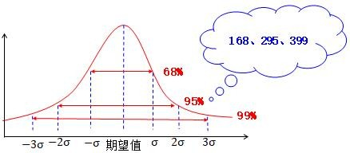

- 期望值±σ之间的概率：68%
- 期望值±2σ之间的概率：95%
- 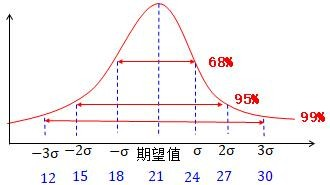期望值±3σ之间的概率：99%

1. 该活动在 18-24 天完成概率为多少？

   也就是问正负一个标准差内完成的概率是多少？68%
2. 该活动在 24 天内完成的概率是多少？

   50%+68%/2=84%
3. 该活动在 18～27 天内完成的概率是多少？

   68%/2+95%/2=81.5%

【例题】某政府 OA 系统的建设可分解为需求分析、设计编码、测试、安装部署 4 个活动，各个活动顺次进行，没有时间上的重叠。

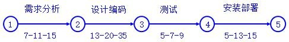

1. 项目周期估算；
2. 求项目标准差；
3. 求项目在 42.4 天～59.6 天完成的概率；
4. 求项目在 60 天内完成的概率；
5. 如果客户要求再提前 7 天，求完成的概率。

   【解析】
6. 项目周期估算

t需求分析 t设计编码

= 7 + 4 × 11 + 15 = 11

6

= 13 + 4 × 20 + 35 = 21

6

t测试 t

= 5 + 4 × 7 + 9 = 7

6

= 5 + 4 × 13 + 15 = 12

安装部署 6

项目周期 T=11+21+7+12=51 天

2. 求项目标准差

2

σ2 = （15 − 7）

= 1.778

需求分析 36

2

σ2 = （35 − 13）

= 13.445

设计编码 36

2

σ2 = （9 − 5）

= 0.445

测试 36

2

σ2 = （15 − 5）

= 2.778

安装部署 36

σ2 = 1.778 + 13.445 + 0.445 + 2.778 = 18.446

σ =

=

= 4.3 天

3. 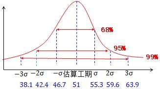求项目在 42.4 天～59.6 天完成的概率

   项目在 42.4 天～59.6 天，是 2 个标准差，完成概率为 95%。
4. 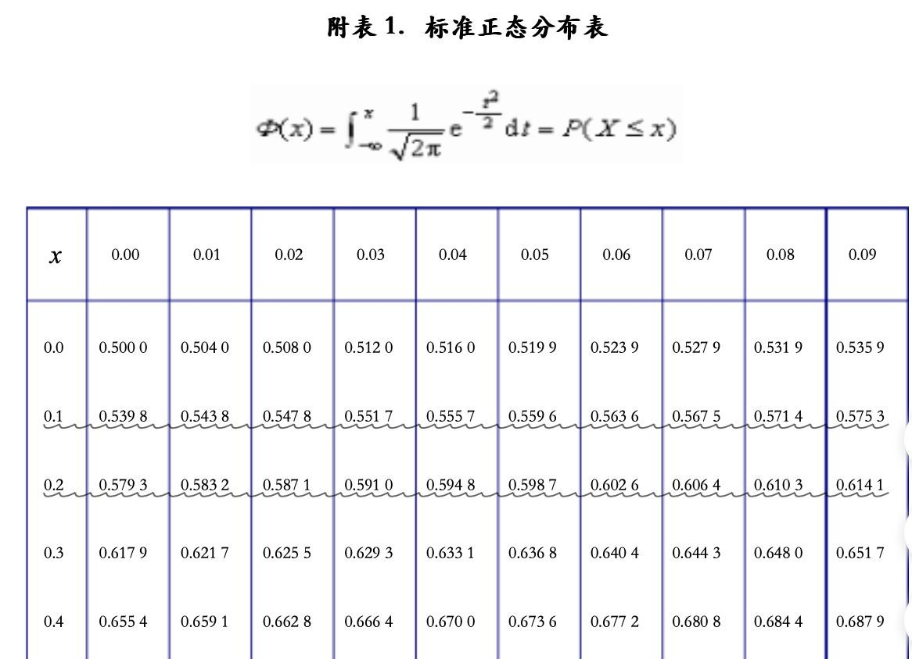求项目在 60 天内完成的概率

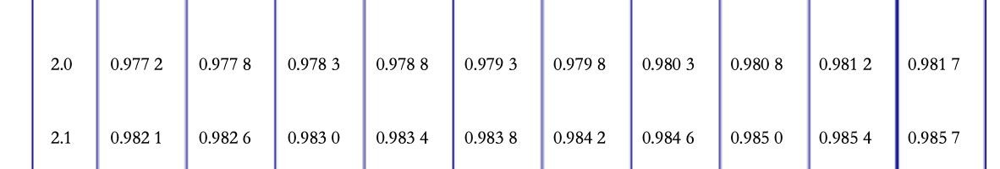

5. 如果客户要求再提前 7 天，求完成的概率

P t ≤ 53 = ∅

= ∅

= 0.6808

进度压缩

通常可用以下一些方法缩短活动的工期：

1. 赶工

投入更多的资源或增加工作时间，以缩短关键活动的工期。包括：批准加班、增加额外资源或支付加急费用，来加快关键路径上的活动。

2. 快速跟进

将正常情况下按顺序进行的活动或阶段改为并行施工，以缩短关键路径的长度。快速跟进可能造成返工和风险增加。

3. 使用高素质的资源或经验更丰富的人员；
4. 减小活动范围或降低活动要求；
5. 改进方法或技术，以提高生产效率；
6. 加强质量管理，及时发现问题，减少返工，从而缩短工期。

   【案例】某信息系统项目包含如下 10 个活动，各活动的历时、活动逻辑关系如下图所示。

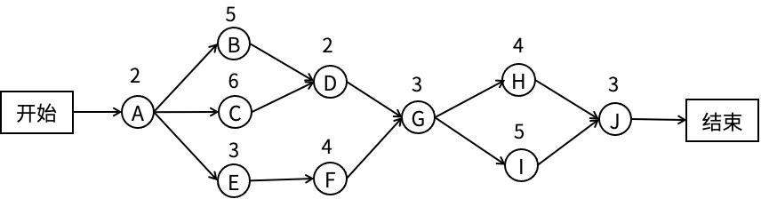

【问题】

在项目开始前，客户希望将项目工期压缩为 19 天，并愿意承担所发生的所有额外费用，经过对各项活动的测算发现，只有活动 B、C、I 有可能缩短工期，其余活动均无法缩短工期，活动 B、C、I 最多可以缩短的天数以及额外费用如下：

| 活动名称 | 最多可以缩短的天数 | 每缩短一天需要增加的额外费用 |
| -------- | ------------------ | ---------------------------- |
| B        | 2                  | 2000                         |
| C        | 3                  | 2500                         |
| I        | 3                  | 3000                         |

在此要求下，请给出费用最少的工期压缩方案及额外增加的费用。

【答案】

找到所有大于 19 的路径： ACDGIJ＝21

ABDGIJ＝20 ACDGHJ＝20 AEFGIJ＝20

压缩方案：

1.C 压缩 1 天，工期缩短 1 天，费用 2500 元

1. 压缩 1 天，工期缩短 1 天，费用 3000 元

需要额外增加费用 5500 元资源优化

1. 资源平衡

根据资源制约对开始日期和结束日期进行调整的一种技术。如果一个资源在同一时段内被分配至两个或多个活动，就需要进行资源平衡。

- 资源平衡导致关键路径改变，通常是延长

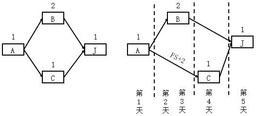

如果活动 B、C 都只能由小王完成 2.资源平滑

对活动进行调整，使项目资源需求不超过预定的资源限制的技术，活动只在其自由和总浮动时间内延迟。该技术不能实现所有资源的优化。

- 资源平滑不会改变关键路径

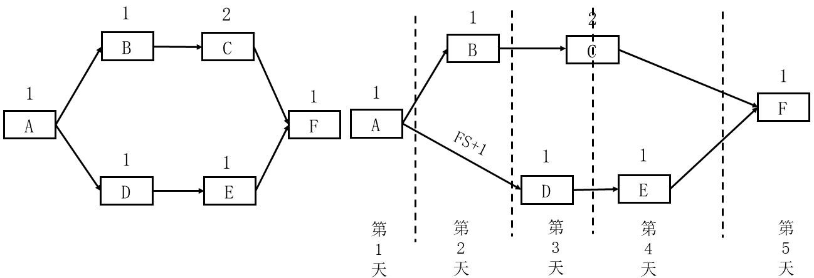

如果活动 B、D 都只能由小王完成

D 有一天的总浮动时间，可以通过滞后量，把 D 活动安排在第 3 天，避免了小王第二天资源负荷过大的问题，而且不影响整体工期。

【例题】

1. 给出一个网络图，如何判断是否做资源平滑？

【解析】有总浮动时间或自由浮动时间的网络图，才可能做资源平滑。没有总浮动时间或自由浮动时间的网络图，一定无法做资源平滑。

2. 资源平滑一定能解决资源冲突的问题？

   【解析】不一定。

六、控制进度

# 信息系统项目管理师-精讲班-进度管理 5

控制进度是监督项目状态，以更新项目进度和管理进度基准变更的过程。本过程作用：在整个项目期间保持对进度基准的维护。

输入&输出：

| 输入            | 输出            |
| --------------- | --------------- |
| 1、进度管理计划 | 1、工作绩效信息 |
| 2、项目进度计划 | 2、进度预测     |
| 3、工作绩效数据 | 3、变更请求     |
| 4、项目日历     |                 |
| 5、进度数据     |                 |

工具与技术：

【工具-1】迭代燃尽图

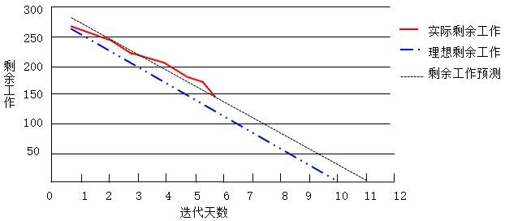

【工具-2】偏差分析

项目实际执行过程中，如果某活动落后了： 1.判断该活动的总浮动时间、自由浮动时间；

1. 如果活动落后时间小于等于总浮动时间，则不影响总工期；如果活动落后时间大于总浮动时间，则影响总工期。

   总工期落后时间=该活动拖后时间-总浮动时间。
2. 如果活动落后时间小于等于自由浮动时间，则不影响紧后工作；如果活动落后时间大于自由浮动时间，则影响紧后工作。

   紧后活动落后时间=该工作拖后时间-自由浮动时间。

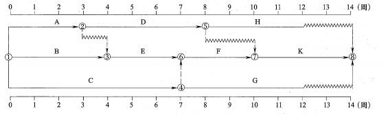【例题】如果活动 D 拖延两周，对总工期和紧后工作最早开始时间有什么影响？

【解析】在时标网络图中，活动 D 的总浮动时间为 2 周，自由浮动时间为 0 周。如果活动 D 拖延两周，小于等于总浮动时间，不影响总工期。

但是拖延时间大于自由浮动时间，影响紧后工作的最早开始时间，紧后工作的最早开始时间拖延 2 周。

# 信息系统项目管理师-精讲班-成本管理 1

第 11 章 项目成本管理

项目成本管理过程：一、规划成本管理 二、估算成本

三、制定预算四、控制成本成本的类型

- 项目成本：项目全过程所耗用的各种成本的总和
- 产品的全生命周期成本：在产品或系统的整个使用生命周期内，在获得阶段（设计、生产、安装和测试等活动，即项目存续期间）、运营与维护及生命周期结束时对产品的处置所发生的全部成本

  成本的类型：

| 名称     | 含义                                                             | 举例                                                                      |
| -------- | ---------------------------------------------------------------- | ------------------------------------------------------------------------- |
| 可变成本 | 随着生产量、工作量或时间而变的成本                               |                                                                           |
| 固定成本 | 不随生产量、工作量或时间的变化而变化的非重复成本                 |                                                                           |
| 直接成本 | 归属于项目工作的成本                                             | 项目团队差旅费、工资、项目使用的物料及设备使用费 ` `项目经理可以控制 |
| 间接成本 | 一般管理费用科目或几个项目共同担负的项目成本所分摊给本项目的费用 | 税金、额外福利和保卫费用等                                                |
| 机会成本 | 因为选择一个项目而放弃另一个项目，另一个项目可能带来的利益       |                                                                           |
| 沉没成本 | 任何已发生的成本，与是否合理无关                                 | 在决定是否继续某个出了问题的项目时，不应该考虑沉没成本                    |

一、规划成本管理输入&输出：

| 输入                                | 输出            |
| ----------------------------------- | --------------- |
| 1、项目章程 ` `2、项目管理计划 | 1、成本管理计划 |

【输出】成本管理计划

成本管理计划是项目管理计划的组成部分，描述将如何规划、安排和控制项目成本。成本管理计划包括：

1. 计量单位；
2. 精确度：根据活动范围和项目规模，设定成本估算向上或向下取整的程度，比如 995.59 美元，

   取整为 1000 美元；
3. 准确度：为活动成本估算规定一个可接受的区间（如±10%）；
4. 组织程序链接；
5. 控制临界值：可能需要规定偏差临界值，用于监督成本绩效；
6. 绩效测量规则：规定用于绩效测量的挣值管理（EVM）规则，规定跟踪方法，以及用于计算项目完工估算（EAC）的挣值管理公式；
7. 报告格式；
8. 其他细节。

| 项目成本管理计划  | 项目进度管理计划              |
| ----------------- | ----------------------------- |
| （1）精确度       | （1）进度计划的发布和迭代长度 |
| （2）准确度       | （2）准确度                   |
| （3）计量单位     | （3）计量单位                 |
| （4）控制临界值   | （4）控制临界值               |
| （5）绩效测量规则 | （5）绩效测量规则             |
| （6）报告格式     | （6）报告格式                 |
| （7）组织程序链接 | （7）项目进度模型             |
| （8）其他细节     | （8）项目进度模型维护         |
|                   | （9）工作分解结构（WBS）      |

估算成本是对完成项目工作所需资源成本进行近似估算的过程。本过程的主要作用是，确定完成项目 所需的资金。

- 对完成活动所需资源的可能成本进行的量化评估，是在某特定时点根据已知信息所做出的成本预测
- 通常用某种货币单位进行成本估算，但有时也可采用其他计量单位，如人时数或人天数，以消除通货膨胀的影响，便于成本比较
- 成本估算应该考虑针对项目收费的全部资源，一般包括人工、材料、设备、服务、设施，以及一些特殊的成本种类，如通货膨胀补贴、融资成本或应急成本
- 成本估算可在活动层级呈现，也可以通过汇总形成呈现
- 估算成本时，需要识别和分析可用于启动与完成项目的备选成本方案；需要权衡备选成本方案并 考虑风险，如比较自制成本与外购成本、购买成本与租赁成本及多种资源共享方案，以优化项目成本
- 在项目生命周期中，项目估算的准确性亦将随着项目的进展而逐步提高输入&输出：

| 输入                                | 输出                            |
| ----------------------------------- | ------------------------------- |
| 1、项目管理计划 ` `2、项目文件 | 1、成本估算 ` `2、估算依据 |

【输出-1】成本估算

对完成项目工作可能需要的成本，应对已识别风险的应急储备。成本估算可以是汇总的或详细分列的。成本估算应覆盖项目所使用的全部资源，如果间接成本也包含在项目估算中，则可在活动层次或更高层次上计列间接成本。

【输出-2】估算依据

成本估算所需的支持信息的数量和种类因应用领域而异，不论其详细程度如何，支持性信息包括：

1. 关于估算依据的文件；
2. 关于全部假设条件的文件；
3. 关于各种已知制约因素的文件；
4. 有关已识别的、在估算成本时应考虑的风险的文件；
5. 对估算区间的说明；
6. 对最终估算的置信水平的说明等。工具与技术：

   【工具】储备分析

|          | 对应风险                                         | 含义                                                                                                                          |
| -------- | ------------------------------------------------ | ----------------------------------------------------------------------------------------------------------------------------- |
| 应急储备 | 已知-未知 ` `已识别，但又无法主动管理的风险 | 包含在成本基准中 ` `项目经理有权使用 ` `可以为某个活动或整个项目建立应急储备                                        |
| 管理储备 | 未知-未知 ` `未知风险，无法进行主动管理     | 不包含在成本基准中 ` `属于项目总预算和资金需求 ` `使用管理储备项目经理需要申请 ` `使用管理储备需要变更成本基准 |

1.是不是要先用应急储备，再用管理储备？

不是，未知-未知风险发生的时候就用管理储备 2.管理储备如果用了的话，在不在成本基准中？

动用管理储备后，变更成本基准，增加已经动用的管理储备到成本基准中

三、制定预算

# 信息系统项目管理师-精讲班-成本管理 2

制定预算是汇总所有单个活动或工作包的估算成本，建立一个经批准的成本基准的过程。本过程的主要作用是：确定可以依据其来进行监督和控制项目绩效的成本基准。

估算成本与制定预算的区别：

- 估算成本

  估算成本是对完成项目工作所需资源成本进行近似估算的过程。
- 输出：成本估算
- 制定预算

  制定预算是汇总所有单个活动或工作包的估算成本，建立一个经批准的成本基准的过程。
- 输出：成本基准

对于小项目而言，成本估算和成本预算之间的关系极其密切，可以将其视为一个过程。项目预算的组成：

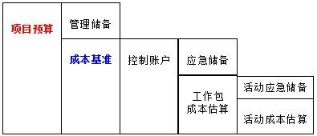

项目预算：包括经批准用于执行项目的全部资金。项目预算=成本基准+管理储备

成本基准：经过批准且按时间段分配的项目预算输入&输出：

| 输入            | 输出            |
| --------------- | --------------- |
| 1、成本管理计划 | 1、成本基准     |
| 2、资源管理计划 | 2、项目资金需求 |
| 3、范围基准     |                 |
| 4、成本估算     |                 |
| 5、估算依据     |                 |
| 6、项目进度计划 |                 |
| 7、风险登记册   |                 |
| 8、协议         |                 |

【输出-1】成本基准

成本基准：经过批准且按时间段分配的项目预算，包括应急储备，但不包括管理储备。

- 成本基准中包括预计支出及预计债务
- 只有通过正式的变更控制程序才能变更，用作与实际结果进行比较的依据
- 成本基准用于挣值分析

  【输出-2】项目资金需求

根据成本基准，确定总资金需求和阶段性（如季度或年度）资金需求。项目资金通常以增量的方式投入，并且可能是非均衡的，呈现出阶梯状。

如果有管理储备，则总资金需求等于成本基准加管理储备，在资金需求文件中，也可说明资金来源。

- 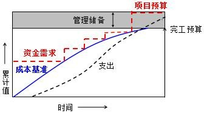S 曲线

  工具与技术：

  【工具-1】历史信息审核

历史信息包括各种项目特征（参数），它们用于建立数学模型预测项目总成本。审核历史信息有助于进行参数估算或类比估算。

类比和参数模型预测的成本及准确性可能差别很大，满足以下情况时，模型预测最为可靠：

1. 用来建立模型的历史信息准确；
2. 模型中的参数易于量化；
3. 模型可以调整，以便对大项目、小项目和各项目阶段都适用。

   【工具-2】融资

   融资是指为项目获取资金。

   【工具-3】资金限制平衡

应该根据对项目资金的限制来平衡资金支出，如果发现资金限制与计划支出之间存在差异，则可能需要调整工作的进度计划，以平衡资金的支出水平，例如可以通过在项目进度计划中添加强制日期来实现。

四、控制成本

# 信息系统项目管理师-精讲班-成本管理 3

控制成本是监督项目状态，以更新项目成本和管理成本基准变更的过程。本过程得主要作用是：在整个项目期间保持对成本基准的维护

- 成本控制中，应重点分析项目资金支出与完成的相应工作之间的关系
- 有效成本控制的关键在于管理经批准的成本基准输入&输出：

| 输入                                                            | 输出                                                    |
| --------------------------------------------------------------- | ------------------------------------------------------- |
| 1、项目管理计划 ` `2、项目资金需求 ` `3、工作绩效数据 | 1、工作绩效信息 ` `2、成本预测 ` `3、变更请求 |

项目成本控制的目标：

1. 对造成成本基准变更的因素施加影响；
2. 确保所有变更请求都得到及时处理；
3. 当变更实际发生时，管理这些变更；
4. 确保成本支出不超过批准的资金限额，既不超出按时段、WBS 组件和活动分配的限额，也不超出项目总限额；
5. 监督成本绩效，找出并分析与成本基准间的偏差；
6. 对照资金支出，监督工作绩效；
7. 防止在成本或资源使用报告中出现未经批准的变更；
8. 向干系人报告所有经批准的变更及其相关成本；
9. 设法把预期的成本超支控制在可接受的范围内等。挣值管理

   挣值管理（EVM：Earned Value Management）用于成本控制，是一种常用的项目绩效测量方法。

- 收集：进度如何、成本如何
- 对比：和计划比
- 预测：预测项目完工成本一、挣值分析四个基本参数

  【例题】某项目完工预算 100 万，工期 10 天，均匀分布。

  第 5 天末，整个项目完成了 40 万的工作，整个项目实际花费 45 万。

| 参数                 | 含义                                                                            | 举例子                                  |
| -------------------- | ------------------------------------------------------------------------------- | --------------------------------------- |
| 完工预算 ` `BAC | 项目完工预算，也就是成本基准（不含管理储备），` `也称为绩效测量基准（PMB） | 项目完工预算 100 万，` `BAC=100 万 |

现在是第 5 天末，执行情况：

- 按计划应该花费预算：50 万
- 实际花费：45 万元

| 参数                | 含义                     | 举例子                                                     |
| ------------------- | ------------------------ | ---------------------------------------------------------- |
| 计划价值 ` `PV | 某个时点，计划花费的预算 | 第 5 天末，按计划工作应该花费 ` `预算 50 万，PV=50 万 |
| 实际成本 ` `AC | 某个时点，实际花了多少钱 | 第 5 天末，实际花费 45 万，` `AC=45 万                |

实际完成了 40 万的工作，价值多少？

| 参数            | 含义                         | 举例子                                               |
| --------------- | ---------------------------- | ---------------------------------------------------- |
| 挣值 ` `EV | 某个时点，实际完成工作的预算 | 第 5 天末，实际完成了 40 万的工 ` `作，EV=40 万 |

- 完工预算（成本基准）：BAC=100 万
- 计划价值：PV=50 万
- 实际成本：AC=45 万
- 挣值：EV=40 万

1. 计划价值的总和是什么？

——计划价值代表着应该已经完成的工作，PV 的总和有时被称为绩效测量基准（PMB），项目的总计划价值为完工预算（BAC）。

2. 挣值能大于完工预算么？

——EV 的计算应该与 PMB 相对应，且所得的 EV 值不得大于相应组件的 PV 总预算。 3.实际花费有上限么？

——实际花费 AC 没有上限，为实现挣值所花费的任何成本都要计算进去。 4.项目经理只关注挣值 EV 的增量，行么？

——项目经理既要检测 EV 的增量，以判断当前的状态，又要监测 EV 的累计值，以判断长期的绩效趋势。

二、偏差分析

偏差一：进度是提前了还是落后了？

第 5 天末，计划完成 50 万工作，实际完成了 40 万工作，意味着什么？

| 参数             | 含义                                                                         | 举例子                                      |
| ---------------- | ---------------------------------------------------------------------------- | ------------------------------------------- |
| 进度偏差 SV      | 挣值与计划价值相减： EV-PV ` `小于 0，进度落后 ` `大于 0，进度提前 | 挣值 40 万-计划价值 50 万，小于 0，进度落后 |
| 进度绩效指数 SPI | EV/PV ` `小于 1，进度落后大于 1，进度提前                               | 40/50=0.8，小于 1，进度落后                 |

偏差二：成本是节约还是超支了？

第 5 天末，实际完成了 40 万工作，实际花了 45 万，意味着什么？

| 参数             | 含义                                                                       | 举例子                                      |
| ---------------- | -------------------------------------------------------------------------- | ------------------------------------------- |
| 成本偏差 CV      | 挣值与实际值相减： EV-AC ` `小于 0，成本超支 ` `大于 0，成本节约 | 挣值 40 万-实际支出 45 万，小于 0，成本超支 |
| 成本绩效指数 CPI | EV/AC ` `小于 1，成本超支大于 1，成本节约                             | 40/45，小于 1，成本超支                     |

偏差分析公式：

- 进度偏差 SV=EV-PV
- 成本偏差 CV=EV-AC
- 进度绩效指数 SPI=EV/PV
- 成本绩效指数 CPI=EV/AC EV 在前面或者在分子

  项目完工时：
- 进度偏差等于 0：全部的计划价值都将实现，进度偏差最终将等于零
- 成本偏差为完工预算（BAC）与实际成本之间的差值不管是成本还是进度：
- SV/CV，SPI/CPI 越大越好
- 进度超前，成本节省！

【例题】某软件开发项目包括 A、B、C 三项活动，目前各活动的相关信息如下（单位：万元），则该项目绩效处于（ ）状态。

| 活动 | PMB | PV | 完成 PMB 的百分比 | AC |
| ---- | --- | -- | ----------------- | -- |
| A    | 20  | 20 | 100%              | 20 |
| B    | 15  | 5  | 50%               | 6  |
| C    | 7   | 0  | 0                 | 0  |

1. 进度提前且成本节约
   1. 进度提前且成本超支
   2. 进度落后且成本节约
   3. 进度落后且成本超支

      【答案】A

【 解析】 PMB 绩效测量基准， 相当于项目预算。 BAC=42 万元， PV=25 万元， AC=26 万元， EV=20\*100%+15\*50%=27.5 万元，通过计算得出 CV 和 SV 均大于 0，说明进度提前且成本节约。

三、完工估算

【例题】某项目完工预算 100 万，工期 10 天，均匀分布。第 5 天末，整个项目完成了 40 万的工作，

整个项目实际花费 45 万。

项目还剩价值多少的工作未完成？

——还剩价值 60 万的工作未完成。

情况一（非典型）：剩余工作按计划完成

|          | 已完成工作 | 剩余工作 |
| -------- | ---------- | -------- |
| 工作价值 | 40 万      | 60 万    |
| 花费     | 45 万      | ？       |

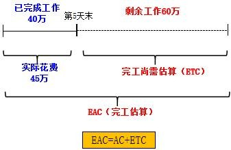

非典型偏差：

| 参数                 | 含义                                                                  | 举例子           |
| -------------------- | --------------------------------------------------------------------- | ---------------- |
| 完工尚需估算 ETC     | 非典型：偏差发生，不会再发生，剩余工作按计划预算做 ` `ETC=BAC-EV | ETC=100-40=60 万 |
| 完工估算 ` `EAC | EAC=AC+（BAC-EV）                                                     | EAC=45+60=105 万 |

情况一（非典型）题干表述：

非典：“非典型肺炎”，偏差出现一次就不会出现了

- 目前的情况只是暂时的
- 目前的情况是特殊情况
- 偏差后面不会再发生
- 剩余工作按预算单价

  情况二（典型）：剩余工作按现有绩效完成

|          | 已完成工作 | 剩余工作 |
| -------- | ---------- | -------- |
| 工作价值 | 40 万      | 60 万    |
| 花费     | 45 万      | ？       |

典型偏差：

| 参数                 | 含义                                                                      | 举例子                                                           |
| -------------------- | ------------------------------------------------------------------------- | ---------------------------------------------------------------- |
| 完工尚需估算 ETC     | 典型：偏差一直存在，即剩余工作按现有成本绩效做 ` `ETC=（BAC-EV）/CPI | CPI=EV/AC=40/45 ` `ETC=（100-40）/（40/45）=67.5 ` `万 |
| 完工估算 ` `EAC | EAC=AC+（BAC-EV）/CPI 或快速公式：EAC=BAC/CPI                             | EAC=45+67.5=112.5 万                                             |

情况二（典型）题干表述：

- 目前情况一直持续
- 后面工作一直是这种偏差
- 按此趋势
- 以当前 CPI 完成剩余工作完工估算 EAC=AC+ETC

  完工尚需估算 ETC=剩余工作/剩余工作的绩效

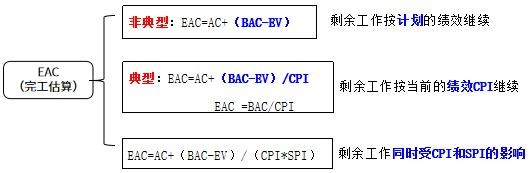

四、完工偏差

完工偏差 VAC=BAC-EAC

五、完工尚需绩效指数（TCPI）

TCPI 是一种为了实现特定的管理目标，剩余资源的使用必须达到的成本绩效指标，是完成剩余工作所 需的成本与剩余预算之比。

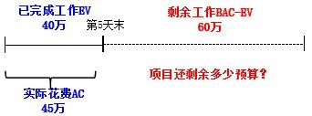

| 参数                      | 含义                                                                                  | 举例子                                    |
| ------------------------- | ------------------------------------------------------------------------------------- | ----------------------------------------- |
| TCPI ` `（按原预算） | 若需按原计划完成 ` `TCPI=（BAC-EV）/（BAC-AC）                                   | TCPI=（100-40）/（100-45）=1.09           |
| TCPI ` `（按新估算   | 若预算已明显不可行，则按新完工估算 EAC 来计算 TCPI ` `TCPI=（BAC-EV）/（EAC-AC） | TCPI=（100-40）/（112.5-45）` `=0.89 |

TCPI 是 CPI 分子分母都用 BAC 减一下完工尚需绩效指数 TCPI：越小越好。下列情况，哪个更容易完成？

- 剩余搬砖 200 块、10 元钱
- 剩余搬砖 100 块、10 元钱挣值管理小结

  挣值管理各指标的英文全称：

  BAC=Budget at Completion 完工预算

  AC=Actual Cost 实际成本

  EV=Earned Value 挣值

  PV=Planned Value 计划价值

  CV=Cost Variance 成本偏差

  SV=Schedule Variance 进度偏差

  CPI=Cost Performance Index 成本绩效指数

  SPI=Schedule Performance Index 进度绩效指数

  ETC=Estimate to Complete 完工尚需估算

  EAC=Estimate at Complete 完工估算

  VAC=Variance at Complete 完工偏差

  TCPI=To Complete Performance Index 完工尚需绩效指数

  挣值管理计算总结：

1. 寻找题目中的 BAC、PV、EV、AC；
2. 确定典型还是非典型；
3. 牢记以下公式：
   - 进度偏差 SV=EV-PV
   - 成本偏差 CV=EV-AC
   - 进度绩效指数 SPI=EV/PV
   - 成本绩效指数 CPI=EV/AC

- 非典型：EAC=AC+（BAC-EV）
  - 典型：EAC=AC+（BAC-EV）/CPI=BAC/CPI
  - 进度成本同时作用：EAC=AC+（BAC-EV）/（CPI\*SPI）
  - TCPI=（BAC-EV）/（BAC-AC）
  - TCPI=（BAC-EV）/（EAC-AC）（BAC 不可行，分母变 EAC）
  - VAC=BAC-EAC

    EV 总是在前面或者在分子

【真题】下表给出了某项目到 2019 年 6 月 30 日为止的成本执行（绩效）数据。计算该时间点上 BAC、 AC、PV 和 EV。

| 活动                         | 完成百分比 | 计划值（PV）/元 | 实际成本（AC）/元 |
| ---------------------------- | ---------- | --------------- | ----------------- |
| A                            | 100        | 2200.00         | 2500.00           |
| B                            | 100        | 2500.00         | 2900.00           |
| C                            | 100        | 2500.00         | 2800.00           |
| D                            | 80         | 1500.00         | 1500.00           |
| E                            | 70         | 3000.00         | 2500.00           |
| F                            | 60         | 2500.00         | 2200.00           |
| 合计                         | 14200.00   | 14400.00        |                   |
| 项目总预算（BAC）：40000.00  |            |                 |                   |
| 报告日期：2019 年 6 月 30 日 |            |                 |                   |

【答案】BAC=项目总预算=40000 元

AC=实际成本=每项活动实际成本的合计数=14400 元 PV=计划完成=每项活动计划完成的合计=14200 元

EV=活动实际完成=每项活动完成百分的合计=A+B+C+D\*80%+E\*70%+F\*60%

=2200+2500+2500+1500\*0.8+3000\*0.7+2500\*0.6=12000 元

【例题】某公司中标了一个软件开发项目，项目经理根据以往的经验估算了开发过程中各项任务需要的工期及预算成本，如下表所示。

到第 13 天晚上，项目经理检查了项目的进展情况和经费使用情况，发现 A、B、C 三项活动均已完工， D 任务明天可以开工，E 任务完成了一半，F 尚未开工。

请计算该项目第 13 天晚上，BAC，PV，EV，AC。

| 任务 | 紧前任务 | 工期 | PV  | AC  |
| ---- | -------- | ---- | --- | --- |
| A    | -        | 5    | 500 | 400 |
| B    | A        | 6    | 600 | 650 |
| C    | A        | 3    | 300 | 200 |
| D    | B，C     | 2    | 200 |     |
| E    | C        | 2    | 200 | 180 |
| F    | D，E     | 3    | 300 |     |

【答案】

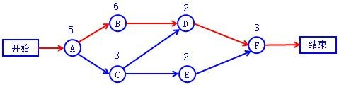

BAC：所有活动 PV 总和=500+600+300+200+200+300=2100

AC：实际花费，通过查询表格 AC 列加总： AC=400+650+200+180=1430

EV：实际完成工作，根据题干中的描述： EV=A+B+C+0.5×E=500+600+300+0.5×200=1500

PV：计划工作，需要通过网络图分析出第 13 天晚上，应该完成哪些工作，A、B、C、D、E 应该做完了： PV=A+B+C+D+E=500+600+300+200+200=1800

进度图上如何找 PV、EV，你掌握了么？

- BAC：题干文字、或者表中 PV 总和
- AC：题干文字、或者表中 AC 总和
- EV：题干文字
- PV：沿着进度网络图找，该时点应该进行到哪个活动，注意活动可能做完一部分

【例题】某项目的总预算为 20 万元，其中包含 2 万元管理储备和 2 万元应急储备，当项目进行到某一天时，项目实际完成的工作量仅为计划工作的 60%，此时 PV 为 12 万元，实际花费为 10 万元。

1. 请计算该项目的 BAC；
2. 请计算当前时点的 EV、CV、SV；
3. 在当前绩效下，请计算该项目的完工尚需估算 ETC。

   【答案】
4. BAC=总预算，包括应急储备，但不包括管理储备。BAC=20-2=18 万元
5. 题干中给出 PV=12 万、AC=10 万元。

EV=实际完成工作，根据题干描述，实际完成工作为计划工作的 60%。 EV=12×60%=7.2 万元

CV=EV-AC=7.2-10=﹣2.8 万元 SV=EV-PV=7.2-12=﹣4.8 万元

3. 完工尚需估算 ETC 是估算完成剩下工作所需要的成本。

题干中“在当前绩效下”，意思是用当前绩效完成剩下的工作，剩下的工作为 BAC-EV。 CPI=EV/AC=7.2/10=0.72

ETC=（BAC-EV）/CPI=（18-7.2）/0.72=15 万元

挣值图

【例题】假设每个活动结束了，才开始下一个活动。

第 14 天，整个项目完成了 40 万的活，整个项目实际花费 45 万。

| 活动     | 工期（天） | 成本（万元） |
| -------- | ---------- | ------------ |
| 需求分析 | 4 天       | 10 万        |
| 设计研发 | 20 天      | 80 万        |
| 系统测试 | 6 天       | 8 万         |
| 收尾     | 2 天       | 2 万         |

- 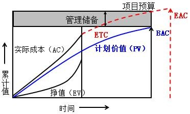挣值、计划值和实际成本

  【真题】以下是某项目的挣值图，图中 A、B、C、D 对应的数值分别是 600，570，500，450。

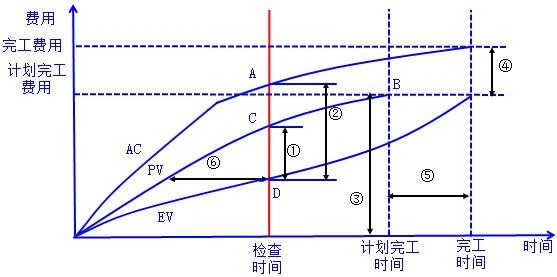

【问题 1】结合案例，请将图中的编号①～⑥填写在答题纸的对应栏内。

| 目前项目拖延工期 |  |
| ---------------- | - |
| 项目整体拖延工期 |  |
| 进度绩效         |  |
| 成本绩效         |  |
| 项目成本超支     |  |
| 计划完工成本     |  |

【答案】⑥⑤①②④③

【问题 2】结合案例，请计算项目在检查日期时的成本偏差（CV）和进度偏差（SV），并判断当时的执行绩效。

【答案】A 点在 AC 线上，是当前时间的 AC，AC=A=600

B 点是计划完成费用，BAC=B=570

C 点在 PV 线上，是当前时间的 PV，PV=C=500

D 点在 EV 线上，是当前时间的 EV，EV=D=450 CV=EV-AC=450-600=-150

SV=EV-PV=450-500=-50

CV＜0，成本超支；SV＜0，进度落后。

管理基础

（一）质量与项目质量 1.质量

# 信息系统项目管理师-精讲班-质量管理 1

第 12 章 项目质量管理

- 国际标准化组织（ISO）：反映实体满足主体明确和隐含需求的能力的特性总和
- 国家标准（GB/T19000-2008）：一组固有特性满足要求的程度 2.项目质量
- 项目产品质量：体现在产品性能或使用价值上
- 项目工作质量：项目质量体现在由 WBS 反映出的项目范围内所有的阶段、子项目、项目工作单元的质量构成

  工作质量则是产品质量的保证，它反映了与产品质量直接有关的工作对产品质量的保证程度。

不同的客户有着不同的质量要求，其意图已经反映在项目合同中。项目合同通常是进行项目质量管理的主要依据。

（二）质量与等级

质量：作为实现的性能或成果，是一系列内在特性满足要求的程度。等级：对用途相同但技术特性不同的可交付成果的级别分类。

- 一个低等级（功能有限）、高质量（无明显缺陷，用户手册易读）的软件产品，适合一般情况下使用，也可以被认可
- 一个高等级（功能繁多）、低质量（有许多缺陷，用户手册杂乱无章）的软件产品该产品的功能会因质量低劣而无效和/或低效，不会被使用者接受。

  （三）质量管理

质量管理是指确定质量方针、目标和职责，并通过质量体系中的质量规划、质量保证、质量控制以及质量改进来使其实现所有管理职能的全部活动。

- 质量方针：由组织的最高管理者正式发布的该组织总的质量宗旨和方向，由最高管理者批准
- 质量目标：在质量方面所追求的目的，它是落实质量方针的具体要求，它从属于质量方针，应与利润目标、成本目标、进度目标等相协调

【例如】项目：给客户定制 100 张桌子质量管理计划：

- 质量方针：把客户满意度放在第一位
- 质量目标：项目缺陷率低于 1%
- 质量标准：GB/T3976-2018 学校课桌功能、尺寸及技术要求

  （四）按有效性递增排列的五种质量管理水平

1. 代价最大的方法是让客户发现缺陷。这种方法可能会导致召回、商誉受损和返工成本。
2. 控制质量过程包括先检测和纠正缺陷，再将可交付成果发送给客户。该过程会带来相关成本，主要是评估成本和内部失败成本。
3. 通过质量保证检查并纠正过程本身。
4. 将质量融入项目和产品的规划和设计中。
5. 在整个组织内创建一种关注并致力于实现过程和产品质量的文化。

   （五）质量管理标准体系
6. ISO 9000 原则

GB/T 19000 系列标准可帮助各种类型和规模的组织实施并运行有效的质量管理体系，该系列质量管理体系能够帮助组织增进顾客满意。

| ISO 9000 系列 | 内容                                                                                           |
| ------------- | ---------------------------------------------------------------------------------------------- |
| ISO 9000      | 质量管理体系基础、规定质量管理体系术语                                                         |
| ISO 9001      | 质量管理体系要求、组织证实其具有提供满足顾客要求和适用的法规要求的产品能力，目的是增进顾客满意 |
| ISO 9002      | 质量管理体系 GB/T 19001 应用指南                                                               |
| ISO 9004      | 提供考虑质量管理体系的有效性和效率两方面指南，组织业绩改进和顾客及其他相关方满意               |
| ISO 19011     | 提供审核质量和环境管理体系指南                                                                 |

2. 全面质量管理

全面质量管理（TQM）是一种全员、全过程、全企业的品质管理，是将质量控制扩展到产品生命周期全过程。它由结构、技术、人员和变革推动者 4 个要素组成。

- 全员参加的质量管理
  - 全过程的质量管理
  - 全面方法的质量管理
  - 全面结果的质量管理

    （六）管理新实践
  - 客户满意
  - 持续改进
  - 管理层的责任
  - 与供应商的互利合作关系项目质量管理过程：

一、规划质量管理二、管理质量

三、控制质量

管理质量和控制质量：

- 在敏捷型项目中，整个项目期间的质量管理由所有团队成员在整个项目生命周期中执行
  - 在传统项目中，在瀑布或预测型项目中，质量管理通常是由特定团队成员在特定时间点或项目或阶段快结束时候执行

一、规划质量管理

# 信息系统项目管理师-精讲班-质量管理 2

规划质量管理是识别项目及其可交付成果的质量要求、标准，并书面描述项目将如何证明符合质量要求、标准的过程。

本过程的主要作用：为在整个项目期间如何管理和核实质量提供指南和方向。输入&输出：

| 输入            | 输出            |
| --------------- | --------------- |
| 1、项目管理计划 | 1、质量管理计划 |
| 2、干系人登记册 | 2、质量测量指标 |
| 3、风险登记册   |                 |
| 4、需求文件     |                 |

【输出-1】质量管理计划

质量管理计划是项目管理计划的组成部分，描述如何实施适用的政策、程序和指南以实现质量目标。应该在项目早期就对质量管理计划进行评审。

质量管理计划包括：

1. 项目采用的质量标准
2. 项目的质量目标
3. 质量角色与职责
4. 需要质量审查的项目可交付成果和过程
5. 为项目规划的质量控制和质量管理活动
6. 项目使用的质量工具
7. 与项目有关的主要程序，例如处理不符合要求的情况、纠正措施程序以及持续改进程序等

   【输出-2】质量测量指标

   质量测量指标专用于描述项目或产品属性，以及控制质量过程将如何验证符合程度。

质量测量指标包括：按时完成的任务的百分比、以 CPI 测量的成本绩效、故障率、识别的日缺陷数量、每月总停机时间、每个代码行的错误、客户满意度分数，以及测试计划所涵盖的需求百分比（即测试覆盖度）。

工具与技术：

【工具-1】质量成本（COQ）

质量成本指在产品生命周期中发生的所有成本，包括为预防不符合要求、为评价产品或服务是否符合要求，以及因未达到要求而发生的所有成本。

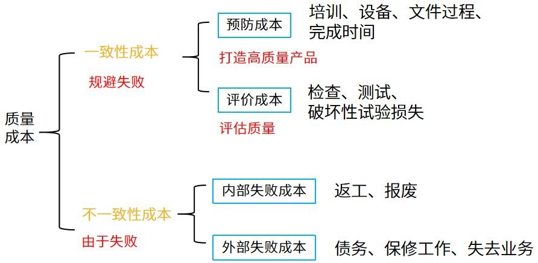

【真题】下列质量活动所产生的成本，（ ）属于非一致性成本。

1. 组织员工进行业务培训
2. 采购项目所需设备
3. 产品上市后的保修业务
4. 产品出厂前做的破坏性测试

   【答案】C

   【解析】产品上市后的保修业务属于非一致性成本中的外部失败成本。

   【工具-2】成本效益分析

成本效益分析是用来估算备选方案优势和劣势的财务分析工具，以确定可以创造最佳效益的备选方案。达到质量要求的主要效益包括减少返工、提高生产率、降低成本、提升干系人满意度及提升赢利能力。

对每个质量活动进行成本效益分析，就是要比较其可能成本与预期效益。

【工具-3】逻辑数据模型

把组织数据可视化，用业务语言加以描述，不依赖任何特定技术。逻辑数据模型可用于识别会出现数 据完整性或其他问题的地方。

| 仓库     |           | 职工     |
| -------- | --------- | -------- |
| 仓库编号 |           | 职工编号 |
| 职工编号 |           | 职工姓名 |
| 仓库面积 | 仓库-职工 | 职工性别 |
| 电话     | →        | 职工年龄 |
|          |           | 职级     |
|          |           | 联系电话 |
|          |           | 备注     |

【工具-4】流程图

用来显示将一个或多个输入转化成一个或多个输出的过程中，所需步骤顺序和可能分支。可帮助改进 过程并识别可能出现质量缺陷或可以纳入质量检查的地方。

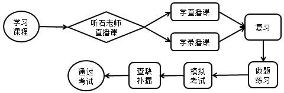

【工具-5】矩阵图

在行列交叉的位置展示因素、原因和目标之间的强弱关系。矩阵图有助于识别对项目成功至关重要的 质量测量指标。

根据可用来比较因素的数量，项目经理可使用不同形状的矩阵图。

|      | 原因   |        |        |    |
| ---- | ------ | ------ | ------ | -- |
|      | 原因 1 | 原因 2 | 原因 3 |    |
| 问题 | 问题 1 | △     |        |    |
|      | 问题 2 |        | ●     | ○ |
|      | 问题 3 |        | ○     |    |

- 密切关系 ○有关系 △可能有关系

  【工具-6】思维导图

  用于可视化组织信息的绘图法，有助于快速收集项目质量要求、制约因素、依赖关系的联系。

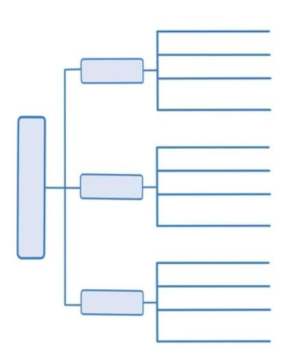

【工具-7】测试与检查的规划

在规划阶段，项目经理和项目团队决定如何测试或检查产品、可交付成果或服务，以满足干系人的需求和期望，以及如何满足产品的绩效和可靠性目标。

【真题】在规划质量管理过程中，确定项目和产品质量标准时的正确做法是（ ）。

1. 使用决策分析识别达到项目目标所需的关键活动
2. 使用回归分析展示项目团队成员的技能分布
3. 使用流程图分析评估项目成本与质量之间的关系
4. 使用因果图监控项目过程中的质量和性能表现

   【答案】C

【解析】流程图有助于了解和估算一个过程的质量成本，通过工作流的逻辑分支及其相对频率来估算质量成本，这些逻辑分支细分为完成符合要求的输出而需要开展的一致性工作和非一致性工作。

二、管理质量

# 信息系统项目管理师-精讲班-质量管理 3

管理质量是把组织的质量政策用于项目，并将质量管理计划转化为可执行的质量活动的过程。本过程的主要作用：

1. 提高实现质量目标的可能性；
2. 识别无效过程和导致质量低劣的原因；
3. 使用控制质量过程的数据和结果向干系人展示项目总体质量状态。

管理质量贯穿全程，所有人的共同职责，包括项目经理、项目团队、项目发起人、执行组织的管理层，甚至是客户。

管理质量有时被称为“质量保证”，但“管理质量”的定义比“质量保证”更广。

- 质量保证着眼于项目使用的过程，管理质量可用于非项目工作
  - 管理质量包括所有质量保证活动，还与产品设计和过程改进有关
  - 管理质量的工作属于质量成本框架中的一致性工作管理质量有助于：

1. 通过执行有关产品特定方面的设计准则，设计出最优的成熟产品；
2. 建立信心，相信通过质量保证工具和技术可以使未来输出在完工时满足特定的需求和期望；
3. 确保使用质量过程并确保其使用能够满足项目的质量目标；
4. 提高过程和活动的效率和效果，获得更好的成果和绩效并提高干系人的满意度。输入&输出：

| 输入                | 输出                |
| ------------------- | ------------------- |
| 1、质量管理计划     | 1、质量报告         |
| 2、质量测量指标     | 2、测试与评估文件   |
| 3、质量控制测量结果 | 3、变更请求         |
| 4、经验教训登记册   | 4、项目管理计划更新 |
| 5、风险报告         | 5、项目文件更新     |

【输出-1】质量报告

质量报告可能是图形、数据或定性文件，其中包含的信息可帮助其他过程和部门采取纠正措施，以实现项目质量期望。

质量报告可包含：

- 团队上报的质量管理问题
  - 针对过程、项目和产品的改善建议
  - 纠正措施建议（包括返工、缺陷/漏洞补救、100%检查等）
  - 控制质量过程中发现的情况的概述

    【输出-2】测试与评估文件

可基于行业需求和组织模版创建测试与评估文件。它们是控制质量过程的输入，用于评估质量目标的实现情况。这些文件包括专门的核对单和详尽的需求跟踪矩阵。

工具与技术：

【工具-1】审计

审计是用于确定项目活动是否遵循了组织和项目的政策、过程与程序的一种结构化且独立的过程。 质量审计通常由项目外部的团队开展，如组织内部审计部门、项目管理办公室（PMO）或组织外部的审计师。质量审计可事先安排，也可随机进行；可由内部或外部审计师进行。

质量审计还可确认已批准的变更请求的实施情况。质量审计目标：

1. 识别全部正在实施的良好及最佳实践；
2. 识别所有违规做法、差距及不足；
3. 分享所在组织和/或行业中类似项目的良好实践；
4. 积极、主动地提供协助，以改进过程的执行，从而帮助团队提高生产效率；
5. 强调每次审计都应对组织经验教训知识库的积累做出贡献等。

   【工具-2】核对单

核对单是一种结构化工具，通常列出特定组成部分，用来核实所要求的一系列步骤是否已得到执行或检查需求列表是否已得到满足。

质量核对单应该涵盖在范围基准中定义的验收标准。

【工具-3】文件分析

分析项目控制过程所输出的不同文件，如质量报告、测试报告、绩效报告和偏差分析，可以重点指出可能超出控制范围之外并阻碍项目团队满足特定要求或干系人期望的过程。

【工具-4】过程分析

识别过程改进机会，同时检查在过程期间遇到的问题、制约因素以及非增值活动。

【工具-5】面向 X 的设计

面向 X 的设计（DfX）是产品设计期间可采用的一系列技术指南，旨在优化设计的特定方面，可以控制或提供产品最终特性。

DfX 中的 X 可以是产品开发的不同方面，例如可靠性、调配、装配、制造、成本、服务、可用性、安全性和质量。使用 DfX 可以降低成本、改进质量、提高绩效和客户满意度。

【工具-6】问题解决

问题解决发现解决问题或应对挑战的解决方案。问题解决方法通常包括以下要素：

- 定义问题
  - 识别根本原因
  - 生成可能的解决方案
  - 选择最佳解决方案
- 执行解决方案
  - 验证解决方案的有效性

    【工具-7】质量改进方法

质量改进的开展，可基于质量控制过程的发现和建议、质量审计的发现或管理质量过程的问题解决。计划-实施-检查-行动（PDCA）和六西格玛是常用的两种质量改进工具。

【工具-8】数据表现

| 数据表现 | 含义                                                                                                                              |
| -------- | --------------------------------------------------------------------------------------------------------------------------------- |
| 亲和图   | 对潜在缺陷成因进行分类，展示最应关注的领域                                                                                        |
| 因果图   | 又称“鱼骨图”“why-why 分析图”和“石川图”将问题陈述的原因分解为离散 ` `的分支，有助于识别问题的主要原因或根本原因         |
| 流程图   | 展示了引发缺陷的一系列步骤                                                                                                        |
| 直方图   | 展示数字数据的条形图，可展示每个可交付成果的缺陷数量、缺陷成因排列、各 ` `个过程的不合规次数，或项目或产品缺陷的其他表现形式 |
| 矩阵图   | 在行列交叉的位置展示因素、原因和目标之间的关系强弱                                                                                |
| 散点图   | 一种展示两个变量之间关系的图形，它能够展示两支轴的关系，一支轴表示过程、` `环境或活动的任何要素，另一支轴表示质量缺陷        |

- 亲和图

  例如：如何快速通过考试？

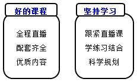

- 因果图

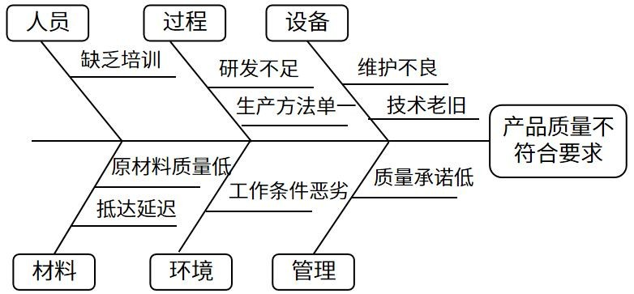

- 散点图

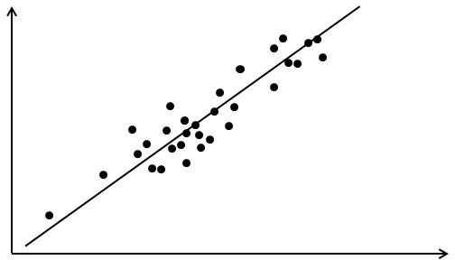

- 直方图

  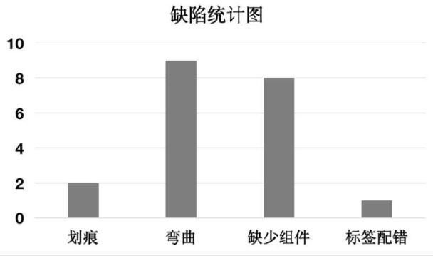

  【例题】关于“管理质量”过程的描述，不正确的是（ ）。

  1. 管理质量是把组织的质量政策用于项目，并将质量管理计划转化为可执行的质量活动的过程
  2. 管理质量是所有人的共同职责，包括项目经理、项目团队、项目发起人、执行组织的管理层
  3. 管理质量包括所有质量保证活动，与产品设计和过程改进无关
  4. 管理质量过程需要在整个项目期间开展

     【答案】C

     【解析】本题考查管理质量的相关内容。

     管理质量包括所有质量保证活动，还与产品设计和过程改进有关。

三、控制质量

# 信息系统项目管理师-精讲班-质量管理 4

控制质量是为了评估绩效，确保项目输出完整、正确且满足客户期望，而监督和记录质量管理活动执行结果的过程。

本过程的主要作用：

1. 核实项目可交付成果和工作已经达到主要干系人的质量要求，可供最终验收；
2. 确定项目输出是否达到预期目的，这些输出需要满足所有适用标准、要求、法规和规范。控制质量过程的目的是在用户验收的最终交付之前测量产品或服务的完整性、合规性和适用性。控制质量的努力程度和执行程度可能会因所在行业和项目管理风格而不同。

   输入&输出：

| 输入              | 输出                |
| ----------------- | ------------------- |
| 1、项目管理计划   | 1、质量控制测量结   |
| 2、质量测量指标   | 2、核实的可交付成果 |
| 3、测试与评估文件 | 3、工作绩效信息     |
| 4、可交付成果     | 4、变更请求         |
| 5、批准的变更请求 |                     |
| 6、工作绩效数据   |                     |

【输入-1】可交付成果【输出-1】核实的可交付成果

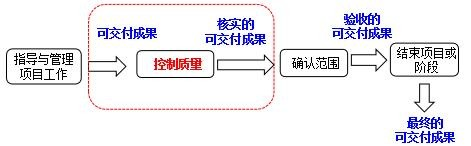

工具与技术：

【工具-1】核对单

有助于以结构化的方式管理控制质量活动。

【工具-2】核查表

又称计数表，用于合理排列各种事项，以便有效地收集关于潜在质量问题的有用数据。

| 序号 | 缺陷项目 | 日期 1 | 日期 2 | 日期 3 | 日期 4 | 小计 |
| ---- | -------- | ------ | ------ | ------ | ------ | ---- |
| 1    | 划痕     | 1      | 0      | 0      | 1      | 2    |
| 2    | 弯曲     | 3      | 3      | 1      | 2      | 9    |
| 3    | 缺少组件 | 3      | 2      | 2      | 1      | 8    |
| 4    | 标签配错 | 1      | 0      | 0      | 0      | 1    |
| 合计 |          |        |        |        |        | 20   |

【工具-3】统计抽样

统计抽样是指从目标总体中选取部分样本用于检查。样本用于测量控制和确认质量。抽样的频率和规模应在规划质量管理过程中确定。

【工具-4】问卷调查

可用于在部署产品或服务之后收集关于客户满意度的数据。在问卷调查中识别的缺陷相关成本被视为 COQ 模型中的外部失败成本，给组织带来的影响会超出成本本身。

【工具-5】绩效审查

针对实际结果测量、比较和分析规划质量管理过程中定义的质量测量指标。

【工具-6】测试/产品评估

测试是一种有组织的、结构化的调查，旨在根据项目需求提供有关被测产品或服务质量的客观信息。软件测试可能包括单元测试、集成测试、黑盒测试、白盒测试、接口测试、回归测试、α测试等。

【工具-7】控制图

用于确定一个过程是否稳定，或者是否具有可预测的绩效。

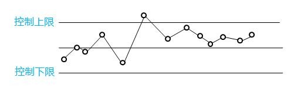

规格上限和下限是根据要求制定的，反映了可允许的最大值和最小值。上下控制界限不同于规格界限。控制界限根据标准的统计原则，通过标准的统计计算确定，代表一个稳定过程的自然波动范围。

# 信息系统项目管理师-精讲班-资源管理 1

第 13 章 项目资源管理

项目资源管理包括识别、获取和管理所需资源以成功完成项目的各个过程，确保项目经理和项目团队在正确的时间和地点使用正确的资源。

项目资源包括：

- 实物资源：设备、材料、设施和基础设施
- 团队资源：人力资源项目资源管理过程：

一、规划资源管理二、估算活动资源三、获取资源

四、建设团队 五、管理团队 六、控制资源 剪裁考虑因素：

由于每个项目都是独特的，项目经理可以根据需要对项目资源管理过程进行剪裁。剪裁时应考虑的因素包括：

- 多元化
- 物理位置
- 行业特定资源
- 团队成员的获得
- 团队管理
- 生命周期方法资源管理基础知识

  （一）项目团队、项目管理团队、项目经理
- 项目团队

为了完成项目而承担不同角色与职责的人员组成。项目团队成员可能具备不同的技能，可能是全职的或兼职的，可能随项目进展而增加或减少。

- 项目管理团队

直接参与项目管理活动的项目团队成员，负责项目管理和领导活动，对于小型项目，项目管理职责可由整个项目团队分担，或者由项目经理独自承担。

- 项目经理

  执行组织委派，领导项目团队实现项目目标的个人。

  （二）领导和管理
- 管理者：被组织赋予职位和权力，负责某件事情的管理或实现某个目标
- 领导者：让一个群体为了一个共同的目标而努力的能力。尊重和信任是有效领导力的关键要素，领导力是一种影响力

  领导者的工作：

1. 确定方向
2. 统一思想
3. 激励和鼓舞

   领导“人”、管理“事”：

   - 领导者设定目标，管理者率众实现目标

- 项目经理具有领导者和管理者的双重身份，两者缺一不可
  - 对于大型复杂项目，领导能力尤为重要

    （三）权力

权力是影响行为、改变事情的过程和方向、克服阻力、使人们进行原本并不愿意进行事情的潜在能力。项目经理的权力有 5 种来源：

1. 职位权力：来源于管理者在组织中的职位和职权；
2. 惩罚权力：使用降职、扣薪、惩罚、批评、威胁等负面手段的能力，尽量避免使用；
3. 奖励权力：给予下属奖励的能力；
4. 专家权力：来源于个人的专业技能；
5. 参照权力：由于成为别人学习参照榜样所拥有的力量。
   - 职位权力、惩罚权力、奖励权力来自于组织的授权
   - 专家权力、参照权力来自于管理者自身

     （四）冲突和竞争

- 冲突：两个或两个以上的社会单元在目标上互不相容或互相排斥，从而产生心理上的或行为上的矛盾
- 竞争：竞争的双方则具有同一个目标，不需要发生势不两立的争夺
  - 冲突不一定是有害的，“一团和气”的集体不一定是一个高效率的集体
  - 项目经理对于有害的冲突要设法加以解决或减少；对有益的冲突要加以利用，要鼓励团队成员良性竞争

    （五）团队发展阶段

| 阶段       | 内容                                                                                                                                   |
| ---------- | -------------------------------------------------------------------------------------------------------------------------------------- |
| 1.形成阶段 | 互相认识、互相独立，不一定开诚布公，开始形成共同目标                                                                                   |
| 2.震荡阶段 | 开始执行分配的任务，一般会遇到超出预想的困难，开始争执，互相指责，怀疑项目 ` `经理的能力                                          |
| 3.规范阶段 | 开始协同工作，并调整各自的工作习惯和行为来支持团队，开始互相信任，项目经理 ` `能得到团队的认可                                    |
| 4.发挥阶段 | 组织有序，相互依靠，平稳高效地解决问题，团队成员的集体荣誉感非常强，常以“我 ` `们组”“我们部门” 称呼团队，并会努力捍卫团队声誉 |
| 5.解散阶段 | 所有工作完成后，项目结束，团队解散                                                                                                     |

团队发展阶段应注意：

1. 通常按顺序进行，然而，团队停滞在某个阶段或退回到较早阶段的情况也并非罕见；
2. 如果团队成员曾经共事过，项目团队建设也可跳过某些阶段；
3. 某个阶段持续时间的长短，取决于团队活力、团队规模和项目管理团队的领导力。

   （六）激励理论
4. 马斯洛需求层次理论

| 层次       | 需求 | 举例                                                                   |
| ---------- | ---- | ---------------------------------------------------------------------- |
| 5.自我实现 | 高   | 给他更多的空间让他负责、让他成为智囊团、参与决策、参与组织的管理会议等 |
| 4.受尊重   | 低   | 荣誉性的奖励，形象、地位提升，颁发奖章，作为导师培训别人等             |
| 3.社会交往 | 低   | 定期员工活动、聚会、比赛、俱乐部等                                     |
| 2.安全     | 低   | 养老保险、医疗保障、长期劳动合同、意外保险、失业保险等                 |
| 1.生理     | 低   | 员工宿舍、工作餐、工作服、班车、工资、补贴、奖金等                     |

2. 赫茨伯格双因素理论
3. 保健因素：与工作环境或条件有关的，能防止人们产生不满意感的一类因素。

- 工作环境、工资薪水、组织政策、个人生活、管理监督、人际关系等

2. 激励因素：与员工的工作本身或工作内容有关的，能促使人们产生工作满意感的一类因素。
   - 成就、承认、工作本身、责任、发展机会等

     3.X 理论和 Y 理论

X 理论：注重满足员工的生理需求和安全需求，激励仅在生理和安全层次起作用，同时很注重惩罚； Y 理论：认为激励在需求的各个层次上都起作用，激励方法包括将员工个人目标与组织目标融合，扩大员工的工作范围，尽可能把员工的工作安排得富有意义并具有挑战性，使其工作之后感到自豪，满足其自尊和自我实现的需要，使员工达到自我激励。

X 理论：

1. 人天性好逸恶劳，只要有可能就会逃避工作；
2. 人生来就以自我为中心，漠视组织的要求；
3. 人缺乏进取心，逃避责任，甘愿听从指挥，安于现状，没有创造性；
4. 人们通常容易受骗，易受人煽动；
5. 人们天生反对改革；
6. 人的工作动机就是为了获得经济报酬。 Y 理论：
7. 人天生并不是好逸恶劳，他们热爱工作，从工作得到满足感和成就感；
8. 外来的控制和处罚对人们实现组织的目标不是一个有效的办法，下属能够自我确定目标，自我指挥和自我控制；
9. 在适当的条件下，人们愿意主动承担责任；
10. 大多数人具有一定的想象力和创造力；
11. 在现代社会中，人们的智慧和潜能只是部分地得到了发挥，如果给予机会，人们喜欢工作，并渴望发挥其才能。

- 崇尚 X 理论的领导者：在领导工作中必须对员工采取强制、惩罚和解雇等手段，强迫员工努力工作，对员工应当严格监督、控制和管理
- 崇尚 Y 理论的管理者：对员工采取以人为中心的、宽容的及放权的领导方式，使下属目标和组织目标很好地结合起来，为员工的智慧和能力的发挥创造有利的条件，但对于员工把握工作而言可能又放任过度

项目团队的开始阶段，运用 X 理论去指导和管理；当项目进入执行阶段，可以运用 Y 理论授权团队完成所负责的工作。

4. 期望理论

期望理论认为，一个目标对人的激励程度受两个因素影响：激发力量＝目标效价×期望值

- 目标效价：实现该目标对个人有多大价值的主观判断，价值大，激励作用大
  - 期望值：个人对实现该目标可能性大小的主观估计，可能性大，激励作用大期望理论在实践中的基本原则：

1. 管理者不要泛泛地抓一般的激励措施，而应当抓多数被组织成员认为效价最大的激励措施；
2. 设置某一激励目标时应尽可能加大其效价的综合值；
3. 适当加大不同人实际所得效价的差值，加大组织希望行为与非希望行为之间的效价差值，如只奖不罚与奖罚分明，其激励效果大不一样；
4. 适当控制期望概率与实际概率。期望概率既不是越大越好，也不是越小越好，关键要适当。当 一个期望概率远高于实际概率时可能产生挫折，而期望概率太小时又会减少某一目标的激发力量。实际概率最好大于平均的个人期望概率，使大多数人受益。但实际概率应与效价相适应，效价大，实际

概率可以小些；效价小，实际概率可以大些。

【例题】关于团队管理的描述，不正确的是（ ）。

1. 滥用惩罚权力可能会导致项目失败，应谨慎使用
2. 在赫茨伯格双因素理论中，保健因素的满足可以消除不满，激励因素的满足可以产生满意感
3. 奖励权利来自于组织的授权，参照权利来自于管理者自身
4. X 理论可以激发员工主动性，Y 理论注重加强管理与惩罚

   【答案】D

【解析】崇尚 X 理论的领导者认为，在领导工作中必须对员工采取强制、惩罚和解雇等手段，强迫员工努力工作，对员工应当严格监督、控制和管理；在领导行为上应当实行高度控制和集中管理。

崇尚 Y 理论的管理者对员工采取以人为中心的、宽容的及放权的领导方式，使下属目标和组织目标很好地结合起来，为员工的智慧和能力的发挥创造有利的条件。

X 理论和 Y 理论的选择决定管理者处理员工关系的方式。这两个理论各有自己的长处和不足。用 X 理论可以加强管理，但项目团队成员通常是比较被动地工作。用 Y 理论可以激发员工主动性，但对于员工把握工作而言可能又放任过度。

（七）管理新实践

1. 资源管理方法：精益管理、准时制（JIT）生产、持续改善（Kaizen）、全员生产维护（TPM）、约束理论等
2. 情商
3. 自组织团队
4. 虚拟团队/分布式团队

一、规划资源管理

# 信息系统项目管理师-精讲班-资源管理 2

规划资源管理是定义如何估算、获取、管理和利用团队以及实物资源的过程。本过程的主要作用：

根据项目类型和复杂程度确定适用于项目资源的管理方法和管理程度。 项目资源可以从组织内部资产获得，或者通过采购过程从组织外部获取。输入&输出：

| 输入            | 输出            |
| --------------- | --------------- |
| 1、项目章程     | 1、资源管理计划 |
| 2、质量管理计划 | 2、团队章程     |
| 3、项目进度计划 | 3、项目文件更新 |
| 4、需求文件     |                 |
| 5、范围基准     |                 |
| 6、风险登记册   |                 |
| 7、干系人登记册 |                 |

【输出-1】资源管理计划

资源管理计划的内容主要包括：

1. 识别资源
2. 获取资源
3. 资源控制
4. 角色与职责
5. 项目组织图
6. 项目团队资源管理
7. 培训
8. 团队建设
9. 认可计划

   ①角色：项目中某人承担的职务或分配给某人的职务，如土木工程师、商业分析师和测试协调员；

   ②职权：使用项目资源、做出决策、签字批准、验收可交付成果并影响他人开展项目工作的权力；

   ③职责：为完成项目活动，项目团队成员必须履行的职责和工作；

   ④能力：为完成项目活动，项目团队成员须具备的技能和才干。

   【输出-2】团队章程

团队章程是为团队创建团队价值观、共识和工作指南的文件。团队章程包括：

- 团队价值观
- 沟通指南
- 决策标准和过程
- 冲突处理过程
- 会议指南
- 团队共识工具与技术：

【工具-1】数据表现

图表适用于规划资源管理过程的数据表现。数据表现有多种格式来记录和阐明团队成员的角色与职责。

层级型文本型矩阵型

- 层级型

  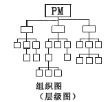可采用传统的组织结构图，自上而下地显示各种职位及其相互关系。

1. 工作分解结构（WBS）

   用来显示如何把项目可交付成果分解为工作包；
2. 组织分解结构（OBS）

按照组织现有的部门、单元或团队排列，并在每个部门下列出项目活动或工作包。只需要找到其所在的 OBS 位置，就能看到自己的全部项目职责；

3. 资源分解结构（RBS）

按资源类别和类型，对资源的层级列表，用于规划、管理和控制项目工作。每向下一个层级代表对资源的更详细描述，直到信息细到可以与工作分解结构（WBS）相结合。

- 文本型

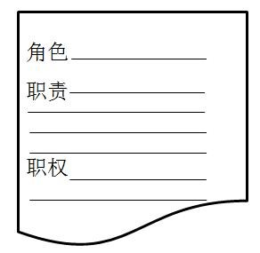如果需要详细描述团队成员的职责，就可以采用文本型。文本型文件通常以概述的形式，提供诸如职责、职权、能力和资格等方面的信息。

- 矩阵型

  展示项目资源在各个工作包中的任务分配。

责任分配矩阵（RAM）（Responsibility Assignment Matrix）是用来显示分配给每个工作包的项目资源的表格，用于说明工作包或活动与项目团队成员之间的关系。

责任分配矩阵一种是 RACI 矩阵（Responsible Accountable Consult Inform）

| RACI 矩阵    | 人员   |        |        |        |      |
| ------------ | ------ | ------ | ------ | ------ | ---- |
| 活动         | 张美丽 | 李致远 | 王智慧 | 赵先修 | 刘工 |
| 创建章程     | A      | R      | I      | I      | I    |
| 收集需求     | I      | A      | R      | C      | C    |
| 提交变更请求 | I      | A      | R      | R      | C    |
| 制订测试计划 | A      | C      | I      | I      | R    |

R＝执行 A＝负责 C＝咨询 I＝知情

责任分配矩阵中每个活动 A 只能有一个，可确保任何一项任务都只有一个人负责，从而避免职责不清。

- 分配给每项工作的资源可以是个人或小组
- 反映与每个人相关的所有活动；反映与每项活动相关的所有人
- 大型项目中，可以制定多个层次的责任分配矩阵。高层次 RAM 可定义项目团队中的各小组分别负责 WBS 中的哪部分工作；低层次 RAM 则可在各个小组内为具体活动分配角色、职责和职权
- 确保任何一项任务都只有一个人负责，从而避免职责不清

  【工具-2】组织理论

组织理论阐述个人、团队和组织部门的行为方式。有效利用组织理论中的常用技术，可以节约规划资源管理过程的时间、成本及人力投入，提高规划工作的效率。

二、估算活动资源

估算活动资源是估算执行项目所需的团队资源，以及材料、设备和用品的类型和数量的过程。本过程的主要作用：

明确完成项目所需的资源种类、数量和特性。输入&输出：

| 输入            | 输出            |
| --------------- | --------------- |
| 1、资源管理计划 | 1、资源需求     |
| 2、资源日历     | 2、资源分解结构 |
| 3、范围基准     | 3、估算依据     |
| 4、活动清单     | 4、项目文件更新 |
| 5、活动属性     |                 |
| 6、成本估算     |                 |
| 7、风险登记册   |                 |
| 8、假设日志     |                 |

【输出-1】资源需求

识别了各个工作包或工作包中每项活动所需的资源类型和数量，可以汇总这些需求，以估算每个工作包、每个 WBS 分支以及整个项目所需的资源。

【输出-2】资源分解结构（RBS）

资源依类别和类型的层级展现。资源分解结构是一份完整的文件，用于获取和监督资源。

- 资源类别：（但不限于）人力、材料、设备和用品
- 资源类型：技能水平、要求证书、等级水平或适用于项目的其他类型
- 资源分解结构（RBS） Resource Breakdown Structure

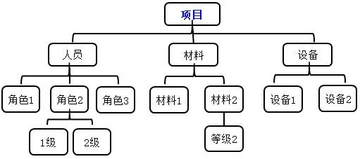

【输出-3】估算依据

资源估算的支持信息包括：

- 估算方法
- 用于估算的资源，如以往类似项目的信息
- 与估算有关的假设条件
- 已知的制约因素
- 估算范围
- 估算的置信水平
- 有关影响估算的已识别风险的文件等工具与技术：

  【工具】数据分析

适用于估算活动资源过程的数据分析技术是备选方案分析。备选方案分析是一种对已识别的可选方案进行评估的技术，用来决定选择哪种方案或适用何种方法来执行项目工作。

备选方案分析有助于提供在定义的制约因素范围内执行项目活动的最佳方案。

三、获取资源

# 信息系统项目管理师-精讲班-资源管理 3

获取资源是获取项目所需的团队成员、设施、设备、材料、用品和其他资源的过程。本过程的主要作用：

1. 概述和指导资源的选择；
2. 将选择的资源分配给相应的活动。

   本过程应根据需要在整个项目期间定期开展。

   项目经理可能没有对资源选择的直接控制权。在获取项目资源过程中应注意如下事项：
3. 项目经理或项目团队应该进行有效谈判，并影响那些能为项目提供所需团队和实物资源的人员；
4. 不能获得项目所需的资源时，可能会影响项目进度、预算、客户满意度、质量和风险，资源或人员能力不足会降低项目成功的概率，最坏情况下可能导致项目被取消；
5. 因制约因素而无法获得所需团队资源时，项目经理或项目团队可能不得不使用也许能力和成本不同的替代资源。

   输入&输出：

| 输入            | 输出                |
| --------------- | ------------------- |
| 1、资源管理计划 | 1、物质资源分配单   |
| 2、采购管理计划 | 2、项目团队派工单   |
| 3、项目进度计划 | 3、资源日历         |
| 4、成本基准     | 4、变更请求         |
| 5、资源需求     | 5、事业环境因素更新 |
| 6、干系人登记册 | 6、组织过程资产更新 |

【输出-1】物质资源分配单

物质资源分配单记录了项目将使用的材料、设备、用品、地点和其他实物资源。

【输出-2】项目团队派工单

项目团队派工单记录了团队成员及其在项目中的角色和职责，可包括项目团队名录，还需要把人员姓名插入项目管理计划的其他部分，如项目组织图和进度计划。

【输出-3】资源日历

资源日历识别了每种具体资源可用时的工作日、班次、正常营业的上下班时间、周末和公共假期。在规划活动期间，潜在的可用资源信息用于估算资源可用性。

资源日历规定了在项目期间确定的团队和实物资源何时可用和可用多久。这些信息可以在活动或项目 层面建立，并考虑了诸如资源经验、技能水平以及不同地理位置等属性。

- 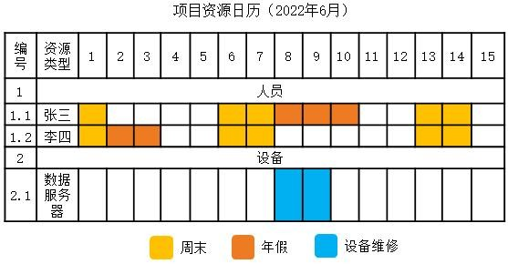资源日历
- 资源直方图

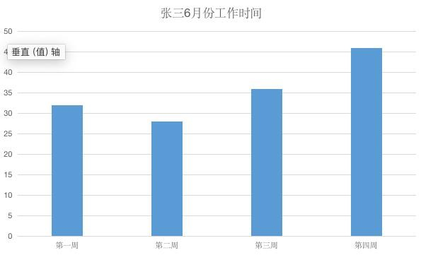

把人分配到活动上，如果发现有人被分配到若干个活动上，被过度分配了，应该做什么？

- 资源优化

  资源平衡：导致关键路径延长

资源平滑：不会导致关键路径延长工具与技术：

【工具-1】决策

适用于获取资源过程的决策技术是多标准决策分析。选择标准常用于选择项目的实物资源或项目团队。可使用的标准包括：可用性、成本、能力、经验、知识、技能、态度、国际因素等。

【工具-2】预分派

预分派指事先确定项目的实物或团队资源，在如下情况时可采用预分派：

1. 在竞标过程中承诺分派特定人员进行项目工作；
2. 项目取决于特定人员的专有技能；
3. 在完成资源管理计划的前期工作之前，制定项目章程过程或其他过程已经指定了某些团队成员的工作。

【工具-3】虚拟团队

虚拟团队可定义为具有共同目标、在完成角色任务的过程中很少或没有时间面对面工作的一群人。 在虚拟团队的环境中，沟通规划变得日益重要，可能需要花更多时间来设定明确的期望、促进沟通、制定冲突解决方法、召集人员参与决策、理解文化差异、以及共享成功喜悦。

虚拟团队模式使人们有可能：

1. 在组织内部地处不同地理位置的员工之间组建团队；
2. 为项目团队增加特殊技能，即使相应的专家不在同一地理区域；
3. 将在家办公的员工纳入团队；
4. 在工作班次、工作小时或工作日不同的员工之间组建团队；
5. 将行动不便者或残疾人纳入团队；
6. 执行那些原本会因差旅费用过高而被否决的项目；
7. 节省员工所需的办公室和所有实物设备的开支等。

四、建设团队

# 信息系统项目管理师-精讲班-资源管理 4

建设团队是提高工作能力，促进团队成员互动，改善团队整体氛围，以提高项目绩效的过程。本过程的主要作用：

1. 改进团队协作；
2. 增强人际关系技能；
3. 激励员工；
4. 减少摩擦；
5. 提升整体项目绩效。建设项目团队的目标包括：
6. 提高团队成员的知识和技能；
7. 提高团队成员之间的信任和认同感：以提高士气、减少冲突和增进团队协作；
8. 创建富有生气、凝聚力和协作性的团队文化；
9. 提高团队参与决策的能力。可实现团队的高效运行的行为有：
10. 使用开放与有效的沟通；
11. 创造团队建设机遇；
12. 建立团队成员间的信任；
13. 以建设性方式管理冲突；
14. 鼓励合作型的问题解决方法；
15. 鼓励合作型的决策方法等。输入&输出：

| 输入                                                          | 输出                                                                    |
| ------------------------------------------------------------- | ----------------------------------------------------------------------- |
| 1、项目管理计划 ` `2、项目团队派工单 ` `3、资源日历 | 1、团队绩效评价 ` `2、事业环境因素更新 ` `3、组织过程资产更新 |

【输出-1】团队绩效评价

评价团队有效性的指标可包括：

1. 个人技能的改进；
2. 团队能力的改进；
3. 团队成员离职率的降低；
4. 团队凝聚力的加强。

   【输出-2】事业环境因素更新

作为建设项目团队过程的结果，需要更新的事业环境因素包括（但不限于）：员工发展计划的记录和 技能评估。

建设团队、管理团队的输出：事业环境因素更新

工具与技术：

【工具-1】虚拟团队

虚拟团队的使用能带来很多好处，例如：使用更多技术熟练的资源、降低成本、减少出差及搬迁费用，以及拉近团队成员与供应商或其他重要干系人的距离。虚拟团队可以利用技术来营造在线团队环境，以供团队存储文件、使用在线对话来讨论问题，以及保存团队日历。

【工具-2】集中办公

集中办公是指把许多或全部最活跃的项目团队成员安排在同一个地点工作，以增强团队工作能力。集中办公既可以是临时的（如仅在项目特别重要的时期），也可以贯穿整个项目。

【工具-3】沟通技术

可采用的沟通技术包括：共享门户、视频会议、音频会议和电子邮件/聊天软件。

【工具-4】人际关系与团队技能

适用于建设团队过程的人际关系与团队技能主要包括：

- 冲突管理：项目经理应及时地以建设性方式解决冲突，从而创建高绩效团队
- 影响力：收集相关的关键信息，在维护相互信任的关系时，用来解决重要问题并达成一致意见
- 激励：为采取行动提供了理由。提高团队参与决策的能力并鼓励独立工作
- 谈判：旨在就项目需求达成共识
- 团队建设

  【工具-5】认可与奖励

最初的奖励计划是在规划资源管理过程中编制的，只有能满足被奖励者的某个重要需求的奖励，才是有效的奖励。

- 正式或非正式的方式做出奖励决定
- 决定认可与奖励时，应考虑文化差异
- 金钱是奖励制度中的有形奖励
- 项目经理在整个项目生命周期中尽可能地给予表彰，而不是等到项目完成时才给予

  【工具-6】培训

培训包括旨在提高项目团队成员能力的全部活动，可以是正式的或非正式的，方式包括课堂培训、在线培训、计算机辅助培训、在岗培训、辅导及训练。

- 可以是计划中，也可以开展必要的计划外培训
- 培训可以由内部或外部培训师来执行

  【工具-7】个人和团队评估

个人和团队评估工具能让项目经理和项目团队洞察成员的优势和劣势。可以利用的工具，如：态度调查、专项评估、结构化访谈、能力测试及焦点小组。

五、管理团队

# 信息系统项目管理师-精讲班-资源管理 5

管理团队是跟踪团队成员工作表现，提供反馈，解决问题并管理团队变更以优化项目绩效的过程。本过程的主要作用：

影响团队行为、管理冲突以及解决问题。

项目经理应该向团队成员分配富有挑战性的任务，并对优秀绩效进行表彰。

项目经理应留意团队成员是否有意愿和能力完成工作，然后相应地调整管理和领导力方式。相对于那些已展现出能力和有经验的团队成员，技术能力较低的团队成员更需要强化监督。

输入&输出：

| 输入              | 输出                |
| ----------------- | ------------------- |
| 1、资源管理计划   | 1、变更请求         |
| 2、项目团队派工单 | 2、事业环境因素更新 |
| 3、团队绩效评价   |                     |
| 4、工作绩效报告   |                     |
| 5、问题日志       |                     |

工具与技术：

1.冲突管理

项目环境中，冲突不可避免。冲突的来源包括资源稀缺、进度优先级排序和个人工作风格差异等。采用团队基本规则、团队规范及成熟的项目管理实践（如沟通规划和角色定义），可以减少冲突的数量。成功的冲突管理可提高生产力，改进工作关系。

假如意见分歧成为负面因素，应该首先由项目团队成员负责解决；如果冲突升级，项目经理应提供协 助，促成满意的解决方案，采用直接和合作的方式，尽早并且通常是在私下处理冲突。如果破坏性冲突继续存在，则可使用正式程序，包括采取惩戒措施。

| 冲突管理      | 含义                                                                                     |
| ------------- | ---------------------------------------------------------------------------------------- |
| 撤退/回避     | 退出冲突，将问题推迟或推给别人                                                           |
| 缓和/包容     | 也叫“求同存异”，强调一致性而非差异，考虑其他方面的需求                                 |
| 妥协/调解     | 各退一步，各方都在一定程度上满意，有时会导致“双输”                                     |
| 强迫/命令     | 推行一方的观点，利用权力来强行解决紧急问题，通常导致“赢-输”                            |
| 合作/解决问题 | 综合考虑不同的观点和意见，采用合作的态度和开放式对话引导各方达成共识和承诺，可以带来双赢 |

不同的项目经理可能采用不同的解决冲突方法。影响冲突解决方法的因素包括：

1. 冲突的重要性与激烈程度
2. 解决冲突的紧迫性
3. 涉及冲突的人员的相对权力
4. 维持良好关系的重要性
5. 永久或暂时解决冲突的动机等 2.制定决策

决策是指谈判能力以及影响组织与项目管理团队的能力。进行决策需要：

1. 着眼于所要达到的目标；
2. 遵循决策流程；
3. 研究环境因素；
4. 分析可用信息；
5. 激发团队创造力；
6. 理解风险。 3.情商

识别、评估和管理个人情绪、他人情绪及团体情绪的能力。项目管理团队能通过情商来了解、评估及控制项目团队成员的情绪，预测团队成员的行为，确认团队成员的关注点及跟踪团队成员的问题，来达到减轻压力、加强合作的目的。

1. 影响

在矩阵环境中，项目经理对团队成员通常没有或仅有很小的命令职权，所以他们适时影响干系人的能力，对保证项目成功非常关键。

影响力主要体现在：说服他人、清晰表达观点和立场、积极且有效的倾听、了解并综合考虑各种观点；收集相关信息、在维护相互信任的关系下，解决问题并达成一致意见等。

2. 领导力

成功的项目需要强有力的领导技能，领导力是领导团队、激励团队做好本职工作的能力。它包括各种不同的技巧、能力和行动。领导力在项目生命周期中的所有阶段都很重要。

六、控制资源

控制资源是确保按计划为项目分配实物资源，以及根据资源使用计划监督资源实际使用情况，并采取必要纠正措施的过程。

本过程的主要作用：

1. 确保所分配的资源适时、适地可用于项目；
2. 资源在不再需要时被释放。

应在所有项目阶段和整个项目生命周期期间持续开展控制资源过程，且适时、适地和适量地分配和释放资源，使项目能够持续进行。

控制资源过程重点关注实物资源，管理团队过程重点关注人力资源。控制资源过程关注：

1. 监督资源支出
2. 及时识别和处理资源缺乏/剩余情况
3. 确保根据计划和项目需求使用并释放资源
4. 出现资源相关问题时通知相应干系人
5. 影响可以导致资源使用变更的因素
6. 在变更实际发生时对其进行管理等

输入&输出：

| 输入              | 输出                |
| ----------------- | ------------------- |
| 1、协议           | 1、变更请求         |
| 2、资源管理计划   | 2、工作绩效信息     |
| 3、项目进度计划   | 3、项目管理计划更新 |
| 4、资源分解结构   | 4、项目文件更新     |
| 5、资源需求       |                     |
| 6、物质资源分配单 |                     |
| 7、问题日志       |                     |
| 8、风险登记册     |                     |
| 9、工作绩效数据   |                     |

工具与技术：

【工具-1】数据分析

适用于控制资源过程的数据分析技术主要包括：

- 备选方案分析：有助于选择最佳解决方案以纠正资源使用偏差
- 成本效益分析：有助于项目成本出现差异时确定最佳的纠正措施
- 绩效审查：测量、比较和分析计划的资源使用和实际资源使用的不同
- 趋势分析：检查项目绩效随时间的变化情况，可用于确定绩效是在改善还是在恶化

  【工具-2】问题解决

问题解决可能会用到一系列工具，有助于项目经理解决控制资源过程中出现的问题。问题可能来自组织内部，也可能来自组织外部。

1. 识别问题：明确问题；
2. 定义问题：将问题分解为可管理的小问题；
3. 调查：收集数据；
4. 分析：找出问题的根本原因；
5. 解决：从众多解决方案中选择最合适的一个；
6. 检查解决方案：确认是否已解决问题。

# 信息系统项目管理师-精讲班-沟通管理 1

第 14 章 项目沟通管理

项目沟通管理过程：一、规划沟通管理 二、管理沟通

三、监督沟通沟通管理基础

（一）沟通

项目沟通管理是确保及时、正确地产生、收集、分发、存储和最终处理项目信息所需的过程，实现成功沟通所需的人员、观点、信息三要素之间的联系。

项目沟通管理由两部分组成：

一是制定策略，确保沟通对干系人行之有效；二是执行必要活动，以落实沟通策略。

与 IT 项目成功有关的最重要的四个因素是：

- 主管层的支持、用户参与、有经验的项目经理、清晰的业务目标沟通是指用各种可能的方式来发送或接收信息。

  沟通形式包括：
- 书面形式：实物或电子形式
- 口头形式：面对面或远程形式
- 正式或非正式形式：通过正式的纸质文件或社交媒体
- 手势动作：语调和面部表情
- 媒体形式：图片、行动或借助其他媒介
- 遣词造句：表达某种想法的词语往往不止一个，须留意各词语的含义会存在细微差异

  （二）沟通分类

| 沟通分类       | 含义                                                                   |
| -------------- | ---------------------------------------------------------------------- |
| 内部沟通       | 针对项目内部或组织内部的干系人                                         |
| 外部沟通       | 针对外部干系人，如客户、供应商、其他项目、组织、政府、公众和环保倡导者 |
| 正式沟通       | 报告、正式会议（定期或临时）、会议议程记录、干系人简报和演示           |
| 非正式沟通     | 电子邮件、社交媒体、网站和非正式临时讨论                               |
| 官方沟通       | 年报、呈交监管机构或政府部门的报告                                     |
| 非官方沟通     | 灵活手段                                                               |
| 层级沟通       | 根据内部职权不同，向上、向下或横向沟通方式                             |
| 书面与口头沟通 | 口头、非口头、社交媒体和网站、媒体发布                                 |

（三）沟通技巧

1. 有效沟通活动的 3 个基本属性：
2. 沟通目的明确
3. 尽量了解沟通接收方，满足其需求及偏好
4. 监督并衡量沟通的效果
5. 书面沟通的 5C 原则
   - 正确的语法和拼写（Correctness）
   - 简洁的表述（Concise）：降低误解信息意图的可能性
   - 清晰的目的和表述（Clarity）：确保在信息中包含能满足受众需求与激发其兴趣的内容
   - 连贯的思维逻辑（Coherent）：在整个书面文件中使用诸如“引言”和“小结”的小标题

- 善用控制语句和承接（Controlling）：可能需要使用图表或小结来控制语句和思想的承接

  （四）管理新实践

1. 将干系人纳入项目评审范围
2. 让干系人参加项目会议
3. 社交工具的使用日益增多
4. 多面性沟通方法

一、规划沟通管理

# 信息系统项目管理师-精讲班-沟通管理 2

规划沟通管理是基于每个干系人或干系人群体的信息需求、可用的组织资产，以及具体项目的需求，为项目沟通活动制定恰当的方法和计划的过程。

本过程的主要作用：

1. 及时向干系人提供相关信息；
2. 引导干系人有效参与项目；
3. 编制书面沟通计划。

项目经理需在项目生命周期的早期，针对项目干系人多样性的信息需求，制订有效的沟通管理计划。应该在整个项目期间，定期审查本过程的成果并做必要修改。

虽然所有项目都需要进行信息沟通，但是各项目的信息需求和信息发布方式可能差别很大。

- 规划沟通管理：和什么人、以什么样的方式、沟通什么信息输入&输出：

| 输入                                                        | 输出            |
| ----------------------------------------------------------- | --------------- |
| 1、项目章程 ` `2、项目管理计划 ` `3、干系人登记册 | 1、沟通管理计划 |

【输出】沟通管理计划

1. 干系人的沟通需求；
2. 需沟通的信息，包括语言、形式、内容和详细程度；
3. 上报步骤；
4. 发布信息的原因；
5. 发布所需信息、确认已收到或作出回应（若适用）的时限和频率；
6. 负责沟通相关信息的人员；
7. 负责授权保密信息发布的人员；
8. 接收信息的人员或群体，包括他们的需要、需求和期望；
9. 用于传递信息的方法或技术，如备忘录、电子邮件、新闻稿，或社交媒体；
10. 为沟通活动分配的资源，包括时间和预算；
11. 随着项目进展（如项目不同阶段干系人社区的变化）而更新与优化沟通管理计划的方法；
12. 通用术语表；
13. 项目信息流向图、工作流程（可能包含审批程序）、报告清单和会议计划等；
14. 来自法律法规、技术、组织政策等的制约因素等。

    沟通管理计划中还包括关于项目状态会议、项目团队会议、网络会议和电子邮件等的指南和模板。

- 沟通管理计划示例

| 沟通内容     | 沟通信息                                  | 沟通频率                  | 沟通方法 | 沟通人   | 接收人     |
| ------------ | ----------------------------------------- | ------------------------- | -------- | -------- | ---------- |
| 每周项目情况 | 工作绩效报告                              | 每周五上午 ` `一小时 | 会议     | 项目经理 | 客户、团队 |
| 团队每日例会 | 昨天做了什么 ` `遇到的问题今天做什么 | 每天 15 分钟内            | 站会     | 项目经理 | 团队       |

- 沟通原则：公开、透明、平等、尊重、分享
- 问题升级程序：找直接上级沟通

如果团队成员抱怨，为什么那么多无关的邮件，应该审查哪份文件？

- 沟通管理计划
- 下列情况也都是审查沟通管理计划：

  信息多发了：为什么有那么多无关的邮件信息少发了：为什么我没有收到那条信息信息时限问题：为什么现在才发

信息别人看不懂：不是想要的信息传递方式工具与技术：

【工具-1】沟通需求分析

常用于识别和确定项目沟通需求的信息主要包括：

1. 干系人登记册及干系人参与计划中的相关信息和沟通需求；
2. 潜在沟通渠道或途径的数量，包括一对一、一对多和多对多沟通；
3. 组织结构图；
4. 项目组织与干系人的职责、关系及相互依赖；
5. 开发方法；
6. 项目所涉及的学科、部门和专业；
7. 有多少人在什么地点参与项目；
8. 内部信息需求，例如，何时在组织内部沟通；
9. 外部信息需求，例如，何时与媒体、公众和承包商沟通；
10. 法律要求等。

    【工具-2】沟通技术

    影响沟通技术的选择的因素：

- 信息需求的紧迫性
- 技术的可用性与可靠性
- 易用性
- 项目环境
- 信息的敏感性和保密性

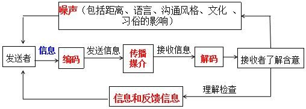【工具-3】沟通模型

1. 沟通模型的关键要素
2. 编码：把思想或想法转化为他人能理解的语言；
3. 信息和反馈信息：编码过程所得到的结果；
4. 媒介：用来传递信息的方法；
5. 噪声：干扰信息传输和理解的一切因素（如距离、新技术、缺乏背景信息等）；
6. 解码：把信息还原成有意义的思想或想法（误解一般发生在解码阶段）。
7. 沟通模型包含 5 个基本状态

| 序号 | 基本状态           | 含义                                                                                  |
| ---- | ------------------ | ------------------------------------------------------------------------------------- |
| 1    | 已发送             | 当你传送信息给他人                                                                    |
| 2    | 已收到             | 当对方信息已收到                                                                      |
| 3    | 已理解             | 正确地消化和理解信息中的内容                                                          |
| 4    | 已认可             | 对方已同意这个观点                                                                    |
| 5    | 已转化为积极的行动 | 整个过程中最难的一环，通常需要反复地沟通、在一定的监督 ` `或帮助下才能较好的完成 |

【工具-4】沟通方法

| 沟通方法 | 含义                                 | 举例                                                                |
| -------- | ------------------------------------ | ------------------------------------------------------------------- |
| 互动沟通 | 在两方或多方之间进行多向信息交换     | 会议、电话、即时通信、社交媒体、视频会议                            |
| 拉式沟通 | 信息量很大、受众很多、接收者自行访问 | 门户网站、组织内网、电子在线课程、经验教 ` `训数据库、知识库   |
| 推式沟通 | 把信息发送给特定的接收方             | 信件、备忘录、报告、电子邮件、传真、语音 ` `邮件、博客、新闻稿 |

【例题】工程师小王作为项目干系人之一，主动去访问项目相关的知识库，这种沟通属于（ ）。

1. 互动沟通
2. 拉式沟通
3. 推式沟通
4. 集中式沟通

   【答案】B

【解析】拉式沟通用于信息量很大或受众很多的情况。要求接收者自主自行地访问信息内容。这种方法包括门户网站、组织内网、电子在线课程、经验教训数据库、知识库等。

可以采用如下方法来实现沟通管理计划所规定的主要的沟通需求：

- 人际沟通：个人之间交换信息，通常以面对面的方式进行
- 小组沟通：在 3〜6 名人员的小组内部开展
- 公众沟通：单个演讲者面向一群人
- 大众传播：信息发送人员或小组与大量目标受众（有时为匿名）之间只有最低程度的联系
- 网络和社交工具沟通：借助社交工具和媒体，开展多对多的沟通可用于沟通的方法或成果主要包括：

公告板；新闻通讯、内部杂志和电子杂志；致员工或志愿者的信件；新闻稿；年度报告；电子邮件和内部局域网；门户网站和其他信息库（适用于拉式沟通）；电话交流；演示；团队简述或小组会议；焦点小组；干系人之间的正式或非正式的面对面会议；咨询小组或员工论坛；社交工具和媒体等。

【工具-5】人际关系与团队技能

1. 沟通风格评估
2. 政策意识
3. 文化意识

   【工具-6】数据表现

适用于规划沟通管理过程的数据表现技术是干系人参与度评估矩阵。干系人参与度评估矩阵显示了个体干系人当前和期望参与度之间的差距。

| 干系人   | 不知晓 | 抵制 | 中立 | 支持 | 领导 |
| -------- | ------ | ---- | ---- | ---- | ---- |
| 干系人 1 | C      |      |      | D    |      |
| 干系人 2 |        |      | C    | D    |      |
| 干系人 3 |        |      |      | DC   |      |

注：C 表示当前参与程度，D 表示所需参与程度

二、管理沟通

# 信息系统项目管理师-精讲班-沟通管理 3

管理沟通是确保项目信息及时且恰当地收集、生成、发布、存储、检索、管理、监督和最终处置的过程。

本过程的主要作用：

促成项目团队与干系人之间的有效信息流动。输入&输出：

| 输入                                    | 输出            |
| --------------------------------------- | --------------- |
| 1、沟通管理计划 ` `2、工作绩效报告 | 1、项目沟通记录 |

【输入】工作绩效报告

工作绩效报告会通过本过程传递给项目干系人。工作绩效报告的典型示例包括状态报告和进展报告。工作绩效报告可以包含挣值图和信息、趋势线和预测、储备燃尽图、缺陷直方图、合同绩效信息以及风险概述信息。可表现为有助于引起关注、制定决策和采取行动的仪表指示图、热点报告、信号灯图或其他形式。

【输出】项目沟通记录

项目沟通记录主要包括：绩效报告、可交付成果的状态、进度进展、产生的成本、演示，以及干系人需要的其他信息。

有效的沟通管理需要借助的技术包括：

- 发送方-接收方模型：运用反馈循环，为互动和参与提供机会，并清除妨碍有效沟通的障碍
- 媒介选择
- 写作风格
- 会议管理
- 演示：了解肢体语言和视觉辅助设计的作用
- 引导：达成共识、克服障碍，以及维持小组成员兴趣和热情
- 积极倾听：包括告知已收到、澄清与确认信息、理解，以及消除妨碍理解的障碍工具与技术：

【工具-1】沟通技术

会影响技术选用的因素包括团队是否集中办公、需要分享的信息是否需要保密、团队成员的可用资源，以及组织文化会如何影响会议和讨论的正常开展。

【工具-2】沟通技能

1. 沟通胜任力：有助于明确关键信息的目的、建立有效关系、实现信息共享和采取领导行为。
2. 反馈
3. 非口头技能
4. 演示：演示是信息和文档的正式交付。

   ①向干系人报告项目进度和信息更新；

②提供背景信息以支持决策制定；

③提供关于项目及其目标的通用信息，以提升项目工作和项目团队的形象；

④提供具体信息，以提升对项目工作和目标的理解和支持力度等。

【工具-3】项目报告

项目报告发布是收集和发布项目信息的行为。项目信息应发布给众多干系人群体。应针对各种干系人来调整项目信息发布的适当层次、形式和细节。

从简单的沟通到详尽的定制报告和演示，报告的形式各不相同。可以定期准备信息或基于例外情况准备。

虽然工作绩效报告是监控项目工作过程的输出，但是本过程会编制临时报告、项目演示、博客，以及其他类型的信息。

【真题】适用于管理沟通过程的沟通技能不包括（ ）。

1. 反馈
2. 非口头技能
3. 演示
4. 社交媒体管理

   【答案】D

【解析】沟通技能包括：沟通胜任力、反馈、非口头技能和演示。三、监督沟通

监督沟通是确保满足项目及其干系人的信息需求的过程。本过程的主要作用：

按沟通管理计划和干系人参与计划的要求优化信息传递流程。

监督沟通是确保在正确的时间，通过正确的渠道，将正确的内容传递给正确的受众。监督沟通可能需要采取各种方法，例如，开展客户满意度调查、整理经验教训、开展团队观察、审查问题日志和评估变更。

如果沟通有问题怎么办？

- 通过变更请求，修改沟通管理计划输入&输出：

| 输入                                                        | 输出                                |
| ----------------------------------------------------------- | ----------------------------------- |
| 1、项目管理计划 ` `2、项目文件 ` `3、工作绩效数据 | 1、工作绩效信息 ` `2、变更请求 |

工具与技术：

项目风险管理过程：一、规划风险管理 二、识别风险

三、实施定性风险分析四、实施定量风险分析五、规划风险应对

六、实施风险应对七、监督风险

管理基础

（一）项目风险

# 信息系统项目管理师-精讲班-风险管理 1

第 15 章 项目风险管理

项目风险是一种不确定的事件或条件，一旦发生，就会对项目目标产生某种正面或负面的影响。

- 概率、影响
- 消极风险、积极风险

  每个项目都有两个层面的风险：
- 每个项目都有会影响项目达成目标的单个风险
- 由单个风险和不确定性的其他来源联合导致的整体项目风险项目风险管理过程同时兼顾这两个层面的风险。

（二）风险的属性 1.风险事件的随机性

风险事件的发生及其后果都具有偶然性 2.风险的相对性

- 收益越大，愿意承担的风险就越大
- 投入越多，愿意冒的风险就越小
- 拥有资源越多，风险承受能力越大 3.风险的可变性

  风险性质的变化、风险后果的变化、出现新的风险
- 不同类型投资者对风险的态度

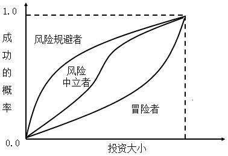

（三）风险的分类 1.按风险后果划分

1. 纯粹风险：不能带来机会、无获得利益可能的风险，叫纯粹风险；
   1. 投机风险：既可能带来机会、获得利益，又隐含威胁、造成损失的风险，叫投机风险。投机风

险有三种可能的后果：造成损失、不造成损失和获得利益。

纯粹风险和投机风险在一定条件下可以相互转化，项目管理人员必须避免投机风险转化为纯粹风险。风险不是零和游戏，很多情况下，涉及风险的各个方面都要蒙受损失，无一幸免。

1. 按风险来源划分
2. 自然风险：由于自然力的作用，造成财产毁损或人员伤亡的风险，如地震；
3. 人为风险：是指由于人的活动而带来的风险。人为风险可以细分为行为、经济、技术、政策和组织风险等。
4. 按风险是否可管理划分
5. 可管理的风险：可以预测，并可采取相应措施加以控制的风险；
6. 不可管理风险：与可管理的风险反之，则为不可管理的风险。

   风险能否管理，取决于风险不确定性是否可以消除以及活动主体的管理水平。

随着数据、资料和其他信息的增加以及管理水平的提高，有些不可管理的风险可以变成可管理的风险。 4.按风险影响范围划分

1. 局部风险
2. 总体风险

- 局部风险影响的范围小，总体风险影响的范围大
- 局部风险和总体风险也是相对的
- 项目管理团队特别要注意总体风险 5.按风险后果的承担者划分

项目风险若按其后果的承担者来划分则有项目业主风险、政府风险、承包商风险、投资方风险、设计单位风险、监理单位风险、供应商风险、担保方风险和保险公司风险等。

6.按风险的可预测性划分

1. 已知风险

已知风险是指在认真、严格地分析项目及其计划之后就能够明确的那些经常发生的，而且其后果亦可 预见的风险。

如：项目目标不明确、过分乐观的进度计划，设计或施工变更，材料价格波动等。

2. 可预测风险

   可以预见其发生，但不可预见其后果的风险。

   如：业主不能及时审查批准，分包商不能及时交工，施工机械出现故障，不可预见的地质条件等。
3. 不可预测风险

有可能发生，但其发生的可能性即使最有经验的人也不能预见的风险。如：地震、百年不遇的暴雨、通货膨胀、政策变化等。

风险分类的总结：

| 依据                     | 分类                                                                                 |
| ------------------------ | ------------------------------------------------------------------------------------ |
| 1.按风险后果划分         | 纯粹风险、投机风险                                                                   |
| 2.按风险来源划分         | 自然风险、人为风险                                                                   |
| 3.按风险是否可管理划分   | 可管理的风险、不可管理的风险                                                         |
| 4.按风险影响范围划分     | 局部风险、总体风险                                                                   |
| 5.按风险后果的承担者划分 | 项目业主风险、政府风险、承包商风险、投资方风险、` `设计单位风险、监理单位风险等 |
| 6.按风险的可预测性划分   | 已知风险、可预测风险、不可预测风险                                                   |

（四）风险成本

| 风险成本       | 分类                                                                                                                                                                                                                                                                                                             |
| -------------- | ---------------------------------------------------------------------------------------------------------------------------------------------------------------------------------------------------------------------------------------------------------------------------------------------------------------- |
| 有形成本       | 直接损失：如压缩空气机房在施工过程中失火，直接损失包括空气压缩机的重置成本、受伤人员的医疗费、休养费、工资等 ` `间接损失：直接损失以外的其他损失、责任损失以及因此而造成的收益的减少，包 ` `括灭火扑救、停工等发生的成本                                                                               |
| 无形成本       | 风险损失减少了机会、风险阻碍了生产率的提高、风险造成资源分配不当                                                                                                                                                                                                                                                 |
| 预防与控制成本 | 为了预防和控制风险损失，必然要采取各种措施。` `如：向保险公司投保、向有关方面咨询、配备必要的人员、购置用于预防和减损的设备、对有关人员进行必要的教育或训练以及人员和设备的维持和维护费用等。这些成本既有 直接的、也有间接的                                                                                |
| 成本的负担     | 风险成本不单要由项目主体来负担，许多情况下，与项目活动有关的其他方面，客观上也要负担一部分风险成本。` `如压缩空气机房在施工过程中失火：` `施工单位的损失是个体负担成本 ` `赶来灭火的消防队的开销由社会负担 ` `消防车辆在急驰火灾现场时，行人和其他车辆因躲避而影响工作的损失都是社会负担成本 |

【真题】关于风险的描述，不正确的（ ）。

1. 已知风险为其后果可以预见的风险
   1. 随机性、相对性、可变性都是风险的属性
   2. 按可预测性划分为可预测风险和不可预测风险两种
   3. 项目管理人员必须避免投机风险转化为纯粹风险

      【答案】C

      【解析】本题考查的是按风险的可预测性划分。

A 选项：已知风险就是在认真、严格地分析项目及其计划之后就能够明确的那些经常发生的，而且其后果也亦可以预见的风险。

B 选项：风险的属于包括：随机性、相对性、可变性。

C 选项：按风险的可预测性划分：已知风险、可预测风险和不可预测风险。

D 选项：项目管理人员必须避免投机风险转化为纯粹风险。故此题正确答案为 C。

（五）风险管理新实践 1.非事件类风险

1. 变异性风险：已规划的目标、活动或决策的某些关键方面存在不确定性，例如，生产率可能高 于或低于目标值，测试发现的错误数量可能多于或少于预期。

变异性风险可通过蒙特卡洛分析加以处理，即：用概率分布表示变异的可能区间，然后采取行动缩小可能结果的区间。

2. 模糊性风险：对未来可能发生什么存在不确定性。

知识不足可能影响项目达成目标的能力，例如，不太了解需求或技术解决方案的要素、法规框架的未来发展，或项目内在的系统复杂性。

1. 项目韧性

有一种风险只有在发生后才能被发现，这种风险称为突发性风险。可以通过加强项目韧性来应对这种风险。

这要求每个项目：

1. 除了为已知风险列出风险预算，还要为突发性风险预留合理应急预算和时间；
2. 采用灵活的项目过程，包括强有力的变更管理，以便在保持朝项目目标推进的正确方向的同时，应对突发性风险；
3. 授权目标明确且值得信赖的项目团队在商定限制范围内完成工作；
4. 留意早期预警信号，以尽早识别突发性风险；
5. 明确征求干系人的意见，为应对突发性风险而可以调整项目范围或策略的领域。 3.整合式风险管理

在项目、项目集、项目组合和组织这些层面上，都存在风险。应该在适当的层面上承担和管理风险。在较高层面识别出的某些风险，可以及时授权给项目团队去管理；在较低层面识别出的某些风险，又可以交给较高层面去管理。

应该利用组织级在风险管理方法，来确保所有层面的风险管理工作的一致性和连贯性。

一、规划风险管理

# 信息系统项目管理师-精讲班-风险管理 2

规划风险管理是定义如何实施项目风险管理活动的过程。本过程的主要作用：

确保风险管理的水平、方法和可见度与项目风险程度相匹配，与对组织和其他干系人的重要程度相匹配。

规划风险管理过程在项目立项阶段就应开始，并在项目早期完成。在项目生命周期的后期，可能有必要重新开展本过程。

输入&输出：

| 输入                                                        | 输出            |
| ----------------------------------------------------------- | --------------- |
| 1、项目管理计划 ` `2、项目章程 ` `3、干系人登记册 | 1、风险管理计划 |

【输出】风险管理计划

风险管理计划描述如何安排与实施风险管理活动，它是项目管理计划的从属计划。

1. 风险管理策略：描述用于管理本项目风险的一般方法。
2. 方法论：确定用于开展本项目风险管理的具体方法、工具及数据来源。
3. 角色与职责：确定每项风险管理活动的领导者、支持者和团队成员，并明确职责。
4. 资金。
5. 时间安排。
6. 风险类别：风险分解结构（RBS），确定对项目风险进行分类的方式。
7. 干系人风险偏好：针对每个项目目标，把干系人的风险偏好表述成可测量的风险临界值。这些临界值也可用于制定概率和影响定义。
8. 风险概率和影响。
9. 概率和影响矩阵：根据风险可能对实现项目目标产生的潜在影响，对风险进行优先排序。
10. 报告格式。
11. 跟踪。

- 风险分解结构（RBS）

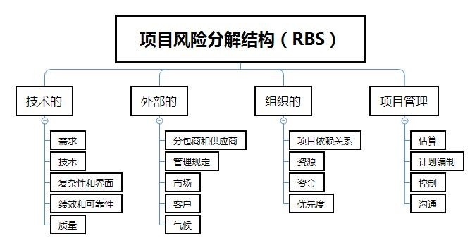

风险分解结构 RBS 最底端是风险类别

风险分解结构列出了一个项目中可能发生的典型的风险分类和风险子分类。有助于项目团队考虑单个项目风险的全部可能来源，对识别风险或归类已识别风险特别有用。

组织可能有适用于所有项目的通用风险分解结构，也可能针对不同类型项目使用不同的风险分解结构，或允许项目量身定制专用的风险分解结构。

- 概率和影响矩阵

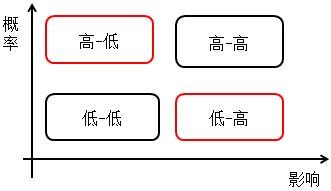

概率高-影响低，概率低-影响高的风险，是否需要管理？

|      | 很低 | 低  | 中  | 高  | 很高 |
| ---- | ---- | --- | --- | --- | ---- |
| 概率 | 0.1  | 0.3 | 0.5 | 0.7 | 0.9  |
| 影响 | 0.05 | 0.1 | 0.2 | 0.4 | 0.8  |

1. 定义概率-影响中，概率量表里面的 0.7 意味着风险发生的概率是 0.7 么？
   - 不是
2. 用 1.3.5…来表示概率或影响，行不行？
   - 行

     【风险概率量表】

| 风险概率量表 |                      |          |           |          |           |
| ------------ | -------------------- | -------- | --------- | -------- | --------- |
| 项目目标     | 标度为相对或数值标度 |          |           |          |           |
|              | 很低 0.10            | 低 0.30  | 中等 0.50 | 高 0.70  | 很高 0.90 |
| 概率         | 0～10%               | 11%～30% | 31%～50%  | 51%～70% | ＞70%     |

【风险影响量表】

| 风险影响量表                          |                      |                                |                          |                                |                          |
| ------------------------------------- | -------------------- | ------------------------------ | ------------------------ | ------------------------------ | ------------------------ |
| 项目目标                              | 标度为相对或数值标度 |                                |                          |                                |                          |
|                                       | 很低 0.05            | 低 0.10                        | 中等 0.20                | 高 0.40                        | 很高 0.80                |
| 成本                                  | 非常小的成本增加     | 成本增加 ` `＜10%         | 成本增加 10%～20%        | 成本增加 20%～40%              | 成本增加 ` `＞40%   |
| 进度                                  | 非常小的进度拖延     | 进度拖延 ` `＜5%          | 进度拖延 5%～10%         | 进度拖延 10%～20%              | 进度拖延 ` `＞20%   |
| 范围                                  | 不显著的范围减少     | 范围次要方面受到影响           | 范围主要方面受到影响     | 发起者不可接受的范围缩减       | 项目最终结果实际无法使用 |
| 质量                                  | 不显著的质量降低     | 仅有要求极其严格的应用受到影响 | 质量降低需要发起者的批准 | 质量降低到发起人不能接受的程度 | 项目最终结果实际无法使用 |
| 该表反映了 4 项项目目标的风险影响比例 |                      |                                |                          |                                |                          |

【概率和影响矩阵】

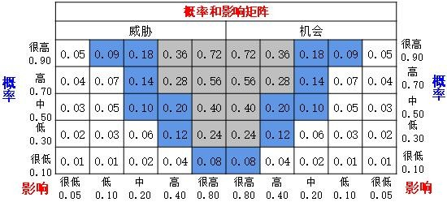

二、识别风险

识别风险是识别单个项目风险以及整体项目风险的来源，并记录风险特征的过程。本过程的主要作用：

1. 记录现有的单个项目风险，以及整体项目风险的来源；
2. 汇总相关信息，以便项目团队能够恰当地应对已识别的风险。

- 识别风险时，要同时考虑单个项目风险以及整体项目风险的来源
- 应采用统一的风险描述格式来描述和记录项目风险，以确保每一项风险都被清楚、明确地理解
- 在整个项目生命周期中，单个项目风险可能随项目进展而不断变化，整体项目风险的级别也会发 生变化
- 识别风险在项目期间开展，是一个迭代的过程。迭代的频率和每次迭代所需的参与程度因情况而

异，应在风险管理计划中作出相应规定输入&输出：

| 输入            | 输出          |
| --------------- | ------------- |
| 1、项目管理计划 | 1、风险登记册 |
| 2、项目文件     | 2、风险报告   |
| 3、采购文档     |               |
| 4、协议         |               |

【输出-1】风险登记册

风险登记册记录已识别项目风险的详细信息。

- 已识别风险的清单
- 潜在风险责任人
- 潜在风险应对措施清单

  【风险登记册】

| 风险     | 潜在应对策略 | 概率 | 影响 | 分值 | 责任人 | 定量 | 策略 | 应对计划 |
| -------- | ------------ | ---- | ---- | ---- | ------ | ---- | ---- | -------- |
| 范围蔓延 |              |      |      |      |        |      |      |          |
| 需求不清 |              |      |      |      |        |      |      |          |
| 进度落后 |              |      |      |      |        |      |      |          |
| 成本超支 |              |      |      |      |        |      |      |          |

【输出-2】风险报告

风险报告提供关于整体项目风险的信息，以及关于已识别的单个项目风险的概述信息。

- 整体项目风险的来源：说明哪些是整体项目风险的最重要因素
- 关于已识别单个项目风险的概述信息：例如，已识别的威胁与机会的数量、风险在风险类别中的分布情况、测量指标和发展趋势

  工具与技术：

  【工具-1】核查单

  核查单包括需要考虑的项目、行动或要点的清单。核查单不能取代所需的风险识别工作。

【工具-2】SWOT 分析 S（Strength）：优势 W（Weakness）：劣势 O（Opportunity）：机会 T（Threat）：威胁

【工具-3】提示清单

提示清单是关于可能引发项目风险来源的风险类别的预设清单。在采用风险识别技术时，提示清单可作为框架用于协助项目团队形成想法。可以用风险分解结构底层的风险类别作为提示清单，来识别单个项目风险。

【真题】关于识别风险的描述，不正确的是（ ）。

1. 可使用类似项目信息的核查单替代所需的风险识别
2. 在风险管理计划中应规定识别风险的迭代频率和迭代参与程度
3. 从组织外部采购商品和服务可能引发新的项目风险
4. 使用 SWOT 分析法可以拓宽项目识别风险的范围

   【答案】A

【解析】核查单：包括需要考虑的项目、行动或要点的清单。虽然核查单简单易用，但它不可能穷尽所有风险。所以，必须确保不要用核查单来取代所需的风险识别工作；同时，项目团队也应该注意考察未在核查单中列出的事项。此外，还应该不时地审查核查单，增加新信息，删除或存档过时信息。

三、实施定性风险分析

# 信息系统项目管理师-精讲班-风险管理 3

实施定性风险分析是通过评估单个项目风险发生的概率和影响及其他特征，对风险进行优先级排序，从而为后续分析或行动提供基础的过程。

本过程的主要作用：

重点关注高优先级的风险。

实施定性风险分析具有主观性，本过程为每个风险识别出责任人。输入&输出：

| 输入                                | 输出            |
| ----------------------------------- | --------------- |
| 1、风险管理计划 ` `2、项目文件 | 1、项目文件更新 |

【输出】项目文件更新

可能需要更新的项目文件包括（但不限于）：

- 风险登记册：概率和影响评估、优先级别或风险分值、指定风险责任人、风险紧迫性信息或风险类别，以及低优先级风险的观察清单和需要进一步分析的风险
- 风险报告：记录最重要的单个项目风险、所有已识别风险的优先级列表以及简要的结论
- 假设日志
- 问题日志工具与技术：

【工具-1】概率和影响矩阵

| 风险     | 潜在应对策略 | 概率 | 影响 | 分值 | 责任人 | 定量 | 策略 | 应对计划 |
| -------- | ------------ | ---- | ---- | ---- | ------ | ---- | ---- | -------- |
| 范围蔓延 |              |      |      |      |        |      |      |          |
| 需求不清 |              |      |      |      |        |      |      |          |
| 进度落后 |              |      |      |      |        |      |      |          |
| 成本超支 |              |      |      |      |        |      |      |          |

概率：0.10、0.30、0.50、0.70、0.90影响：0.05、0.10、0.20、0.40、0.80

【工具-2】风险概率和影响评估

风险概率评估考虑的是特定风险发生的可能性，而风险影响评估考虑的是风险对一项或多项项目目标的潜在影响，如进度、成本、质量或绩效。威胁将产生负面的影响，机会将会产生正面的影响。

- 高风险区域：需要采取重点措施，并采取积极的应对策略
- 低风险区域：只需将其放入待观察风险清单或分配应急储备，不需采取任何其他积极管理措施

  【工具-3】风险数据质量评估

风险数据是开展定性风险分析的基础。风险数据质量评估旨在评价关于单个项目风险的数据的准确性 和可靠性。可以开展问卷调查，了解项目干系人对数据质量各方面的评价，包括数据的完整性、客观性、相关性和及时性，进而对风险数据的质量进行综合评估。可以计算这些方面的加权平均数，将其作为数据质量的总体分数。

【工具-4】其他风险参数评估

| 其他风险参数 | 含义                                     |
| ------------ | ---------------------------------------- |
| 紧迫性       | 为有效应对风险而必须采取应对措施的时间段 |
| 邻近性       | 风险在多长时间后会影响一项或多项项目目标 |
| 潜伏期       | 从风险发生到影响显现之间可能的时间段     |
| 可管理性     | 管理风险发生或影响的容易程度             |
| 可控性       | 能够控制风险后果的程度                   |
| 可监测性     | 对风险发生或即将发生进行监测的容易程度   |
| 连通性       | 风险与其他单个项目风险存在关联的程度大小 |
| 战略影响力   | 风险对组织战略目标潜在的正面或负面影响   |
| 密切度       | 风险被一名或多名干系人认为要紧的程度     |

【工具-5】风险分类

可依据风险来源，受影响的项目区域，以及其他实用类别来分类，确定哪些项目领域最容易被不确定性影响；风险还可以根据共同根本原因进行分类。

应该在风险管理计划中规定可用于项目的风险分类方法。

【工具-6】层级图

如果使用了两个以上的参数对风险进行分类，不能使用概率和影响矩阵，而需要使用其他图形。例如，气泡图能显示三维数据。

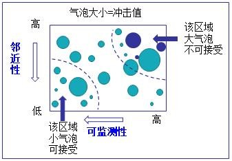

【真题】（ ）不属于定性风险分析的技术。

1. 风险数据质量评估
2. 概率和影响矩阵
3. 风险紧迫性评估
4. 预期货币价值分析

   【答案】D

【解析】定性风险分析工具与技术包括： 1.数据收集：访谈

1. 数据分析
   - 风险数据质量评估
   - 风险概率和影响评估
   - 其他风险参数评估 3.风险分类
2. 数据表现
   - 概率和影响矩阵
   - 层级图

     四、实施定量风险分析

实施定量风险分析是就已识别的单个项目风险和不确定性的其他来源对整体项目目标的影响进行定量分析的过程。

本过程的主要作用：

1. 量化整体项目风险最大可能性；
2. 提供额外的定量风险信息，以支持风险应对规划。所有的风险都需要做实施定量风险分析么？

- 定量风险分析，并非每个项目必需，但如果采用，它会在整个项目期间持续开展
- 风险管理计划会规定是否需要使用定量风险分析
- 定量分析适用于大型或复杂的项目，具有战略重要性的项目，合同要求进行定量分析的项目和主要干系人要求进行定量分析的项目

输入&输出：

| 输入                                                                                                                                              | 输出            |
| ------------------------------------------------------------------------------------------------------------------------------------------------- | --------------- |
| 1、风险管理计划 ` `2、范围基准 ` `3、进度基准 ` `4、成本基准 ` `5、风险登记册 ` `6、事业环境因素 ` `7、组织过程资产 | 1、风险报告更新 |

【输出】项目文件（更新）

可作为实施定量风险分析过程输出的项目文件是风险报告。

1. 对整体项目风险最大可能性的评估结果整体项目风险两种测量方式：

- 项目成功的可能性：项目实现其主要目标的概率
- 项目固有的变化性：可能的项目结果的分布区间

2. 项目详细概率分析的结果

- 所需的应急储备
- 对项目关键路径有最大影响的单个项目风险或其他不确定性来源的清单
- 整体项目风险的主要驱动因素

3. 单个项目风险优先级清单

   根据敏感性分析的结果，列出对项目造成最大威胁或产生最大机会的单个项目风险。
4. 定量风险分析结果的趋势

   发展趋势可能逐渐清晰，发展趋势会影响风险应对措施的规划。
5. 风险应对建议工具与技术：

【工具-1】不确定性表现方式

要开展定量风险分析，就需要建立能反映单个项目风险和其他不确定性来源的定量风险分析模型，并为之提供输入。

如果活动的持续时间、成本或资源需求是不确定的，就可以在模型中用概率分布来表示其数值的可能区间。概率分布可能有多种形式，最常用的有三角分布、正态分布、对数正态分布、贝塔分布、均匀分布或离散分布。

单个项目风险可以用概率分布图表示，也可以作为概率分支包括在定量分析模型中，在概率分支上添加风险发生的时间和（或）成本影响。

如果风险的发生与任何计划活动都没有关系，就最适合将其作为概率分支。

【工具-2】模拟

使用模型来模拟单个项目风险和其他不确定性来源的综合影响，如蒙特卡洛分析。

- 对成本风险进行蒙特卡洛分析时，使用项目成本估算作为模拟的输入
- 对进度风险进行蒙特卡洛分析时，使用进度网络图和持续时间估算作为模拟的输入
- 开展定量成本和进度综合风险分析时，同时使用以上两种输入其输出就是定量风险分析模型。

【定量成本风险分析 S 曲线】

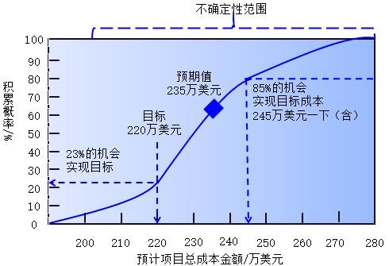

【工具-3】敏感性分析

敏感性分析有助于确定哪些单个项目风险或不确定性来源对项目结果具有最大的潜在影响。它在项目 结果变化与定量风险分析模型中的要素变化之间建立联系。

敏感性分析的结果通常用龙卷风图来表示。

【龙卷风图】

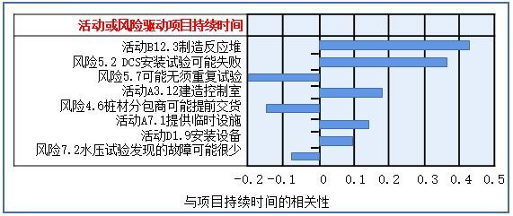

【工具-4】影响图

不确定条件下进行决策的图形辅助工具，它将一个项目或项目中的一种情境表现为一系列实体、结果和影响，以及它们之间的关系和相互影响。

如果因为存在单个项目风险或不确定性来源而影响图中的某些要素的不确定性，就在影响图中以区间或概率分布的形式表示这些要素。

【工具-5】决策树分析

用决策树在若干备选行动方案中选择一个最佳方案。在决策树中，用不同的分支代表不同的决策或事件，即项目的备选路径。通过计算每条分支的预期货币价值，就可以选出最优的路径。

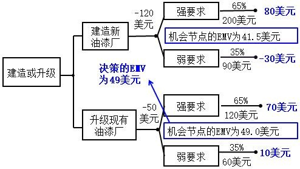

【真题】一件商品卖出去将盈利 50 元，卖不出去将亏损 60 元，卖出去的概率是 80%，卖不出去概率是 20%，该商品的预期货币价值（EMV）是（ ）元。

1. 6
2. 8
3. 66
4. 28

   【答案】D

   【解析】EMV＝50\*0.8－60\*0.2＝28，该商品的预期货币价值是 28 元。

五、规划风险应对

# 信息系统项目管理师-精讲班-风险管理 4

规划风险的应对措施是为了应对项目风险，而制定可选方案、选择应对策略并商定应对行动的过程。本过程的主要作用：

1. 制定应对整个项目风险和单个项目风险的适当方法；
2. 分配资源，并根据需要将相关活动添加进项目文件和项目管理计划中。

- 一旦完成对风险的识别、分析、和排序，指定的风险责任人就应该编制计划，以应对项目团队认为足够重要的每项单个的项目风险
- 风险应对方案应该与风险的重要性相匹配，在当前项目背景下现实可行，获得全体干系人的同意，并由一名责任人具体负责
- 可用结构化的决策技术来选择最适当的应对策略
- 对于大型或复杂项目，可能需要以数学优化模型或实际方案分析为基础，进行备选风险应对策略经济分析
- 如果选定的策略并不完全有效，或者发生了已接受的风险，就需要制订应急计划
- 也需要识别次生风险，次生风险是实施风险应对策略直接导致的风险输入&输出：

| 输入                                  | 输出                                                            |
| ------------------------------------- | --------------------------------------------------------------- |
| 1、风险管理计划 ` `2、风险登记册 | 1、变更请求 ` `2、项目管理计划更新 ` `3、项目文件更新 |

一、风险应对策略

| 威胁应对策略 | 机会应对策略 | 整体项目风险应对策略 |
| ------------ | ------------ | -------------------- |
| 上报         | 上报         | 规避                 |
| 规避         | 开拓         | 开拓                 |
| 转移         | 分享         | 转移或分享           |
| 减轻         | 提高         | 减轻或提高           |
| 接受         | 接受         | 接受                 |

1. 威胁的应对策略

| 威胁 | 内容                                                                                                                                                                                             |
| ---- | ------------------------------------------------------------------------------------------------------------------------------------------------------------------------------------------------ |
| 上报 | 如果项目团队或项目发起人认为某威胁不在项目范围内，或提议的应对措施超出了项目经理的 权限，就应该采用上报策略。威胁一旦上报，就不再由项目团队做进一步监督，但仍可出现在 ` `风险登记册中供参考 |
| 规避 | 采取行动来消除威胁，或保护项目免受威胁的影响 ` `如：消除威胁的原因、延长进度计划、改变项目策略，或缩小范围                                                                                  |
| 转移 | 将应对威胁的责任转移给第三方 ` `如：购买保险、使用履约保函、使用担保书和使用保证书                                                                                                          |
| 减轻 | 采取措施来降低威胁发生的概率和影响 ` `如：采用较简单的流程、更多测试、选用更可靠的卖方、原型和冗余                                                                                          |
| 接受 | 承认威胁的存在，可用于低优先级威胁，也可用于无法以任何其他方式经济有效地应对的威胁 ` `如：应急储备                                                                                          |

2. 机会的应对策略

| 机会 | 内容                                                                                                                      |
| ---- | ------------------------------------------------------------------------------------------------------------------------- |
| 上报 | 某机会不在项目范围内，或提议的应对措施超出了项目经理的权限，就应该采取上报策略                                            |
| 开拓 | 组织想确保把握住高优先级的机会 ` `如：有能力的资源、全新技术或技术升级                                               |
| 分享 | 将应对机会的责任转移给第三方，使其享有机会所带来的部分收益 ` `如：建立合伙关系、合作团队、特殊公司和合资公司分享机会 |
| 提高 | 提高机会出现的概率和影响 ` `如：为早日完成活动而增加资源                                                             |
| 接受 | 承认机会的存在 ` `如：预留时间、资金和资源                                                                           |

3. 整体项目风险应对策略

| 整体                | 内容                                                                                                                                                                  |
| ------------------- | --------------------------------------------------------------------------------------------------------------------------------------------------------------------- |
| 规避                | 如果整体项目风险有严重的负面影响，并已超出商定的项目风险临界值，应采取规避策略 ` `如：取消项目范围中的高风险工作；如果无法将项目拉回到临界值以内，则可能取消项目 |
| 开拓                | 如果整体项目风险有显著的正面影响，并已超出商定的项目风险临界值，就可以采用开拓策略 ` `如：在项目范围中增加高收益的工作；与关键干系人协商修改项目的风险临界值     |
| 转移或 ` `分享 | 如果整体项目风险的级别很高，组织无法有效加以应对，就可能需要让第三方代表组织对 ` `风险进行管理                                                                   |
| 减轻或提高          | 变更整体项目风险的级别，以优化实现项目目标的可能性 ` `如：重新规划项目、改变项目范围和边界、调整项目优先级、改变资源配置、调整交付 时间等                        |
| 接受                | 整体项目风险已超出商定的临界值，如无法针对整体项目风险采取主动的应对策略，组织可能选择继续按当前的定义推动项目进展 ` `如：建立整体应急储备                       |

【例题】下列描述的是何种风险应对策略？

1. ：采取行动来消除威胁，或保护项目免受威胁的影响；
2. ：采取措施来降低威胁发生的概率和影响；
3. ：承认威胁的存在，可用于低优先级威胁，也可用于无法以任何其他方式经济有效地应对的威胁；
4. ：如果整体项目风险有显著的正面影响，并已超出商定的项目风险临界值，就可以采用此策略；
5. ：变更整体项目风险的级别，以优化实现项目目标的可能性。

   【答案】

1.规避 2.减轻 3.接受 4.开拓 5.减轻或提高二、应急应对策略

可以设计一些仅在特定事件发生时才采用的应对措施。对于某些风险，如果项目团队相信其发生会有充分的预警信号，那么就应该制订仅在某些预定条件出现时才执行的应对计划。

应该定义并跟踪应急应对策略的触发条件，例如，未实现中间的里程碑，或获得卖方更高程度的重视。三、其他风险应对技术

1. 成本收益分析：如果能够把单个项目风险的影响进行货币量化，就可以用成本收益分析来确定备选风险应对策略的成本有效性。把应对策略将导致的风险影响级别变更除以策略的实施成本所得到的比

率，就代表了应对策略的成本有效性。 2.备选方案分析

3.多标准决策分析：风险应对策略的选择标准包括：应对成本、应对策略在改变概率和影响方面的预计有效性、资源可用性、时间限制、风险发生的影响级别、应对措施对相关风险的作用、导致的次生风险等。

六、实施风险应对

实施风险应对是执行商定的风险应对计划的过程。本过程的主要作用：

1. 确保按计划执行商定的风险应对措施；
2. 管理整体项目风险入口、最小化单个项目威胁。输入&输出：

| 输入              | 输出            |
| ----------------- | --------------- |
| 1、风险管理计划   | 1、变更请求     |
| 2、风险登记册     | 2、项目文件更新 |
| 3、风险报告       |                 |
| 4、经验教训登记册 |                 |

三种性质的风险应对：

| 风险性质      | 含义                               | 应对措施         |
| ------------- | ---------------------------------- | ---------------- |
| 已知-已知风险 | 已识别并分析过的风险               | 规划风险应对措施 |
| 已知-未知风险 | 已识别，但无法主动管理的风险       | 应急储备         |
| 未知-未知风险 | 无法识别，也无法进行主动管理的风险 | 管理储备         |

七、监督风险

监督风险是在整个项目期间，监督风险应对计划的实施，并跟踪已识别风险、识别和分析新风险，以及评估风险管理有效性的过程。

本过程的主要作用：

保证项目决策是在整体项目风险和单个项目风险当前信息的基础上进行。监督风险过程采用项目执行期间生成的绩效信息，以确定：

1. 实施的风险应对是否有效；
2. 整体项目风险级别是否已改变；
3. 已识别单个项目风险的状态是否已经改变；
4. 是否出现新的单个风险；
5. 风险管理方法是否依然适用；
6. 项目假设条件是否仍然成立；
7. 风险管理政策和程序是否已得到遵守；
8. 成本和进度应急储备是否需要修改；
9. 项目策略是否仍然有效。输入&输出：

工具与技术：

【工具-1】技术绩效分析

把项目执行期间所取得的技术成果与取得相关技术成果的计划进行比较。技术绩效测量指标可能包括处理时间、缺陷数量和储存容量等。

【工具-2】储备分析

储备分析是指在项目的任一时点比较剩余应急储备与剩余风险量，从而确定剩余储备是否仍然合理。可以用各种图形（如燃尽图）来显示应急储备的消耗情况。

【工具-3】审计

风险审计是一种审计类型，可用于评估风险管理过程的有效性。项目经理负责确保按项目风险管理计划所规定的频率开展风险审计。风险审计可以在日常项目审查会和风险审查会上开展，团队也可以召开专门的风险审计会。在实施审计前，应明确定义风险审计的程序和目标。

监督风险程序：

1. 如果风险识别了，先更新风险登记册
2. 如果风险发生了，确定是“已知”风险还是“未知”风险
   - 已知风险：查阅风险登记册，直接应对，一般使用应急储备已知风险但应对无效：
     - 评估应急储备，更新风险登记册
     - 提交变更请求，使用管理储备
   - 未知风险：提交变更请求，使用管理储备

【真题】某项目发生一个已知风险，尽管团队之前针对该风险做过减轻措施，但是并不成功，接下来项目经理应该通过（ ）控制该风险。

1. 重新进行风险识别
2. 使用管理储备
3. 更新风险管理计划
4. 评估应急储备，并更新风险登记册

   【答案】D

   【解析】针对这样的情况应该进行评估应急储备，并更新风险登记册。

项目中的相关方名称： 招标（买方：花钱的）：

- 最终产品的所有人
- 分包商
- 收购机构
- 服务需求者
- 购买方

# 信息系统项目管理师-精讲班-采购管理 1

第 16 章 项目采购管理

投标（卖方：干活儿的）：

- 承包商
- 供货商
- 服务提供商
- 供应商

  一般的采购步骤为：

  1. 准备采购工作说明书（SOW）或工作大纲（TOR）；
  2. 准备高层级的成本估算，制定预算；
  3. 发布招标广告；
  4. 确定合格卖方的名单；
  5. 准备并发布招标文件；
  6. 由卖方准备并提交建议书；
  7. 对建议书开展技术（包括质量）评估；
  8. 对建议书开展成本评估；
  9. 准备最终的综合评估报告（包括质量及成本），选出中标建议书；
  10. 结束谈判，买方和卖方签署合同。项目采购管理过程：

一、规划采购管理二、实施采购

三、控制采购

一、规划采购管理

规划采购管理是记录项目采购决策、明确采购方法，及识别潜在卖方的过程。本过程的主要作用：

确定是否从项目外部获取货物和服务，如果是，则还要确定将在什么时间、以什么方式获取什么货物和服务。货物和服务可从执行组织的其他部门采购，或者从外部渠道采购。

输入&输出：

| 输入            | 输出              |
| --------------- | ----------------- |
| 1、立项管理文件 | 1、采购管理计划   |
| 2、项目章程     | 2、自制或外购决策 |
| 3、项目管理计划 | 3、采购工作说明书 |
| 4、项目文件     | 4、采购策略       |
| 5、事业环境因素 | 5、招标文件       |
| 6、组织过程资产 | 6、供方选择标准   |
|                 | 7、独立成本估算   |

【输入】立项管理文件

立项管理阶段经批准的结果或相关的文件可用于规划采购管理的依据。立项管理会包含商业需求和成 本效益分析，以论证项目的合理性并确定项目边界。

组织高层管理者通常使用立项管理文件作为决策依据。

【输出-1】采购管理计划

采购管理计划可包括以下内容：

1. 如何协调采购与项目的其他工作，例如项目进度计划制订和控制；
2. 开展重要采购活动的时间表；
3. 用于管理合同的采购测量指标；
4. 与采购有关的干系人角色和职责，如果执行组织有采购部，项目团队拥有的职权和受到的限制；
5. 可能影响采购工作的制约因素和假设条件；
6. 司法管辖权和付款货币；
7. 是否需要编制独立估算，以及是否应将其作为评价标准；
8. 风险管理事项，包括对履约保函或保险合同的要求，以减轻某些项目风险；
9. 拟使用的预审合格的卖方（如果有）等。

   【输出-2】自制或外购决策

   通过自制或外购分析，做出某项特定工作最好由项目团队自己完成，还是需要从外部渠道采购的决策。

   【输出-3】采购工作说明书

依据项目范围基准，为每次采购编制工作说明书（SOW），仅对将要包含在相关合同中的那一部分项目范围进行定义。

工作说明书会充分详细地描述拟采购的产品、服务或成果，工作说明书的内容包括：规格、所需数量、质量水平、绩效数据、履约期间、工作地点和其他要求。

对于服务采购，可能会用“工作大纲（TOR）”这个术语。工作大纲内容：

1. 承包商需要执行的任务，以及所需的协调工作；
2. 承包商必须达到的适用标准；
3. 需要提交批准的数据；
4. 由买方提供给承包商的，适用时，将用于合同履行的全部数据和服务的详细清单；
5. 关于初始成果提交和审查（或审批）的进度计划。

   【输出-4】采购策略
6. 交付方法

- 专业服务项目的交付方法：买方或服务提供方不得分包、买方或服务提供方可以分包、买方和服务提供方设立合资企业、买方或服务提供方仅充当代表
- 工业或商业施工项目的交付方法：交钥匙式、设计-建造（DB）、设计-招标-建造（DBB）、设计-建造-运营（DBO）、建造-拥有-运营-转让（BOOT）及其他

2. 合同支付类型

   合同支付类型与项目交付方法无关。

- 总价合同：适用于工作类型可预知、需求能清晰定义且不太可能变更的情况
- 成本补偿合同：适用于工作不断演进、很可能变更或未明确定义的情况
- 激励和奖励费用：可用于协调买方和卖方的目标

3. 采购阶段

   采购策略也可以包括与采购阶段有关的信息，如：

- 采购工作的顺序安排或阶段划分、每个阶段的描述，以及每个阶段的具体目标
- 用于监督的采购绩效指标和里程碑
- 从一个阶段过渡到下一个阶段的标准
- 用于追踪采购进展的监督和评估计划
- 向后续阶段转移知识的过程

  【输出-5】招标文件

  招标文件用于向潜在卖方征求建议书。
- 信息邀请书（RFI）：如果需要卖方提供关于拟采购货物和服务的更多信息，就使用信息邀请书。随后一般还会使用报价邀请书或建议邀请书
- 报价邀请书（RFQ）：如果需要供应商提供关于将如何满足需求和（或）将需要多少成本的更多信息，就使用报价邀请书
- 建议邀请书（RFP）：如果项目中出现问题且解决办法难以确定，就使用建议邀请书。这是最正式的“邀请书”文件，需要遵守与内容、时间表、以及卖方应答有关的严格的采购规则

  【输出-6】供方选择标准

供方选择标准主要包括：能力和潜能；产品成本和生命周期成本；交付日期；技术专长和方法；具体的相关经验；用于响应工作说明书的工作方法和工作计划；关键员工的资质、可用性和胜任力；组织的财务稳定性；管理经验；知识转移计划，包括培训计划等。

供方选择标准：

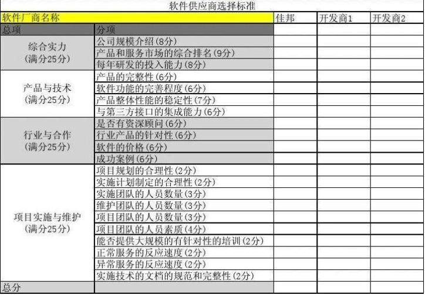

【输出-7】独立成本估算

对于大型的采购，采购组织可自行准备独立估算，或聘用外部专业估算师做出成本估算，并将其作为评价卖方报价的对照基准。

- 采购文件内容比较

| 采购管理计划                       | 采购策略       | 采购工作说明书               |
| ---------------------------------- | -------------- | ---------------------------- |
| 1.采购工作将与其他项目工作协调和整 | 1.采购交付方法 | 1.采购项目描述               |
| 合，特别是资源、进度计划和预算工作 | 2.协议类型     | 2.规格、质量要求和绩效指标   |
| 2.关键采购活动的时间表             | 3.采购阶段     | 3.所需附加服务描述           |
| 3.用于管理合同的采购指标           |                | 4.验收方法和验收标准         |
| 4.所有干系人的职责                 |                | 5.绩效数据和其他所需报告质量 |
| 5.采购假设和制约因素               |                | 6.履约时间和地点             |
| 6.法律管辖和支付货币               |                | 7.货币；支付进度计划         |
| 7.独立估算信息                     |                | 8.担保                       |
| 8.风险管理事项                     |                |                              |

工具与技术：

【工具-1】市场调研

市场调研包括考察行业情况和具体卖方的能力。采购团队可运用从会议、在线评论和各种其他渠道得到的信息，来了解市场情况。采购团队也可以调整具体的采购目标，以便在平衡与有能力提供所需材料或服务的卖方的范围有关的风险的同时，利用成熟技术。

【工具-2】自制或外购分析

制定自制或外购决策时应考虑的因素包括：组织当前的资源配置及其技能和能力，对专业技术的需求，不愿承担永久雇用的义务，以及对独特技术专长的需求；还要评估与每个自制或外购决策相关的风险。

【工具-3】供方选择分析

| 供方选择方法                    | 适用场景                                                                                                    |
| ------------------------------- | ----------------------------------------------------------------------------------------------------------- |
| 最低成本                        | 标准化、常规采购                                                                                            |
| 仅凭资质                        | 采购价值相对较小，不值得花时间和成本开展完整选择过程                                                        |
| 基于质量或技术 ` `方案得分 | 邀请一些组织提交建议书，考察技术方案的质量；再邀请它们进行合同谈判，证明 ` `它们的财务建议书是可接受的 |
| 基于质量和成本                  | 如果项目的风险和不确定性较高，相对于成本而言，质量就应该是一个关键因素                                      |
| 唯一来源                        | 特殊情况，仅在有适当理由时才采用此方法                                                                      |
| 固定预算                        | 工作说明书定义精确、预期不会发生变更，而且预算固定且不得超出的情况                                          |

【真题】某公司准备采购一批设备，附加技术服务。在供方选择时应优先选择（ ）。

①相同预算技术得分最高的

②设备成本和服务成本最低的

③能够在预算范围内完成相关工作的

④服务人员资质最强的

A. ①②

B. ③④

C. ①③

D. ②④

【答案】C

【解析】供方选择标准主要包括：能力和潜能；产品成本和生命周期成本；交付日期；技术专长和方法；具体的相关经验；用于响应工作说明书的工作方法和工作计划；关键员工的资质、可用性和胜任力；组织的财务稳定性；管理经验；知识转移计划，包括培训计划等。

二、实施采购

# 信息系统项目管理师-精讲班-采购管理 2

实施采购（Conduct Procurements）是获取卖方应答、选择卖方并授予合同的过程。

- 选定合格卖方并签署关于货物或服务交付的法律协议
- 最后成果是签订的协议，包括正式合同
- 复杂且高风险的采购在授予卖方合同前要由组织授权管理者审批输入&输出：

| 输入              | 输出          |
| ----------------- | ------------- |
| 1、采购管理计划   | 1、选定的卖方 |
| 2、采购文档       | 2、协议       |
| 3、卖方建议书     | 3、变更请求   |
| 4、经验教训登记册 |               |

【输入】采购文档

采购文档是用于达成法律协议的各种书面文件，其中可能包括当前项目启动之前的较旧文件。采购文档可包括：招标文件、采购工作说明书、独立成本估算、供方选择标准。

【输出-1】选定的卖方

选定的卖方是在建议书评估或投标评估中被判断为最有竞争力的投标人。对于较复杂、高价值和高风险的采购，在授予合同前，要把选定卖方报给组织高级管理人员审批。

【输出-2】协议

合同是对双方都有约束力的协议。它强制卖方提供规定的产品、服务或成果，强制买方向卖方支付相应的报酬。

协议内容：

1. 采购工作说明书或主要的可交付成果；
2. 进度计划、里程碑，或进度计划中规定的日期；
3. 绩效报告；
4. 定价和支付条款；
5. 检查、质量和验收标准；
6. 担保和后续产品支持；
7. 激励和惩罚；
8. 保险和履约保函；
9. 下属分包商批准；
10. 一般条款和条件；
11. 变更请求处理；
12. 终止条款和替代争议解决方法等。工具与技术：

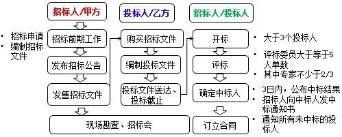

【工具-1】广告

广告是就产品、服务或成果与用户或潜在用户进行的沟通。在大众出版物（如指定的报纸）或专门行业出版物上刊登广告，往往可以扩充现有的潜在卖方名单。大多数政府机构都要求公开发布采购广告，或在网上公布拟签署的政府合同的信息。

【工具-2】投标人会议

投标人会议（又称承包商会议、供应商会议或投标前会议）是在卖方提交建议书之前，在买方和潜在卖方之间召开的会议，其目的是确保所有潜在投标人对采购要求都有清楚且一致的理解，并确保没有任何投标人会得到特别优待。

【工具-3】建议书评估

对建议书进行评估，确定它们是否对包含在招标文件包中的招标文件、采购工作说明书、供方选择标准和其他文件，都做出了完整且充分的响应。

【真题】关于实施采购的描述，正确的是（ ）。

1. 复杂且高风险的采购在授予卖方合同前要由组织授权管理者审批
2. 采购管理计划中应包含清晰且详细的采购目标、需求及成果
3. 实施采购过程主要作用是确保买卖双方履行法律协议，满足项目需求
4. 实施采购过程的输出包括卖方履行的工作绩效达成情况

   【答案】A

【解析】根据每个项目的需要，采购管理计划可以是正式或非正式的，也可以是非常详细或高度概括的。实施采购是获取卖方应答、选择卖方并授予合同的过程。本过程的主要作用是，选定合格卖方并签署关于货物或服务交付的法律协议。工作绩效信息是卖方正在履行的工作的绩效情况，是控制采购的输出。

三、控制采购

控制采购是管理采购关系、监督合同绩效、实施必要的变更和纠偏，以及关闭合同的过程。本过程作用：确保买卖双方履行法律协议，满足项目需求。

控制采购过程是买卖双方都需要的：

- 确保卖方的执行符合合同需求，确保买方可以按合同条款去执行
- 合同管理的关键是管理买方卖方间的接口
- 控制采购的质量，包括采购审计的独立性和可信度，是采购系统可靠性的关键决定因素
- 组织的道德规范、内部法律顾问和外部法律咨询，包括持续的反腐计划，都有助于实现适当的采购控制

输入&输出：

| 输入              | 输出            |
| ----------------- | --------------- |
| 1、项目管理计划   | 1、工作绩效信息 |
| 2、采购文档       | 2、变更请求     |
| 3、协议           | 3、采购关闭     |
| 4、批准的变更请求 |                 |
| 5、质量报告       |                 |
| 6、工作绩效数据   |                 |

【输出】采购关闭

买方通常通过其授权的采购管理员，向卖方发出合同已经完成的正式书面通知。关于正式关闭采购的要求，通常已在合同条款和条件中规定，包括在采购管理计划中。

一般而言，这些要求包括：已按时按质按技术要求交付全部可交付成果；没有未决索赔或发票，全部最终款项已付清。项目管理团队应该在关闭采购之前批准所有的可交付成果。

工具与技术：

【工具-1】索赔管理

如果买卖双方不能就变更补偿达成一致意见，或对变更是否发生存在分歧，那么被请求的变更就成为有争议的变更或潜在的推定变更。此类有争议的变更称为索赔。

在整个合同生命周期中，通常会按照合同条款对索赔进行记录、处理、监督和管理。如果合同双方无法自行解决索赔问题，则可能不得不按合同中规定的程序，用替代争议解决方法（ADR）去处理。谈判是解决所有索赔和争议的首选方法。

【工具-2】检查

检查是指对承包商正在执行的工作进行结构化审查，可能涉及对可交付成果的简单审查或对工作本身的实地审查。

【工具-3】审计

审计是对采购过程的结构化审查。应该在采购合同中明确规定与审计有关的权利和义务。买卖双方的项目经理都应该关注审计结果，以便对项目进行必要的调整。

# 信息系统项目管理师-精讲班-合同管理

项目合同管理

一、按项目范围划分

（一）总承包合同

买方将项目的全过程作为一个整体发包给同一个卖方的合同。总承包合同适用于经验丰富、技术实力雄厚且组织管理协调能力强的卖方，买方只需与一个卖方沟通，容易管理与协调。

（二）单项承包合同

一个卖方只承包项目中的某一项或某几项内容，买方分别与不同的卖方订立项目单项承包合同。单项承包合同使买方可以选择在某一单项上实力强的卖方，但这种方式对买方的组织管理协调能力提出了较高的要求。

（三）分包合同

经合同约定和买方认可，卖方将其承包项目的某一部分或某几部分（非项目的主体结构）再发包给具 有相应资质条件的分包方，与分包方订立的合同称为项目分包合同。

订立项目分包合同必须同时满足 5 个条件，即：

1. 经过买方认可；
2. 分包的部分必须是项目非主体工作；
3. 只能分包部分项目，而不能转包整个项目；
4. 分包方必须具备相应的资质条件；
5. 分包方不能再次分包。

如果分包的项目出现问题，买方既可以要求卖方承担责任，也可以直接要求分包方承担责任。二、按项目付款方式划分

（一）总价合同

总价合同为既定产品或服务的采购设定一个总价。

- 这类合同应在已明确定义需求，且不会出现重大范围变更的情况下使用。买方必须准确定义要采购的产品或服务
- 虽然允许范围变更，但范围变更通常会导致合同价格提高 1.固定总价合同

固定总价合同是最常用的合同类型。大多数买方都喜欢这种合同，因为采购的价格在一开始就被确定，并且不允许改变（除非工作范围发生变更）。因合同履行不好而导致的任何成本增加都由卖方承担。 2.总价加激励费用合同

允许有一定的绩效偏离，并对实现或既定目标时给予财务奖励。

- 设置一个价格上限，卖方必须完成工作并且要承担高于上限的全部成本
- 一般设置比例分摊，如 80/20，买方 80%，卖方 20%

  【例题】下表为总价加激励费用合同，请根据合同情况计算 A 项目和 B 项目的实际支付和实际利润。

|          | 合同情况 | 实际执行情况 |        |
| -------- | -------- | ------------ | ------ |
|          |          | A 项目       | B 项目 |
| 目标成本 | 10       | 8            | 13     |
| 目标费用 | 1        |              |        |
| 分摊比例 | 60:40    |              |        |
| 价格上限 | 12       |              |        |
| 实际支付 | -        |              |        |
| 实际利润 | -        |              |        |

【解析】

|          | 合同情况 | 实际执行情况 |        |
| -------- | -------- | ------------ | ------ |
|          |          | A 项目       | B 项目 |
| 目标成本 | 10       | 8            | 13     |
| 目标费用 | 1        | 1            | 0      |
| 分摊比例 | 60:40    | 0.8          | 0      |
| 价格上限 | 12       |              | 12     |
| 实际支付 | -        | 9.8          | 12     |
| 实际利润 | -        | 1.8          | -1     |

3. 总价加经济价格调整合同

   如果卖方履约要跨越相当长的周期，就应该使用总价加经济价格调整合同。

- 它是一种特殊的总价合同，允许根据条件变化（如通货膨胀、某些特殊商品的成本增加或降低），以事先确定的方式对合同价格进行最终调整
- 总价加经济价格调整合同可以保护买方和卖方免受外界不可控情况的影响，总价加经济价格调整合同条款必须规定用于准确调整最终价格的、可靠的财务指数

4. 订购单

当非大量采购标准化产品时，通常可以由买方直接填写卖方提供的订购单，卖方照此供货。由于订购单通常不需要谈判，所以也称为单边合同。

（二）成本补偿合同

成本补偿合同向卖方支付为完成工作而发生的全部合法实际成本（可报销成本），外加一笔费用作为卖方的利润。成本补偿合同也可为卖方超过或低于预定目标而规定财务奖励条款。

- 工作范围很不清楚的项目
- 买方特别信得过卖方，想要与卖方全面合作的情况。成本补偿合同也可为卖方超过或低于预定目标而规定财务奖励条款

1. 成本加固定费用合同

为卖方报销履行合同工作所发生的一切合法成本，并向卖方支付一笔固定费用作为利润，该费用以项目初始估算成本（目标成本）的某一百分比计算。费用只能针对已完成的工作来支付，并且不因卖方的绩效而变化。除非项目范围发生变更，费用金额维持不变。

2. 成本加激励费用合同

为卖方报销履行合同工作所发生的一切合法成本（即成本实报实销），并在卖方达到合同规定的绩效目标时，向卖方支付预先确定的激励费用。

- 买方和卖方需要根据事先商定的成本分摊比例来分享节约部分或分担超出部分
  - 通常设置分摊比例，80/20：

    实际成本＞目标成本：买方 80%，卖方 20%

    实际成本＜目标成本：买方 80%，卖方 20%

    【例题】下表为成本加激励费用合同，请根据合同情况计算 A 项目和 B 项目的实际支付和实际利润。

|          | 合同情况 | 实际执行情况 |        |
| -------- | -------- | ------------ | ------ |
|          |          | A 项目       | B 项目 |
| 目标成本 | 10       | 8            | 13     |
| 目标费用 | 1        |              |        |
| 分摊比例 | 60:40    |              |        |
| 实际支付 | -        |              |        |
| 实际利润 | -        |              |        |

【解析】

|          | 合同情况 | 实际执行情况 |        |
| -------- | -------- | ------------ | ------ |
|          |          | A 项目       | B 项目 |
| 目标成本 | 10       | 8            | 13     |
| 目标费用 | 1        | 1            | 1      |
| 分摊比例 | 60:40    | 0.8          | -1.2   |
| 实际支付 | -        | 9.8          | 12.8   |
| 实际利润 | -        | 1.8          | -0.2   |

- 如果实际成本大于目标成本：

  合同总价=目标成本+目标费用+买方应负担的成本超支
- 如果实际成本小于目标成本：

合同总价=目标成本+目标费用-买方应享有的成本节约 3.成本加奖励费用合同

为卖方报销履行合同工作所发生的一切合法成本（即成本实报实销），买方再凭自己的主观感觉给卖方支付一笔利润，完全由买方根据自己对卖方绩效的主观判断来决定奖励费用，并且卖方通常无权申诉。

（三）工料合同

工料合同是指按项目工作所花费的实际工时数和材料数，按事先确定的单位工时费用标准和单位材料费用标准进行付款。这类合同适用于工作性质清楚、工作范围比较明确，但具体的工作量无法确定的 项目。

- 买方承担中等程度的成本风险，即承担工作量变动的风险；而卖方则承担单价风险
- 工料合同在金额小、工期短、不复杂的项目上可以有效使用，但在金额大、工期长的复杂项目上不适用

| 合同类型     | 名称              | 关键词                                   | 卖方风险 |
| ------------ | ----------------- | ---------------------------------------- | -------- |
| 总价合同     | 固定总价          | 最常用，价格固定不变（除非工作范围变更） | 高       |
|              | 总价+激励         | 有最高限价，有分摊比例                   |          |
|              | 总价+经济价格调整 | 跨越较长时期                             |          |
| 工料合同     | 工料合同          | 工作量无法评估、工期短、金额小           |          |
| 成本补偿合同 | 成本+激励         | 有利润上下限，有目标绩效、有奖惩比例     |          |
|              | 成本+奖励         | 绩效标准主观笼统                         | 低       |
|              | 成本+固定费用     | 初始估算成本的百分比，不考虑绩效         | 稳赚     |

合同类型的选择：

- 总价合同（卖方承担风险）：工作范围很明确，且项目的设计已具备详细的细节
- 成本补偿合同（买方承担风险）：工作范围尚不明确
- 工料合同（双方承担风险）：工作性质清楚，但范围不是很清楚，而且工作不复杂，又需要快速签订合同
- 单边合同：购买标准产品，且数量不大

【真题】（ ）为卖方报销履行合同工作所发生的一切合法成本（即成本实报实销），买方再给卖方支付一笔利润，完全由买方根据自己对卖方绩效的主观判断来决定，并且卖方通常无权申诉。

1. 总价加激励费用合同
2. 总价加经济价格调整合同
3. 成本加固定费用合同
4. 成本加奖励费用合同

   【答案】D

【解析】为卖方报销履行合同工作所发生的一切合法成本（即成本实报实销），买方再凭自己的主观感觉给卖方支付一笔利润，完全由买方根据自己对卖方绩效的主观判断来决定奖励费用，并且卖方通常无权申诉。

三、合同的内容

项目合同的具体条款由当事人各方自行约定。总的来说，应包括以下各项：

1. 项目名称；
2. 标的内容和范围；
3. 项目的质量要求；
4. 项目的计划、进度、地点、地域和方式；
5. 项目建设过程中的各种期限；
6. 技术情报和资料的保密；
7. 风险责任的承担；
8. 技术成果的归属；
9. 验收的标准和方法；
10. 价款、报酬（或使用费）及其支付方式；
11. 违约金或者损失赔偿的计算方法；
12. 解决争议的方法；
13. 名词术语解释。四、合同管理的过程 1.合同签订管理

    在合同签订之前，应当做好以下工作：
14. 市场调查。主要了解产品的技术发展状况，市场供需情况和市场价格等；
15. 进行潜在合作伙伴或者竞争对手的资信调查，准确把握对方的真实意图，正确评判竞争的激烈程度；
16. 了解相关环境，做出正确的风险分析判断。为了使签约各方对合同有一致理解，建议如下：
17. 使用国家或行业标准的合同格式；
18. 为避免因条款的不完备或歧义而引起合同纠纷，卖方应认真审阅买方拟订的合同条款。清晰的标准要求，切忌含混不清。例如：对合同标的为设备买卖的，一定要写明设备的名称、品牌、计量单位和价格，切忌只写“购买计算机一台”之类的描述；
19. 对合同中质量条款应具体写清规格、型号、适用的标准；
20. 对于合同中需要变更、转让和解除等内容也应详细说明；
21. 如果合同有附件，对于附件的内容也应精心准备，并注意保持与主合同一致；
22. 对于既有投标书，又有正式合同书、附件等包含多项内容的合同，要在条款中列明适用顺序；
23. 为避免合同纠纷，保证合同订立的合法性和有效性，当事人可以执签订的合同到公证机关进行公证；
24. 避免方案变更导致工程变更，从而引发新的误解；
25. 注意合同内容的前后一致性。 2.合同履行管理

合同的履行管理包括对合同的履行情况进行跟踪管理，主要指对合同当事人按合同规定履行应尽的义务和应尽的职责进行检查，及时、合理地处理和解决合同履行过程中出现的问题，包括合同争议、合同违约和合同索赔等事宜。

- 如果约定了仲裁且约定了仲裁裁决的终局性，就不能向法院诉讼
- 在解决合同争议的方法中，其优先顺序为谈判（协商）、调解、仲裁、诉讼 3.合同变更管理

  合同变更指由于一定的法律事实而改变合同的内容的法律行为，具有特征：

1. 项目合同的双方当事人必须协商一致；
2. 改变了合同的内容；
3. 变更的法律后果是将产生新的债权和债务关系。一般具备以下条件才可以变更合同：
4. 双方当事人协商，并且不因此而损坏国家和社会利益；
5. 由于不可抗拒力导致合同义务不能执行；
6. 由于另一方在合同约定的期限内没有履行合同，并且在被允许的推迟履行期限内仍未履行。 4.合同档案管理

合同档案管理（文本管理）是整个合同管理的基础。项目管理团队使用合同档案管理系统对合同文件和记录进行管理。

- 手写的旁注和修改等不具有法律效力 5.合同违约索赔管理

合同违约是指信息系统项目合同当事人一方或双方不履行或不适当履行合同义务，应承担因此给对方造成的经济损失的赔偿责任。

合同索赔是项目中常见的一项合同管理的内容，同时也是规范合同行为的一种约束力和保障措施。

1. 合同索赔分类

| 合同索赔分类依据 | 索赔内容                         |
| ---------------- | -------------------------------- |
| 按索赔的目的     | 工期索赔、费用索赔               |
| 按索赔的依据     | 合同规定的索赔、非合同规定的索赔 |
| 按索赔的业务性质 | 工程索赔、商务索赔               |
| 按索赔的处理方式 | 单项索赔、总索赔                 |

- 工程索赔

  涉及项目执行过程中的施工条件、技术、范围等变化引起的索赔，一般发生频率高，索赔费用大；
- 商务索赔

  项目执行过程中的设备采购、运输、保管等方面引起的索赔。

2. 索赔的起因和原则

- 合同索赔的起因

  ①索赔事件造成了项目成本的额外支出或者直接工期损失；

  ②索赔事件造成费用增加或工期损失的原因，按合同约定不属于索赔方应承担的行为责任或风险责任。
- 合同索赔的原则

  ①索赔必须以合同为依据；

  ②必须注意资料的积累；

  ③及时、合理地处理索赔；

  ④加强索赔的前瞻性。

3. 合同索赔流程

项目发生索赔事件后，一般先由监理工程师调解，若调解不成，由政府建设主管机构进行调解，若仍调解不成，由经济合同仲裁委员会进行调解或仲裁。

①提出索赔要求

当出现索赔事项时，索赔方以书面的索赔通知书形式，在索赔事项发生后的 28 天以内，向监理工程 师正式提出索赔意向通知。

②报送索赔资料

在索赔通知书发出后的 28 天内，向监理工程师提出延长工期和（或）补偿经济损失的索赔报告及有关资料。

③监理工程师答复

监理工程师在收到送交的索赔报告有关资料后，于 28 天内给予答复，或要求索赔方进一步补充索赔理由和证据。

④监理工程师逾期答复后果

监理工程师在收到承包人送交的索赔报告的有关资料后 28 天未予答复或未对承包人作进一步要求，视为该项索赔已经认可。

⑤持续索赔

当索赔事件持续进行时，索赔方应当阶段性向监理工程师发出索赔意向，在索赔事件终了后 28 天内，

向监理工程师送交索赔的有关资料和最终索赔报告，监理工程师应在 28 天内给予答复或要求索赔方进一步补充索赔理由和证据。逾期未答复，视为该项索赔成立。

⑥仲裁与诉讼

监理工程师对索赔的答复，索赔方或发包人不能接受，即进入仲裁或诉讼程序。合同索赔相关的时间点，都是 28 天

4. 合同解释的原则

   ①主导语言原则

如果合同存在两种语言的文本，必须约定哪一种语言是主导语言。当两者不一致时，应该以主导语言文本为准；

②适用法律原则

合同中应该规定以哪个国家的法律作为合同的适用法律，合同的解释必须根据适用法律进行；

③整体解释原则

合同是一个整体，不能割断其中的内在联系；

④公平诚信原则

在解释合同时应公平合理，兼顾双方当事人的利益。

【真题】关于合同管理的描述，不正确的是：（ ）。

①合同管理包括：合同签订管理、合同履行管理、合同变更管理、合同档案管理、合同违约索赔管理

②对于合同中需要变更、转让、解除等内容应有详细说明

③如果合同中有附件，对于附件的内容也应精心准备，当主合同与附件产生矛盾时，以附件为主

④为了使签约各方对合同有一致的理解，合同一律使用行业标准合同

⑤签订合同前应了解相关环境，做出正确的风险分析判断

A. ①②

B. ③④

C. ②⑤

D. ①⑤

【答案】B

【解析】③应该以主合同为主；④为了对合同理解一致，可以自行拟定合同。

项目干系人管理过程：一、识别干系人

二、规划干系人参与三、管理干系人参与四、监督干系人参与

# 信息系统项目管理师-精讲班-干系人管理 1

第 17 章 项目干系人管理

项目干系人管理包括识别能够影响项目或会受项目影响的人员、团队或组织，分析干系人对项目的期望和影响，制定管理策略有效调动干系人参与项目决策和执行。项目干系人管理过程能够支持项目团队的工作。

- 每个项目都有干系人，他们会受到项目积极或消极的影响，或者能对项目施加积极或消极的影响
- 项目经理和团队管理干系人的能力决定着项目的成败
- 干系人满意度应作为项目目标加以识别和管理谁是项目干系人？
- 能影响项目或者受项目影响的全部人员、群体或者组织
- 项目团队：发起人、项目管理团队、项目经理、项目其他成员
- 甲方：甲方主管领导、甲方接口人
- 公司高层：项目组合经理、项目集经理、PMO
- 公司其他部门：运营经理、职能经理
- 其他：股东、监管机构、金融组织、媒体等干系人管理至少要在以下时点开展活动：

1. 项目进入其生命周期的不同阶段；
2. 当前干系人不再与项目工作有关，或者在项目的干系人群体中出现了新的干系人成员；
3. 组织内部或更大领域的干系人群体发生重大变化。一、识别干系人

识别干系人是定期识别项目干系人，分析和记录他们的利益、参与度、相互依赖性、影响力和对项目成功的潜在影响。

本过程的主要作用：使项目团队能够建立对每个干系人或干系人群体的适度关注。

- 识别干系人过程属于启动过程组
- 整个项目期间定期开展开展识别干系人的时间点：

1. 编制和批准项目章程之前或同时首次开展
2. 每个阶段开始时重复开展
3. 项目或组织出现重大变化时重复开展
4. 项目生命周期过程中必要时重复开展

输入&输出：

| 输入            | 输出            |
| --------------- | --------------- |
| 1、立项管理文件 | 1、干系人登记册 |
| 2、项目章程     | 2、变更请求     |
| 3、协议         |                 |
| 4、项目管理计划 |                 |
| 5、需求文件     |                 |
| 6、问题日志     |                 |
| 7、变更日志     |                 |

【输入】立项管理文件

- 项目建议书
  - 可行性研究报告
  - 项目评估报告

    【输出】干系人登记册

    记录已识别干系人的信息，包括：
  - 身份信息：姓名、组织职位、地点、联系方式，以及在项目中扮演的角色
  - 评估信息：主要需求、期望、影响项目成果的潜力，以及干系人最能影响或冲击的项目生命周期阶段
  - 干系人分类：用内部或外部，作用、影响、权力或利益，上级、下级、外围或横向，或者项目经理选择的其他分类模型进行分类的结果等

【真题】某大型环保信息系统工程建设项目，项目发起人与项目经理一起识别出如下三类项目干系人：甲方信息系统管理人员、项目组主要技术人员、监理方，并准备针对他们编制干系人管理计划。对此，您的建议是（ ）。

1. 重新识别干系人
2. 编制干系人管理计划
3. 召开干系人管理沟通会议
4. 编制项目进度计划

   【答案】A

【解析】项目干系人包括项目当事人和其利益受该项目影响（受益或受损）的个人和组织；也可以把他们称作项目的利害关系者。项目干系人还可能包括政府的有关部门、社区公众、项目用户、新闻媒体、市场中潜在的竞争对手和合作伙伴等；甚至项目团队成员的家属也应视为项目干系人。依据题意，只识别出一部分干系人，因此需要重新进行识别。

如果发现了一个新的干系人，第一步应该做什么？

- 重新识别干系人，更新干系人登记册

应定期查看并更新干系人登记册，因为整个项目生命周期中干系人可能发生变化，也可能识别出新的 干系人

工具与技术：

【工具-1】干系人分析

会产生干系人清单和关于干系人的各种信息，例如，在组织内的岗位、在项目中的角色、与项目的利害关系、期望、态度（如对项目的支持程度），以及对项目信息的兴趣。

确定干系人群体和个人在项目任何特定时间的状态。干系人的利害关系组合包括：

- 兴趣：个人或群体会受与项目有关的决策或成果的影响

  - 权利：合法权利、道德权利
  - 所有权：人员或群体对资产或财产拥有的法定所有权
  - 知识：专业知识
  - 贡献：提供资金或其他资源

    【工具-2】数据表现

  1. 权力利益方格、权力影响方格，或影响作用方格
- 权力：基于干系人的职权级别
- 利益：对项目成果的关心程度
- 影响：对项目成果的影响能力
- 作用：改变项目计划或执行的能力

  - 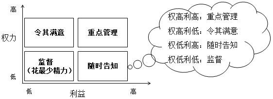权力/利益方格

  1. 干系人立方体

立方体把上述方格中的要素组合成三维模型，项目经理和团队可据此分析干系人并引导干系人参与项目。

1. 凸显模型

通过评估干系人的权力（职权级别或对项目成果的影响能力）、紧迫性（因时间约束或干系人对项目成果有重大利益诉求而导致需立即加以关注）和合法性（参与的适当性），对干系人进行分类。

- 适用于复杂的干系人大型群体

  1. 影响方向

     根据干系人对项目工作或项目团队本身的影响方向，对干系人进行分类。

  - 向上：执行组织或客户组织、发起人和指导委员会的高级管理层
  - 向下：临时贡献知识或技能的团队或专家
  - 向外：项目团队外的干系人群体及其代表，如供应商、政府机构、公众、最终用户和监管部门
  - 横向：项目经理的同级人员，如其他项目经理或中层管理人员，他们与项目经理竞争稀缺项目资源或者合作共享资源或信息

  1. 优先级排序

如果项目有大量干系人、干系人群体的成员频繁变化、干系人和项目团队之间或干系人群体内部的关系复杂，则有必要对干系人进行优先级排序。

【真题】关于识别干系人过程的描述，不正确的是（ ）。

1. 干系人登记册是识别干系人过程的主要输出，记录已识别干系人的信息
2. 变更日志、问题日志、需求文件可以作为识别干系人过程的输入
3. 对干系人进行分类的方法，包括权力利益方格、因果图、回归分析、凸显模型等
4. 识别干系人的主要作用是使项目团队能够建立对每个干系人或干系人群体的适度关注

   【答案】C

【解析】对干系人进行分类的方法，包括权力利益方格、权力影响方格、作用影响方格、干系人立方体、凸显模型、影响方向、优先级排序。

二、规划干系人参与

# 信息系统项目管理师-精讲班-干系人管理 2

规划干系人参与是根据干系人的需求、期望、利益和对项目的潜在影响，制定项目干系人参与项目的方法的过程。

本过程的主要作用：

提供与干系人进行有效互动的可行计划。输入&输出：

| 输入                                                    | 输出              |
| ------------------------------------------------------- | ----------------- |
| 1、协议 ` `2、项目管理计划 ` `3、干系人登记册 | 1、干系人参与计划 |

会触发该计划更新的情况包括：

1. 项目新阶段开始；
2. 组织结构或行业内部发生变化；
3. 新的个人或群体成为干系人、现有干系人不再是干系人群体的成员、或特定干系人对项目成功的重要性发生变化；
4. 当其他项目过程（如变更管理、风险管理或问题管理）的输出导致需要重新审查干系人参与策略等。

   【输出】干系人参与计划

干系人参与计划基于项目的需要和干系人的期望，主要包括调动干系人个人或群体参与的特定策略或方法。

- 干系人参与计划示例

| 基本信息 | 评估信息              | 内部/外部 | 管理策略                        |      |                                         |
| -------- | --------------------- | --------- | ------------------------------- | ---- | --------------------------------------- |
| 编号     | 干系人                | 角色      |                                 |      |                                         |
| 001      | 研发经理              | 项目成员  | 负责技术开发总体工作            | 内部 | 及时沟通，赢得他对项目 ` `持续支持 |
| 002      | 信息中心主 ` `任 | 客户主管  | 需求确认，业务方案确 ` `认 | 外部 | 主动沟通，定期汇报，积 ` `极合作   |

工具与技术：

【工具-1】数据分析

- 假设条件和制约因素分析

  可能需要分析当前的假设条件和制约因素，以合理剪裁干系人参与策略。

  - 根本原因分析

开展根本原因分析，识别是什么根本原因导致了干系人对项目的某种支持水平，以便选择适当策略来改进其参与水平。

【工具-2】干系人参与度评估矩阵

用于将干系人当前参与水平与期望参与水平进行比较。

| 干系人   | 不知晓 | 抵制 | 中立 | 支持 | 领导 |
| -------- | ------ | ---- | ---- | ---- | ---- |
| 干系人 1 | C      |      |      | D    |      |
| 干系人 2 |        |      | C    | D    |      |
| 干系人 3 |        |      |      | DC   |      |

注：C 表示当前参与程度，D 表示所需参与程度干系人参与水平：

1. 不了解型：不知道项目及其潜在影响；
2. 抵制型：知道项目及其潜在影响，但抵制项目工作或成果可能引发的任何变更。此类干系人不会支持项目工作或项目成果；
3. 中立型：了解项目，但既不支持，也不反对；
4. 支持型：了解项目及其潜在影响，并且会支持项目工作及其成果；
5. 领导型：了解项目及其潜在影响，而且积极参与以确保项目取得成功。

   【真题】在以下干系人参与度矩阵中，需要授权管理职责并引导其积极参与项目执行的干系人是（ ）。

| 干系人   | 不知晓 | 抵制 | 中立 | 支持 | 领导 |
| -------- | ------ | ---- | ---- | ---- | ---- |
| 干系人 1 |        |      | CD   |      |      |
| 干系人 2 |        |      | C    | D    |      |
| 干系人 3 |        |      | C    |      | D    |

注：C 表示当前参与程度，D 表示所需参与程度

1. 干系人 1
2. 干系人 2
3. 干系人 3
4. 干系人 2 和干系人 3

   【答案】C

   【解析】干系人参与水平可分为如下：
5. 不了解型：不知道项目及其潜在影响；
6. 抵制型：知道项目及其潜在影响，但抵制项目工作或成果可能引发的任何变更。此类干系人不会支持项目工作或项目成果；
7. 中立型：了解项目，但既不支持，也不反对；
8. 支持型：了解项目及其潜在影响，并且会支持项目工作及其成果；
9. 领导型：了解项目及其潜在影响，而且积极参与以确保项目取得成功。三、管理干系人参与

管理干系人参与是通过与干系人进行沟通协作，以满足其需求与期望，处理问题，并促进干系人合理参与的过程。

本过程的主要作用：

尽可能提高干系人的支持度，并降低干系人的抵制程度。管理干系人参与，活动包括：

1. 在适当的项目阶段引导干系人参与，以便获取、确认或维持他们对项目成功的持续承诺；
2. 通过谈判和沟通的方式管理干系人期望；
3. 处理与干系人管理有关的任何风险或潜在关注点，预测干系人可能在未来引发的问题；
4. 澄清和解决已识别的问题等。

输入&输出：

| 输入              | 输出                |
| ----------------- | ------------------- |
| 1、项目管理计划   | 1、变更请求         |
| 2、干系人登记册   | 2、项目管理计划更新 |
| 3、变更日志       | 3、项目文件更新     |
| 4、经验教训登记册 |                     |

工具与技术：

【工具-1】沟通技能

在开展管理干系人参与过程时，应该根据沟通管理计划，针对每个干系人采取相应的沟通方法。项目管理团队应该使用反馈机制，来了解干系人对各种项目管理活动和关键决策的反应，包括正式与非正 式对话、问题识别和讨论、会议、进展报告和调查。

【工具-2】基本规则

根据团队章程中定义的基本规则，明确项目团队成员和其他干系人引导干系人参与的行为。

【工具-3】人际关系与团队技能

文化意识、政策意识、冲突管理、谈判、观察和交谈。

【真题】关于管理干系人参与过程，正确的是（ ）。

1. 干系人参与计划必须是正式的、详细的项目文件，以确保满足项目的需要
2. 规划干系人参与过程是管理干系人参与过程的前置流程，不受管理干系人参与过程的影响
3. 管理干系人参与过程的输出包括变更请求、组织过程资产、事业环境因素
4. 管理干系人参与过程的主要作用是尽可能提高干系人的支持度、降低抵制程度

   【答案】D

【解析】管理干系人参与是通过与干系人进行沟通协作，以满足其需求与期望、处理问题，并促进干系人合理参与的过程。本过程的主要作用是，尽可能提高干系人的支持度，并降低干系人的抵制程度。本过程需要在整个项目期间开展。

四、监督干系人参与

监督干系人参与是监督项目干系人的关系，并通过修订参与策略和计划来引导干系人合理参与项目的过程。

本过程的主要作用：

随着项目进展和环境变化，维持或提升干系人参与活动的效率和效果。输入&输出：

| 输入                                                        | 输出                                |
| ----------------------------------------------------------- | ----------------------------------- |
| 1、项目管理计划 ` `2、问题日志 ` `3、工作绩效数据 | 1、工作绩效信息 ` `2、变更请求 |

工具与技术：

【例题】“通过与干系人进行沟通协作以满足其需求与期望，处理问题促进其合理参与”属于（ ）过程的工作。

1. 管理沟通
2. 监督沟通
3. 管理干系人参与
4. 监督干系人参与

   【答案】C

   【解析】管理过程区别：

管理沟通：确保项目信息及时且恰当地收集、生成、发布、存储、检索、管理、监督和最终处置监督沟通：确保满足项目及其干系人的信息需求

管理干系人参与：与干系人沟通和协作、以满足其需求与期望，并处理问题，以促进干系人合理参与监督干系人参与：监督干系人关系，并通过修订参与策略和计划来引导干系人合理参与项目

1. PMBOK 的发展

# 信息系统项目管理师-精讲班-项目管理概论 1

第 6 章 项目管理概论

PMBOK 项目管理知识体系（Project Management Body Of Knowledge，PMBOK）是由美国项目管理协会

（Project Management Institute，PMI）开发的一套描述项目管理专业范围的知识体系，包含了对项目管理所需的知识、技能和工具的描述。

- 第 7 版：12 个项目管理原则、8 个绩效域
  1. 项目基本要素 项目基本要素

     一、项目基础

项目是为创造独特的产品、服务或成果而进行的临时性工作。例如：

- 开发一款新手机
  - 向火星发射探测器
    - 互联网电子商务网站
    - 社区信息管理系统开发

1. 独特的产品、服务或成果
2. 临时性工作
3. 项目驱动变更
4. 项目创造业务价值
5. 项目启动背景
   - 可交付成果可能是有形的，也可能是无形的
     - 实现项目目标可能会产生一个或多个可交付成果
     - 项目可以在组织的任何层级上开展，一个项目可能只涉及一个人或一组人
     - 临时性指项目有明确的起点和终点，并不一定意味着项目的持续时间短
     - 虽然项目是临时性工作，但其可交付成果可能会在项目终止后依然存在
     - 项目的业务价值指特定项目的成果能够为干系人带来效益二、促成项目创建的因素
6. 符合法律法规或社会需求
7. 满足干系人要求或需求
8. 创造、改进或修复产品、过程或服务
9. 执行、变更业务或技术战略

| 特定因素           | 示例                                                                                                    | 符合法律法规或社会需求 | 满足干系人要求或需求 | 创造、改进或修复产品、过程或服务 | 执行、变更业务或技术战略 |
| ------------------ | ------------------------------------------------------------------------------------------------------- | ---------------------- | -------------------- | -------------------------------- | ------------------------ |
| 新技术             | 某电子公司批准一个新项目，在计算机内存和电子技术发展基础上，开发一种高速、廉价的小型笔记本电脑          |                        |                      | √                               | √                       |
| 竞争力             | 为保持竞争力，产品价格要低于竞争对手 产品价格，需要降低生产成本                                         |                        |                      |                                  | √                       |
| 材料问题           | 某市政桥梁的一些支撑构件出现裂缝，因此需要实施一个项目来解决问题                                        | √                     |                      | √                               |                          |
| 政策变革           | 在某新政策影响下，当前某项目经费发生 变更                                                               |                        |                      |                                  | √                       |
| 市场需求           | 为应对汽油紧缺，某汽车公司批准一个低油耗车型的研发项目                                                  |                        | √                   | √                               | √                       |
| 经济变革           | 经济滑坡导致某当前项目优先级发生变更                                                                    |                        |                      |                                  | √                       |
| 客户要求           | 为了给新工业园区供电，某电力公司批准一个新变电站建设项目                                                |                        | √                   | √                               |                          |
| 干系人需求         | 某干系人要求组织进行新的输出                                                                            |                        | √                   |                                  |                          |
| 法律要求           | 某化工制造商批准一个项目，为妥善处理 一种新的有毒材料制定指南                                           | √                     |                      |                                  |                          |
| 业务过程改进       | 某组织实施一个运用精益六西格玛价值流 图的项目                                                           |                        |                      | √                               |                          |
| 战略机会或业务需求 | 为增加收入，某培训公司批准一个项目，开发一门新课程                                                      |                        |                      | √                               | √                       |
| 社会需求           | 为应对传染病频发，某发展中国家的非政 府组织批准一个项目，为社区建设饮用水系统和公共厕所，并开展卫生教育 |                        | √                   |                                  |                          |
| 环境需要           | 为减少污染，某上市公司批准一个项目，开创电动汽车共享服务                                                |                        |                      | √                               | √                       |

三、项目成功的标准

1. 完成项目效益管理计划；
2. 达到可行性研究与论证中记录的已商定的财务测量指标，包括：净现值（NPV）、投资回报率（ROI）、

内部报酬率（IRR）、回收期（PBP）和效益成本比率（BCR）；

3. 达到可行性研究与论证的非财务目标；
4. 组织从“当前状态”成功转移到“将来状态”；
5. 履行合同条款和条件；
6. 达到组织战略、目的和目标，使干系人满意；
7. 可接受的客户/最终用户的采纳度；
8. 将可交付成果整合到组织的运营环境中；
9. 满足商定的交付质量；
10. 遵循治理规则；
11. 满足商定的其他成功标准或准则（例如过程产出率）等。项目可宣告结束的情况：
12. 达成项目目标；不能达到目标；
13. 项目资金耗尽或不再获得资金支持；
14. 对项目的需求不复存在；
15. 无法获得所需的人力或物力资源；
16. 出于法律或其他原因终止项目等。

项目、项目集、项目组合和运营管理之间的关系一、项目、项目集和项目组合

一个项目可以采用三种不同的模式进行管理：独立项目、在项目集内、在项目组合内。

- 项目集：是一组相互关联且被协调管理的项目、子项目集和项目集活动，目的是为了获得分别管理所无法获得的利益。项目集不是大项目
  - 项目组合：是指为实现战略目标而组合在一起管理的项目、项目集、子项目组合和运营工作项目组合、项目集、项目和运营在特定情况下是相互关联的。

    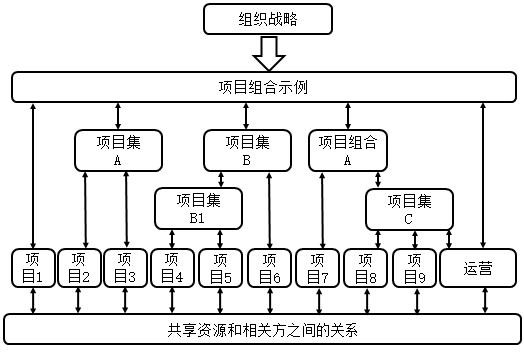

    从组织角度：

    - 项目、项目集：正确地做事
    - 项目组合：做正确的事

|      | 项目                                                                                    | 项目集                                                                                                      | 项目组合                                                                                        |
| ---- | --------------------------------------------------------------------------------------- | ----------------------------------------------------------------------------------------------------------- | ----------------------------------------------------------------------------------------------- |
| 范围 | 项目具有明确的目标，范围在整个项目生命周期中是渐进明晰的                                | 项目集的范围包括其项目集组件的范围。项目集通过确保各项目集组件的输出和成果协调互 ` `补，为组织带来效益 | 项目组合的组织范围随着组织战略目标的变化而变化                                                  |
| 变更 | 项目经理对变更和实施过程做出预期，实现对变更的管 理和控制                               | 项目集的管理方法是随着项目集各组件成果和输出的交付，在必要时接受和适应变更，优化效 ` `益实现           | 项目组合经理持续监督更广泛的内外部环境的变更                                                    |
| 规划 | 在整个项目生命周期中，项目经理渐进明晰高层级信息，将其转化为详细的计划                  | 项目集的管理利用高层级计划，跟踪项目集组件的依赖关系和进展。项目集计划也用于在组件 ` `层级指导规划     | 项目组合经理建立并维护与项目组合整体有关的必要过程和沟通                                        |
| 管理 | 项目经理为实现项目目标而管理项目团队                                                    | 项目集由项目集经理管理，其通过协调项目集组件的活动，确保项目集效益按预期实现                                | 项目组合经理可管理或协调项目组合管理人员或对项目组合整体负有报告职 ` `责的项目集和项目人员 |
| 监督 | 项目经理监控项目开展中生产产品、提供服务或成果的 ` `工作                           | 项目集经理监督项目集组件的进展，确保整体目标、进度计划、` `预算和项目集效益的实现                      | 项目组合经理监督战略变 更以及总体资源分配、绩 ` `效成果和项目组合风险                      |
| 成果 | 项目的成功通过产品和项目的质量、时间表、预算的依从性以及客户满意度水平进 ` `行衡量 | 项目集的成功通过项目集向组 织交付预期效益的能力以及项目集交付所述效益的效率和效 ` `果进行衡量          | 项目组合的成功通过项目组合的总体投资效果和实现的效益进行衡量                                    |

二、组织级项目管理和战略

1. 项目组合管理通过选择适当的项目集或项目，对工作进行优先级排序，并提供所需资源，与组织战 略保持一致；
2. 项目集管理通过对其组成部分进行协调，对它们之间的依赖关系进行控制，从而实现既定收益；
3. 项目管理使组织的目标得以实现。

- 组织级项目管理

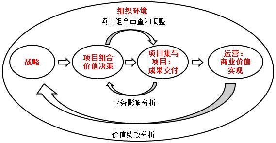

项目内外部运行环境一、组织过程资产

1. 过程资产：包括工具、方法论、方法、模板、框架、模式或 PMO 资源。
2. 治理文件：包括政策和流程。
3. 数据资产：包括以前项目的数据库、文件库、度量指标、数据和工件。
4. 知识资产：包括项目团队成员、主题专家和其他员工的隐性知识。
5. 安保和安全：包括对设施访问、数据保护、保密级别和专有秘密的程序和实践等。二、组织内部的事业环境因素

| 组织内部：事业环境因素 | 内容                                                                                                  |
| ---------------------- | ----------------------------------------------------------------------------------------------------- |
| 组织文化、结构和治理   | 愿景、使命、价值观、信念、文化规范、领导力风格、等级制度和职权关 ` `系、组织风格、道德和行为规范 |
| 设施和资源的物理分布   | 工作地点、虚拟项目团队和共享系统                                                                      |
| 基础设施               | 现有设施、设备、组织和电信通道、IT 硬件、可用性和功能                                                 |
| 信息技术软件           | 进度计划软件、配置管理系统、信息系统的网络接口、协作工具和工作授 ` `权系统                       |
| 资源可用性             | 签订合同和采购制约因素、获得批准的供应商和分包商以及合作协议、与 ` `人员和材料相关的可用性       |
| 员工能力               | 通用和特定的专业知识、技能、能力、技术和知识                                                          |
| 组织外部：事业环境因素 | 内容                                                                                                  |
| 市场条件               | 竞争对手、市场份额、品牌认知度、技术趋势和商标                                                        |
| 社会和文化影响因素     | 政策导向、地域风俗和传统、公共假日和事件、行为规范、道德和观念                                        |
| 监管环境               | 法律和法规                                                                                            |
| 商业数据库             | 标准化的成本估算数据和行业风险研究信息                                                                |
| 学术研究               | 行业研究、出版物和标杆对照结果                                                                        |
| 行业标准               | 标准                                                                                                  |
| 财务考虑因素           | 汇率、利率、通货膨胀、税收和关税                                                                      |
| 物理环境因素           | 工作条件和天气相关因素                                                                                |

组织系统

一、治理框架

治理是在组织各层级上的组织性或结构性安排，旨在确定和影响组织成员的行为。治理是一个多维度 概念，需要考虑人员、角色、结构和政策，同时需要通过数据和反馈提供指导和监督。

二、管理要素

管理要素是组织内部关键职能部门或一般管理原则的组成部分。

- 部门、组织授予的工作职权、明确的工作职位、工作职责
  - 行动纪律、统一指挥原则、统一领导原则
  - 组织的总体目标优先于个人目标
  - 支付合理的薪酬、资源的优化使用
  - 畅通的沟通渠道、在正确的时间让正确的人使用正确的材料做正确的事情
  - 公正、平等地对待所有员工、确保员工安全、允许任何员工参与计划和实施、保持员工士气

三、组织结构类型

| 组织结构类型                             | 项目特征                                                       |              |                                                                 |              |                |              |
| ---------------------------------------- | -------------------------------------------------------------- | ------------ | --------------------------------------------------------------- | ------------ | -------------- | ------------ |
|                                          | 工作 安排人                                                    | 项目经理批准 | 项目经理的角色                                                  | 资源可用性   | 项目预算管理人 | 项目管理人员 |
| 系统型或简单型                           | 灵活，人员并肩工作                                             | 极少或无     | 兼职                                                            | 极少或无     | 负责人或操作员 | 极少或无     |
| 职能 ` `（集中式）                  | 正在进行的工作                                                 | 极少或无     | 兼职                                                            | 极少或无     | 职能经理       | 兼职         |
| 多部门（职能可复制，各部门几乎不会集中） | 其中之一：产品、生产过程、项目组合、项目集、地理区域、客户类型 | 极少或无     | 兼职                                                            | 极少或无     | 职能经理       | 兼职         |
| 矩阵-弱                                  | 工作职能                                                       | 低           | 兼职；作为另一项工作的组成部分，并非指定工作角 色，如协调员     | 低           | 职能经理       | 兼职         |
| 矩阵-均衡                                | 工作职能                                                       | 低到中       | 兼职；作为一种技能的嵌入职能，不可以是指定工作角 色（如协调员） | 低到中       | 混合           | 兼职         |
| 矩阵-强                                  | 按工作职能，项目经理作为一个职能                               | 中到高       | 全职指定工作角色                                                | 中到高       | 项目经理       | 全职         |
| 项目导向 ` `（复合、混合）          | 项目                                                           | 高到几乎全部 | 全职指定工作角色                                                | 高到几乎全部 | 项目经理       | 全职         |
| PMO                                      | 其他类型的混合                                                 | 高到几乎全部 | 全职指定工作                                                    | 高到几乎全部 | 项目经理       | 全职         |
| 混合型                                   | 其他类型的混合                                                 | 混合         | 混合                                                            | 混合         | 混合           | 混合         |
| 虚拟                                     | 网络架构、带有与他人联系的节点                                 | 低到中       | 全职或兼职                                                      | 低到中       | 混合           | 全职或兼职   |

1. 职能、多部门、弱矩阵
   - 预算管理人：职能经理 2.强矩阵、项目导向、PMO
   - 预算管理人：项目经理
   - 项目经理是全职指定工作角色或工作、项目管理人员是全职

- 项目经理批准级别高、资源可用性高四、项目管理办公室（PMO）类型
  - 支持型

担任顾问的角色，向项目提供模板、最佳实践、培训，以及来自其他项目的信息和经验教训。这种类型 PMO 其实就是一个项目资源库，对项目控制程度很低；

- 控制型

  不仅给项目提供支持，而且通过各种手段要求项目服从 PMO 的管理策略，对项目控制程度中等；

  - 指令型

直接管理和控制项目。这种类型的 PMO 对项目的控制程度很高。项目管理和产品管理

产品管理可以在产品生命周期的任何时间点启动项目集或项目，以便为创建或增强特定组件、职能或功能提供支持。

初始产品开始时可以是项目集或项目的可交付物。产品管理可以表现为如下形式：

1. 产品生命周期中包含项目集管理；
2. 产品生命周期中包含单个项目管理；
3. 项目集内的产品管理。
4. 项目经理的角色

# 信息系统项目管理师-精讲班-项目管理概论 2

一、项目经理的影响力范围

项目经理在其影响力范围内可担任多种角色，还承担项目发起人、团队成员与其他干系人之间的沟通者。

| 项目经理 ` `影响力范围 | 内容                                                                                                  |
| --------------------------- | ----------------------------------------------------------------------------------------------------- |
| 项目                        | 项目经理领导项目团队实现项目目标和干系人的期望。项目经理利用可用资源，平衡 ` `相互竞争的制约因素 |
| 组织                        | 项目经理可以是临时被委任的外部顾问                                                                    |
| 行业                        | 项目经理应该时刻关注行业的最新发展趋势，获取并判断这些信息对当前项目的影响                            |
| 专业学科                    | 持续的知识传递和整合非常重要                                                                          |
| 跨领域                      | 项目经理可以指导和教育其他专业人员了解项目管理方法对组织的价值                                        |

二、项目经理的能力

项目经理需要重点关注三个方面的关键技能包括项目管理、战略和商务、领导力。 1.项目管理

与项目、项目集和项目组合管理特定领域相关的知识、技能和行为，可以帮助达成项目目标。

- 关注关键项目管理要素
- 针对每个项目剪裁
- 花时间制订完整计划并谨慎排定优先顺序
- 管理项目制约因素 2.战略和商务管理技能

战略和商务管理技能包括了解组织概况、有效协商，以及执行有利于战略调整和创新的决策及行动的能力。有助于项目经理了解与项目相关的商业因素。

- 向其他人解释关于项目的必要商业信息
- 与项目发起人、团队和专家合作制定合适的项目交付策略
- 以实现项目业务价值最大化的方式执行策略 3.领导力

领导力对组织项目是否成功至关重要，领导力技能指导、激励和带领团队的能力。这些技能包括协商、抗压、沟通、解决问题、批判性思考和人际关系技能等。

- 人际交往
- 领导者品质和技能
- 政策和权力

| 管理                           | 领导力                         |
| ------------------------------ | ------------------------------ |
| 接受现状                       | 挑战现状                       |
| 直接利用职位权力               | 利用关系的力量指导、影响与合作 |
| 维护、管理                     | 建设、创新                     |
| 依赖控制                       | 激发信任                       |
| 了解方式和时间                 | 了解情况和原因                 |
| 关注系统和架构                 | 关注人际关系                   |
| 关注近期目标                   | 关注长期愿景                   |
| 关注赢利                       | 关注范围                       |
| 正确地做事                     | 做正确的事                     |
| 关注可操作性的问题和问题的解决 | 关注愿景、一致性、动力和激励   |

三、项目经理领导力风格

| 领导力风格 | 内容                                                                                                                       |
| ---------- | -------------------------------------------------------------------------------------------------------------------------- |
| 放任型     | 允许团队自主决策和设定目标，无为而治型                                                                                     |
| 交易型     | 根据目标、反馈和成就给予奖励                                                                                               |
| 服务型     | 做出服务承诺，处处先为他人着想；关注他人的成长、学习、发展、自主性和福利；` `关注人际关系、团队与合作、服务优先于领导 |
| 变革型     | 通过理想化特质和行为、鼓舞型激励、促进创新和创造，以及个人关怀提高追随者 ` `的能力                                    |
| 魅力型     | 能够激励他人；精神饱满、热情洋溢、充满自信；说服力强                                                                       |
| 交互型     | 结合了交易型、变革型和魅力型领导的特点                                                                                     |

项目管理原则

原则一：勤勉、尊重和关心他人

1. 关注组织内部和外部的职责；
2. 坚持诚信、关心、可信、合规原则；
3. 秉持整体观，综合考虑财务、社会、技术和可持续的发展环境等因素。原则二：营造协作的项目管理团队环境
4. 项目是由项目团队交付的；
5. 项目团队在组织文化和准则范围内开展工作，通常会建立自己的“本地”文化；
6. 协作的项目团队环境有助于与其他组织文化和指南保持一致；个人和团队的学习和发展；为交付期望成果做出最佳贡献。

   原则三：促进干系人有效参与
7. 干系人会影响项目、绩效和成果；
8. 项目团队通过与干系人互动来为干系人服务；
9. 干系人的参与可主动地推进价值交付。原则四：聚焦于价值
10. 价值是项目成功的最终指标；
11. 价值可以在整个项目进行期间、项目结束或完成后实现；（3）价值可以从定性和/或定量的角度进行定义和衡量；
12. 以成果为导向，可帮助项目团队获得预期收益，从而创造价值；
13. 评估项目进展并做出调整，使期望的价值最大化。

原则五：识别、评估和响应系统交互

1. 项目是由多个相互依赖且相互作用的活动域组成的一个系统；
2. 需要从系统角度进行思考，整体了解项目的各个部分如何相互作用，以及如何与外部系统进行交互；
3. 系统不断变化，需要始终关注内外部环境；
4. 对系统交互作出响应，可以使项目团队充分利用积极的成果。原则六：展现领导力行为
5. 有效的领导力有助于项目成功，并有助于取得积极的成果；
6. 任何项目团队成员都可以表现出领导力行为；
7. 领导力与职权不同；
8. 有效的领导者会根据情境调整自己的风格；
9. 有效的领导者会认识到项目团队成员之间动机的差异性；
10. 领导者应该在诚实、正直和道德行为规范方面展现出期望的行为。原则七：根据环境进行裁剪
11. 每个项目都具有独特性；
12. 项目成功取决于适合项目的独特环境和方法；
13. 裁剪应该在整个项目进展过程中持续进行。原则八：将质量融入到过程和成果中
14. 项目成果的质量要求：达到干系人期望并满足项目和产品需求；
15. 质量通过成果的验收标准来衡量；
16. 项目过程的质量要求是确保项目过程尽可能适当有效。原则九：驾驭复杂性
17. 复杂性是由人类行为、系统交互、不确定性和模糊性造成的；
18. 复杂性可能在项目生命周期的任何时间出现；
19. 影响价值、范围、沟通、干系人、风险和技术创新的因素都可能造成复杂性；
20. 在识别复杂性时，项目团队需要保持警惕，应用各种方法来降低复杂性的数量及其对项目的影响。原则十：优化风险应对
21. 单个和整体的风险都会对项目造成影响；
22. 风险可能是积极的（机会），也可能是消极的（威胁）；
23. 项目团队需要在整个项目生命周期中不断应对风险；
24. 组织的风险态度、偏好和临界值会影响风险的应对方式；
25. 项目团队持续反复地识别风险并积极应对，需要关注的要点包括：明确风险的重要性；考虑成本效益；切合项目实际；与干系人达成共识；明确风险责任人。

    原则十一：拥抱适应性和韧性
26. 适应性是应对不断变化的能力；
27. 韧性是接受冲击的能力和从挫折或失败中快速恢复的能力；
28. 聚焦于成果而非某项输出，有助于增强适应性。原则十二：为实现目标而驱动变革
29. 采用结构化变革方法，帮助个人、群体和组织从当前状态过渡到未来的期望状态；
30. 变革源于内部和外部的影响；
31. 变革具有挑战性，并非所有干系人都接受变革；
32. 在短时间内尝试过多的变革会导致变革疲劳，使变革易受抵制；
33. 干系人参与、激励，有助于变革顺利进行。

项目生命周期和项目阶段

一、项目生命周期和项目阶段

项目生命周期指项目从启动到完成所经历的一系列阶段，这些阶段之间的关系可以顺序、迭代或交叠进行。

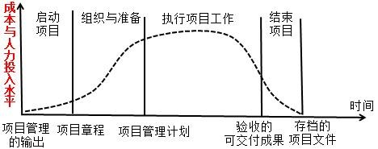项目生命周期特征：

- 成本与人力投入在开始时较低，在工作执行期间达到最高，并在项目快要结束时迅速回落

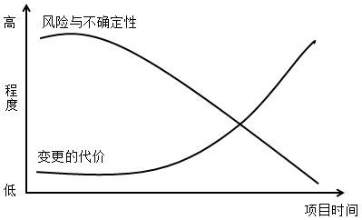

- 风险与不确定性在项目开始时最大，在项目整个生命周期内逐步降低
  - 做出变更和纠正错误的成本，随着项目越来越接近完成而显著增高二、项目生命周期类型

    （一）预测型（计划驱动型）

    预测型（计划驱动型、瀑布型）适用于已经充分了解并明确确定需求的项目。

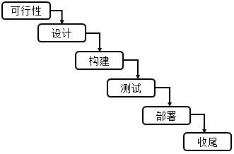

预测型生命周期在生命周期的早期阶段确定项目范围、时间和成本，对任何范围的变更都要进行严格 管理，每个阶段只进行一次，每个阶段都侧重于某一特定类型的工作。

高度预测型项目范围变更很少，干系人之间有高度共识。这类项目会受益于前期的详细规划，但有些情况（如增加范围、需求变化或市场变化）会导致某些阶段重复进行。

（二）迭代型

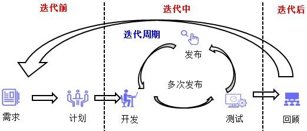项目范围通常在项目生命周期的早期确定，但时间及成本会随着项目团队对产品理解的不断深入而定期修改。

（三）增量型

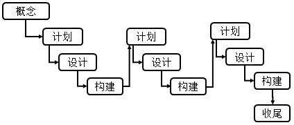增量型生命周期的项目通过在预定的时间区间内渐进增加产品功能的一系列迭代来产出可交付成果。只有在最后一次迭代之后，可交付成果具有了必要和足够的能力，才能被视为完整的。

迭代方法和增量方法的区别：

- 迭代方法：通过一系列重复的循环活动来开发产品
  - 增量方法：渐进地增加产品的功能

    （四）适应型（敏捷型）

适应型适合于需求不确定，不断发展变化的项目。在每次迭代前，项目和产品愿景的范围被明确定义和批准，每次迭代（又称“冲刺”）结束时，客户会对具有功能性的可交付物进行审查。

适应型项目生命周期的特点是先基于初始需求制定一套高层级计划，再逐渐把需求细化到适合特定规 划周期所需的详细程度。

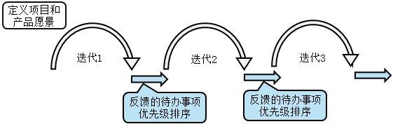

（五）混合型

混合型生命周期是预测型生命周期和适应型生命周期的组合。

- 特定项目的不同阶段往往采用不同的生命周期，项目管理团队需要确定项目及其不同阶段最适合的生命周期

| 预测型                                                           | 迭代型与增量型                           | 适应型                                   |
| ---------------------------------------------------------------- | ---------------------------------------- | ---------------------------------------- |
| 需求在开发前预先确定                                             | 需求在交付期间定期细化                   | 需求在交付期间频繁细化                   |
| 针对最终可交付成果制订交付计划，然后在项目结束时一次交付最终产品 | 分次交付整体项目或产品的各个子集         | 频繁交付对客户有价值的各个子集           |
| 尽量限制变更                                                     | 定期把变更融入项目                       | 在交付期间实时把变更融入项目             |
| 关键干系人在特定里程碑点参与                                     | 关键干系人定期参与                       | 关键干系人持续参与                       |
| 通过对基本已知的情况编制详细计划来控制风险和成本                 | 通过用新信息逐渐细化计划来控制风险和成本 | 随着需求和制约因素的显现而控制风险和成本 |

一、项目管理过程组

1. 启动过程组：定义了新项目或现有项目的新阶段，启动过程组授权一个项目或阶段的开始。
2. 规划过程组：明确项目范围、优化目标，并为实现目标制订行动计划。
3. 执行过程组：完成项目管理计划中确定的工作，以满足项目要求。
4. 监控过程组：跟踪、审查和调整项目进展与绩效，识别变更并启动相应的变更。
5. 收尾过程组：正式完成或结束项目、阶段或合同。各过程组交互：交迭

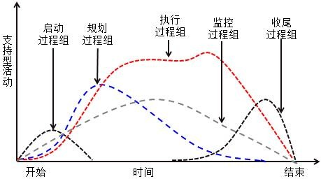

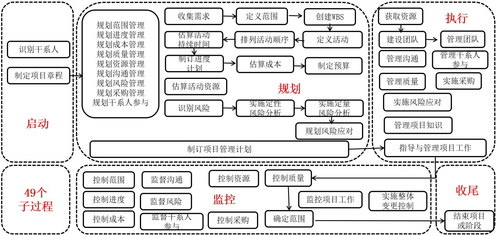

启动过程组：识别干系人、制定项目章程

执行过程组：管理 XX、获取资源、建设团队、实施风险应对、实施采购、指导与管理项目工作 监控过程组：控制 XX、确认范围、实施整体变更控制、监控项目工作

任何项目都必需五个项目过程组！

二、适应型项目中的过程组

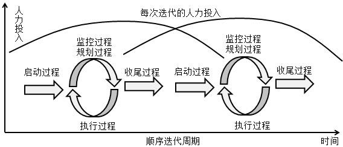

1. 启动过程组

   适应型生命周期，启动过程通常要在每个迭代期开展。要求干系人持续地表达需要和意愿。
2. 规划过程组

   让尽可能多的干系人参与到规划过程组。
3. 执行过程组

每次迭代都是在一个很短的固定时间段内开展工作，然后演示所完成的工作成果，有关的干系人和团队基于演示来进行回顾性审查。虽然工作是通过短期迭代进行的，但也需要对照长期的项目交付时间框架对其进行跟踪和管理。

4. 监控过程组

- 针对未完成的工作项：业务代表对未完成的工作项进行优先级排序，基于业务优先级和团队能力，提取未完项清单最前面的任务，供下一个迭代期完成
- 针对变更：业务代表在听取项目团队的技术意见后，评审变更请求和缺陷报告，排列所需变更或补救的优先级，列入工作未完项清单

5. 收尾过程组

收尾过程对工作进行优先级排序，以便首先完成最具业务价值的工作。价值交付体系

价值交付系统包括项目如何创造价值、价值交付组件和信息流。一、创造价值

项目可以通过以下方式创造价值：

1. 创造满足客户或最终用户需要的新产品、服务或结果；
2. 做出积极的社会或环境贡献；
3. 提高效率、生产力、效果或响应能力；
4. 推动必要的变革，以促进组织向期望的未来状态过渡；
5. 维持以前的项目集、项目或业务运营所带来的收益等。二、价值交付组件

可以单独或共同使用多种组件（例如项目组合、项目集、项目、产品和运营）以创造价值。这些组件共同组成了一个符合组织战略的价值交付系统。

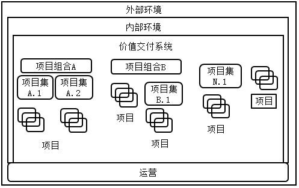

三、信息流

当信息和信息反馈在所有价值交付组件之间以一致的方式共享时，价值交付系统最为有效，能够使系统与战略保持一致。

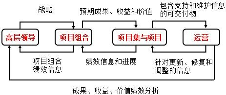

1.为什么要立项？

# 信息系统项目管理师-精讲班-立项管理

第 7 章 项目立项管理

——立项管理重点关注是否要启动一个项目 2.甲方需要立项，还是乙方立项？

——甲乙双方都需要立项，本章中主要指甲方立项项目立项管理五个阶段：

项目建议与立项申请

项目建议书（又称立项申请）是项目建设单位向上级主管部门提交项目申请时所必须的文件，是对拟建项目提出的框架性的总体设想。

项目建议书内容：

- 项目的必要性
- 项目的市场预测
- 项目预期成果的市场预测
- 项目建设必需的条件必要和预测

  项目可行性研究

可行性研究是在项目建议书被批准后，从技术、经济、社会和人员等方面的条件和情况进行调查研究，对可能的技术方案进行论证，以最终确定整个项目是否可行。

一、可行性研究的内容 1.技术可行性分析

在当前的技术、产品条件限制下，能否利用现在拥有的以及可能拥有的技术能力、产品功能、人力资源来实现项目的目标、功能、性能，能否在规定的时间期限内完成整个项目。

1. 进行项目开发的风险
2. 人力资源的有效性
3. 技术能力的可能性
4. 物资（产品）的可用性 2.经济可行性分析

   对整个项目的投资及所产生的经济效益进行分析。
5. 支出分析

- 一次性支出

  开发费、培训费、差旅费、初始数据录入、设备购置费等
- 非一次性支出

  软、硬件租金、人员工资及福利、水电等公用设施使用费，以及其他消耗品支出等

2. 收益分析

- 直接收益

通过项目实施获得的直接经济效益，如销售项目产品的收入

- 间接收益

  通过项目实施，通过间接方式获得的收益，如成本的降低
- 其他收益

  知识产权、软件著作权等

3. 收益投资比、投资回收期分析

   对投入产出进行对比分析，以确定项目的收益率和投资回收期等经济指标。
4. 敏感性分析

当诸如设备和软件配置、处理速度要求、系统的工作负荷类型和负荷量等关键性因素变化时，对支出和收益产生影响的估计。

3.社会效益可行性分析

1. 对组织内部

- 品牌效益、竞争力效益、技术创新效益、人员提升收益、管理提升效益

2. 对社会发展

- 公共效益、文化效益、环境效益、社会责任感效益、其他收益 4.运行环境可行性分析

运行环境是制约信息系统发挥效益的关键。因此，需要从用户的管理体制、基础软硬件平台等多方面进行评估，以确定软件系统在交付以后，是否能够在用户现场顺利运行。

5.其他方面的可行性分析

如法律可行性、政策可行性等方面的可行性分析。

【真题】小张接到一项任务，要对一个新项目投资及经济效益进行分析，包括支出分析、收益分析、敏感性分析等。请问小张正在进行（ ）。

1. 技术可行性分析
2. 经济可行性分析
3. 运行环境可行性分析
4. 法律可行性分析

   【答案】B

【解析】经济可行性分析主要是对整个项目的投资及所产生的经济效益进行分析，具体包括支出分析、收益分析、收益投资比、投资回报分析以及敏感性分析等。

二、初步可行性研究

在对市场或者客户情况进行调查后，对项目进行的初步评估。

1. 分析项目的前途，从而决定是否应该继续深入调查研究。
2. 初步估计和确定项目中的关键技术及核心问题，以确定是否需要解决。
3. 初步估计必须进行的辅助研究，以解决项目的核心问题，并判断是否具备必要的技术、实验、人力条件作为支持等。

初步可行性研究报告可以作为正式的文献供项目决策参考。辅助研究分类：

1. 对要设计开发的产品进行市场研究
2. 配件和投入物资的研究
3. 试验室和中间工厂的试验
4. 网络物理布局设计
5. 规模的经济研究
6. 设备选择研究

辅助研究的费用必须和项目可行性研究的费用一并考虑。初步可行性研究内容：

1. 需求与市场预测
2. 设备与资源投入分析
3. 空间布局
4. 项目设计
5. 项目进度安排
6. 项目投资与成本估算

必须把估计项目的主要投资支出和生产成本作为初步项目可行性研究的一部分。三、详细可行性研究

1. 详细可行性研究的原则

   - 科学性原则
   - 客观性原则
   - 公正性原则
2. 详细可行性研究的方法
3. 投资估算法

   投资费用一般包括固定资金及流动资金两大部分。

   - 固定资金：设计开发费、设备费、场地费、安装费及项目管理费等

投资估算根据其进程或精确程度可分为数量性估算（即比例估算法）、研究性估算、预算性估算及投标估算的方法。

2. 增量净效益法（有无比较法）

将有项目时的成本（效益）与无项目时的成本（效益）进行比较，求得两者差额即为增量成本（效益）。 3.详细可行性研究的内容

1. 市场需求预测：直接影响项目可行性研究的水平
2. 部件和投入的选择供应：应首先考虑
3. 信息系统架构及技术方案的确定
4. 技术与设备选择
5. 网络物理布局设计
6. 投资、成本估算与资金筹措
   - 经营成本：研发成本、行政管理费、销售与分销费用
   - 财务费用和折旧
7. 经济评价及综合分析项目评估与决策

项目评估指在项目可行性研究的基础上，由第三方对拟建项目建设进行评估，判断其是否可行。项目评估是审查项目可行性研究的可靠性、真实性和客观性，为银行的贷款决策或行政主管部门的审批决策提供科学依据。

1. 评估的依据
   - 项目建议书及其批准文件
   - 项目可行性研究报告
   - 报送组织的申请报告及主管部门的初审意见
   - 项目关键建设条件和工程等的协议文件
   - 必需的其他文件和资料等
2. 评估的程序
3. 成立评估小组：进行分工，制订评估工作计划（包括评估目的、评估内容、评估方法和评估进度等）；
4. 开展调查研究：收集数据资料，并对可行性研究报告和相关资料进行审查和分析；
5. 分析与评估：在上述工作基础上，按照项目评估内容和要求，对项目进行技术经济分析和评估；
6. 编写、讨论、修改评估报告；
7. 召开专家论证会；
8. 评估报告定稿并发布。 3.项目评估报告内容大纲
9. 项目概况：项目基本情况；综合评估结论是否批准或可否贷款的结论性意见。
10. 详细评估意见。
11. 总结和建议：存在或遗留的重大问题、潜在的风险、建议等。

# 信息系统项目管理师-精讲班-干系人/团队/开发方法和生命周期绩效域

第 18 章 项目绩效域

干系人绩效域

一、干系人绩效域的绩效要点

1. 识别
2. 理解和分析
3. 优先级排序
4. 参与
5. 监督

可以通过干系人满意度指标来评估干系人绩效域的有效性。二、与其他绩效域的相互作用

1. 为项目团队定义需求和范围，并对其进行优先级排序；
2. 参与并制定规划；
3. 确定项目可交付物和项目成果的验收和质量标准；
4. 客户、高层管理人员、项目管理办公室领导或项目集经理等干系人将重点关注项目及其可交付物绩效的测量。

   三、干系人绩效域的预期目标和检查方法

| 预期目标                                                                                    | 指标及检查方法                                   |
| ------------------------------------------------------------------------------------------- | ------------------------------------------------ |
| 1.建立高效的工作关系                                                                        | 通过观察、记录方式，对干系人参与的连续性进行衡量 |
| 2.干系人认同项目目标                                                                        | 变更的频率                                       |
| 3.支持项目的干系人提高了满意度，并从中收益；反对项目的干系 ` `人没有对项目产生负面影响 | 干系人行为、干系人满意度、干系人相关问题和风险   |

团队绩效域

一、团队绩效域的绩效要点 1.项目团队文化

项目团队文化反映了项目团队中个体的工作和互动方式。形成方式有两种：有意识形成、非正式形成。

1. 高绩效项目团队

   项目经理和项目团队通过以下方式打造高绩效项目团队：

开诚布公的沟通、共识、共享责任、信任、协作、适应性、韧性、赋能、认可。 3.领导力技能

1. 建立和维护愿景

   ①用强有力的词句或简短的描述对项目做出概括描述；

   ②描述可实现的最佳成果；

   ③在项目团队成员脑海中形成一幅共同的、有凝聚力的画面；④激发人们对实现成果的热情。
2. 批判性思维
3. 激励
4. 人际关系技能：情商、决策、冲突管理解决冲突的方法包括：
5. 尊重、开诚布公地进行沟通
6. 聚焦于问题
7. 聚焦于当前和未来
8. 共同寻找备选方案

   二、团队绩效域的预期目标和检查方法

| 预期目标                                                  | 指标及检查方法                           |
| --------------------------------------------------------- | ---------------------------------------- |
| 1.共享责任                                                | 目标和责任心                             |
| 2.建立高绩效团队                                          | 信任与协作程度、适应变化的能力、彼此赋能 |
| 3.所有团队成员都展现出相 ` `应的领导力和人际关系技能 | 管理和领导力风格适宜性                   |

【例题】有效执行团队绩效域可以实现的预期目标，不包括（ ）。

1. 共享责任

   1. 建立高绩效团队
   2. 所有团队成员都展现出相应的领导力和人际关系技能
   3. 项目以有条理、协调一致的方式推进

      【答案】D

      【解析】团队绩效域主要包含：
2. 共享责任；
3. 建立高绩效团队；
4. 所有团队成员都展现出相应的领导力和人际关系技能。开发方法和生命周期绩效域

一、开发绩效域的绩效要点 1.交付节奏

| 交付节奏   | 内容                                                                                                                                                      |
| ---------- | --------------------------------------------------------------------------------------------------------------------------------------------------------- |
| 一次性交付 | 项目只在项目结束时交付                                                                                                                                    |
| 多次交付   | 一个项目可能包含多个组件，这些组件会在整个项目期间的不同时间交付，因此有些 ` `项目会进行多次交付                                                     |
| 定期交付   | 按固定的交付计划进行，例如每月或每两个月交付一次                                                                                                          |
| 持续交付   | 将项目特性增量交付给客户，通常通过使用小批量工作和自动化技术完成。持续交付 ` `聚焦于在整个产品生命周期内产生的收益和价值。更适合于人员稳定的项目团队 |

1. 开发方法

   开发方法是预测型方法、混合型方法和适应型方法。
2. 预测型方法（瀑布型方法）

开发方法相对稳定，范围、进度、成本、资源和风险可以在项目生命周期的早期阶段进行明确定义；能够在项目早期降低很多不确定性因素并提前完成大部分规划工作。很少发生变更，可以借鉴以前类似项目的模板。

预测型方法适用于：

在项目开始时可以定义、收集和分析项目和产品的需求，当涉及重大投资和高风险项目，需要频繁审查、改变控制机制以及在开发阶段之间重新规划时。

2. 适应型方法

适应型方法在项目开始时确立了明确的愿景，之后在项目进行过程中在最初已知需求基础上，按照用 户反馈、环境或意外事件来不断完善、说明、更改或替换。敏捷方法可以视为一种适应性方法。

适应型方法适用于：

当需求面临高度的不确定性和易变性，且在整个项目期间不断变化时。

3. 混合型方法

   适应型方法和预测型方法的结合体，该方法中预测型方法的要素和适应型方法的要素均会涉及。混合

型方法的适应性比预测型方法强，但比纯粹的适应型方法的适应性弱。常使用迭代型方法或增量型方法。

混合型方法适用于：

当需求存在不确定性或风险时，当可交付物可以模块化时，或者由不同项目团队开发可交付物时。

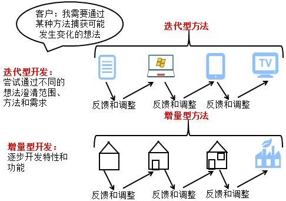

迭代型方法和增量型方法的区别：

- 迭代型方法：适合于澄清需求和调查各种可选项，在最后一个迭代之前，迭代型方法可以完成可接受的全部功能
- 增量型方法：适用于在一系列迭代过程中生成可交付物，每个迭代都会在预先确定的时间期限（时间盒）内增加功能，该可交付物包含的功能只有在最后一个迭代结束后才被完成

2. 开发方法的选择相关因素
3. 产品、服务或成果

| 产品、服务或成果 | 预测型             | 适应型                   |
| ---------------- | ------------------ | ------------------------ |
| 创新程度         | 充分了解范围和需求 | 创新程度高、团队没有做过 |
| 需求确定性       | 需求易于定义       | 需求不确定               |
| 范围稳定性       | 范围稳定且变化小   | 范围会有许多变更         |
| 变更的难易程度   | 变更较为困难       | 容易适应变更             |
| 交付物的性质     | 大型项目           | 组件                     |
| 风险             | 高风险的产品       | -                        |
| 安全需求         | 严格安全需求       |                          |
| 法规             | 重大监管监督的环境 |                          |

2. 项目

| 项目         | 预测型 | 适应型             |
| ------------ | ------ | ------------------ |
| 干系人       | -      | 需要干系人大量参加 |
| 进度制约因素 | -      | 需要尽早交付       |
| 资金可用情况 | -      | 资金不确定的环境   |

3. 组织

| 组织                              | 预测型                                                                                                | 适应型                             |
| --------------------------------- | ----------------------------------------------------------------------------------------------------- | ---------------------------------- |
| 文化                              | 具有指导文化的组织                                                                                    | 项目团队自管理的组织               |
| 组织结构                          | 多层级、严格汇报结构、官僚作风                                                                        | 扁平式结构                         |
| 组织能力                          | 从预测型到适应型，再到敏捷型，不仅需要组织具有敏捷性，也需要整个组织的高 ` `层管理者转变思维模式 |                                    |
| 项目团队的规模 ` `和所处位置 | 大型团队、虚拟团队                                                                                    | 同一物理空间的、团队规模不大的团队 |

3. 协调交付节奏和开发方法以社区中心项目为例：

| 可交付物         | 交付节奏   | 开发方法 |
| ---------------- | ---------- | -------- |
| 建筑物           | 一次性交付 | 预测     |
| 老年人服务       | 多次交付   | 迭代     |
| 网站             | 定期交付   | 自适应   |
| 社区行动巡查培训 | 多次交付   | 增量     |

二、开发方法和生命周期绩效域的预期目标和检查方法

| 预期目标                                                                          | 指标及检查方法           |
| --------------------------------------------------------------------------------- | ------------------------ |
| 1.开发方法与项目可交付物相符合                                                    | 产品质量和变更成本       |
| 2.将项目交付与干系人价值紧密联系                                                  | 价值导向型项目阶段       |
| 3.项目生命周期由促进交付节奏的项 ` `目阶段和产生项目交付物所需的开发方法组成 | 适宜的交付节奏和开发方法 |

规划绩效域

# 信息系统项目管理师-精讲班-规划/项目工作/交付绩效域

一、规划绩效域的绩效要点 1.规划的影响因素

1. 项目估算
2. 项目团队组成和结构规划
3. 沟通规划
4. 实物资源规划
5. 采购规划
6. 变更规划
7. 度量指标和一致性
8. 规划的影响因素
9. 开发方法

   预测型：项目早期规划、大部分规划预先进行，渐进明细

适应型：一些规划提前进行，进一步的规划每个迭代开始进行原型法：高层级规划——原型——更详细的规划

2. 项目可交付物
3. 组织需求
4. 市场条件
5. 法律或法规限制 2.项目估算影响因素
6. 区间：随着项目进展，估算区间会逐步缩小
7. 准确度：估算的正确性

准确度与区间相关，准确度越低，估算值的潜在区间就越大。项目开始时的估算准确度将低于项目进展中的估算准确度

3. 精确度

- 精确度与准确度不同，精确度指与估算相关的精准度，“2 天”比“本周某个时间”精确

4. 信心

   项目估算方法：
5. 确定性估算和概率估算

- 确定性估算：也称点估算，表示为一个数字或金额，如 36 个月
- 概率估算：包括一定区间内的估算以及该区间内的相关概率，确定估算值的方法是：①根据多个可能的结果计算加权平均值；②进行模拟，对特定结果进行概率分析

2. 绝对估算和相对估算

- 绝对估算：具体信息，使用实际数据
- 相对估算：一般会基于某一个特定基准进行

3. 基于工作流的估算

   基于工作流的估算是通过确定周期和产量来制定的。

- 周期：一个产品经过一个完整过程的总消耗时间
- 产量：可以在给定时间内完成一个完整过程的产品数

4. 对不确定性的调整估算

估算本身具有不确定性，不确定性与风险有关，可根据不确定性模拟的结果，通过增加应急储备的方式，调整关键可交付物的交付日期或成本估算值。

2. 度量指标和一致性
3. 度量指标

项目进行过程中，规划、交付和度量工作之间存在自然的联系，这种联系就是度量指标。确定度量指标、基准和临界值，以及确定测试和评估方法及流程是规划绩效域的重要工作。

度量目标的原则是“只测量重要的东西”。

2. —致性

在整个项目生命周期过程中，要保证规划和实际的一致性。例如，交付物需要与需求一致，物流计划需要与材料和交付需求一致，测试计划需要与质量和交付需求保持一致等。

二、规划绩效域的预期目标和检查方法

| 预期目标                                            | 指标及检查方法                                                                                                    |
| --------------------------------------------------- | ----------------------------------------------------------------------------------------------------------------- |
| 1.项目以有条理、协调一致的方式 ` `推进         | 绩效偏差                                                                                                          |
| 2.应用系统的方法交付项目成果                        | 规划的整体性：交付进度、资金提供、资源可用性、采购等表明 ` `项目是以整体方式进行规划的，没有差距或不一致之处 |
| 3.对演变情况进行详细说明                            | 规划的详尽程度                                                                                                    |
| 4.规划投入的时间成本是适当的                        | 规划适宜性                                                                                                        |
| 5.规划的内容对管理干系人的需求 ` `而言是充分的 | 规划的充分性                                                                                                      |
| 6.可以根据新出现的和不断变化的需求进行调整          | 可适应变化：` `采用待办事项列表的项目：项目期间对计划进行调整采用变更控制过程的项目：变更控制流程            |

一、工作绩效域的绩效要点 1.项目过程

2. 项目制约因素
3. 专注于工作过程和能力
4. 管理沟通和参与
5. 管理实物资源
6. 处理采购事宜
7. 监督新工作和变更
8. 学习和持续改进
9. 项目过程

   过程优化方法：

   - 精益生产法

     通过价值流图来测量增值活动和非增值活动之间的比率，用以识别是否存在非增值的冗余活动。
   - 召开回顾会议
   - 价值导向审查

以价值为导向，审视“下一笔资金应该花在哪里”。 2.项目制约因素

制约因素包括最后交付日期、法律法规、固定预算和质量政策等，在整个项目生命周期过程中，制约因素可能会发生变化。

3.专注于工作过程和能力

为了使项目交付和干系人价值最大化，项目工作要聚焦在工作过程（交付价值）和保护项目团队的工

作能力（项目团队的高效性和满意度）两个方面。 4.管理沟通和参与

在整个项目生命周期过程中，大部分项目工作都需要与干系人进行沟通，需要按照项目沟通管理过程执行，并关联干系人绩效域。

5.管理实物资源

管理实物资源的目标主要包括：

1. 减少或消除现场的材料搬运和储存；
2. 消除材料等待时间；
3. 最小化报废和浪费；
4. 促进安全的工作环境等。 6.处理采购事宜

采购在项目生命周期过程中的任何阶段都可进行。 7.监督新工作和变更

敏捷或适应型项目中，项目工作会不断演变和调整。在预测型项目中，通过变更控制流程积极管理变更。

8.学习和持续改进

项目团队需要定期召开会议，确定未来在哪些方面可以做得更好（经验教训），以及如何在下一次迭代或下一阶段工作中对过程做出改进（回顾），在不断学习中优化工作方式，持续改进过程，支持项目完成最优成果。

二、项目工作绩效域的预期目标和检查方法

| 预期目标                                        | 指标及检查方法                                                      |
| ----------------------------------------------- | ------------------------------------------------------------------- |
| 1.高效且有效的项目绩效                          | 状态报告                                                            |
| 2.适合项目和环境的项目过程                      | 过程的适宜性、过程相关性和有效性                                    |
| 3.干系人适当的沟通和参与                        | 沟通有效性                                                          |
| 4.对实物资源进行了有效管理                      | 资源利用率                                                          |
| 5.对采购进行了有效管理                          | 采购过程适宜                                                        |
| 6.有效处理了变更                                | 变更处理情况：` `预测型：变更日志 ` `适应型：待办事项列表 |
| 7.通过持续学习和过程改进提高 ` `了团队能力 | 团队绩效                                                            |

【例题】关于项目工作绩效域目标和工作内容的描述，不正确的是（ ）。

1. 使干系人接受项目可交付物和成果，并对其满意
2. 使项目团队保持专注，并使项目活动顺利进行
3. 通过持续学习和过程改进，提高团队能力
4. 涉及大量的沟通工作，与干系人绩效域关联

   【答案】A

   【解析】有效执行项目工作绩效域可以实现的预期目标，主要包含：
5. 高效且有效的项目绩效；
6. 适合项目和环境的项目过程；
7. 干系人适当的沟通和参与；
8. 对实物资源进行了有效管理；
9. 对采购进行了有效管理；
10. 有效处理了变更；
11. 通过持续学习和过程改进提高了团队能力。交付绩效域

一、交付绩效域的绩效要点 1.价值的交付

在项目进展过程中或在项目生命周期结束时向干系人交付价值。 2.可交付物

可交付物是指项目的临时或最终的产品、服务或结果，它有助于取得项目所要实现的最终成果。可交付物反映了干系人的需求、范围和质量。

- 需求启发、不断演变和发现的需求、管理需求、定义范围和管理变更记录需求的要求主要包括：

1. 清晰：只有一种解释需求的方式。
2. 简洁：要用尽可能少的文字表述需求。
3. 可核实：有至少一种方法可以核实需求是否已得到满足。
4. 一致性：没有相互矛盾的需求。
5. 完整：所有需求代表了当前项目或产品需要的全部。
6. 可跟踪：每个需求都可以由一个唯一的标识来识别。 3.质量

交付不仅仅是范围和需求，范围和需求聚焦于需要交付的内容，而质量聚焦于需要达到的绩效水平。需要在质量和满足质量所付出的成本二者之间寻找平衡。

发现缺陷的时间越晚，纠正缺陷的成本就越高，同理，前期工作完成得越多，变更的成本就越大。二、交付绩效域的预期目标和检查方法

度量绩效域

# 信息系统项目管理师-精讲班-度量/不确定性绩效域

一、度量绩效域的绩效要点 1.制定有效的度量指标

2. 度量内容及相应指标
3. 展示度量信息和结果
4. 度量陷阱
5. 基于度量进行诊断
6. 持续改进
7. 制定有效的度量指标
8. 关键绩效指标

   - 提前指标：预测项目的变化或趋势，例如：

     量化：项目规模、待办事项列表中正在进展的事项的数量

     非量化：风险管理过程缺乏、干系人未到位或没有参与，项目成功标准定义不明确等
   - 滞后指标：测量项目可交付物或重大项目事件，事后提供信息

     例如：已完成的可交付物的数量、进度偏差或成本偏差，以及所消耗资源的数量等
9. 有效度量指标

| SMART           | 含义     | 内容                                                                          |
| --------------- | -------- | ----------------------------------------------------------------------------- |
| S（Specific）   | 具体的   | 度量指标是具体的 ` `例如缺陷数量、已修复的缺陷和修复缺陷平均花费的时间等 |
| M（Measurable） | 有意义的 | 度量指标应与基准或需求相关                                                    |
| A（Attainable） | 可实现的 | 目标是可以实现的                                                              |
| R（Relevant）   | 相关性   | 度量结果应能带来价值                                                          |
| T（Time-bount） | 及时性   | 有用的度量指标具有及时性，新信息比旧信息有用                                  |

2. 度量内容及相应指标

| 度量内容 | 度量指标                                                                                |
| -------- | --------------------------------------------------------------------------------------- |
| 可交付物 | 有关错误或缺陷的信息、绩效度量指标、技术绩效度量指标                                    |
| 交付     | 在制品、提前期、周期时间、队列大小、批量大小、过程效率                                  |
| 基准绩效 | 进度基准、成本基准                                                                      |
| 资源     | 与实际资源利用率相比的计划资源利用率、与实际资源成本相比的计划资源成本                  |
| 价值     | 成本效益比、计划收益交付与实际收益交付的对比、投资回报率（ROI）、净现 ` `值（NPV） |
| 干系人   | 净推荐值（NPS）、情绪图、士气、离职率                                                   |
| 预测型   | 完工尚需估算、完工估算、完工偏差、完工尚需绩效指数、回归分析、产量分析                  |

1. 可交付物度量指标
   - 有关错误或缺陷的信息：缺陷来源、识别的缺陷数量、已解决的缺陷数量
   - 绩效度量指标：描述与系统运行相关的物理和功能属性：尺寸、重量、容量、准确度、可靠性和效率等
   - 技术绩效度量指标：度量系统组件是否符合技术要求
2. 交付的度量指标

| 指标     | 内容                                                                                                   |
| -------- | ------------------------------------------------------------------------------------------------------ |
| 在制品   | 任何特定时间正在处理的工作事项的数量                                                                   |
| 提前期   | 进入待办事项列表到迭代或发布结束的实际消耗时间。提前期越短，表明过程越有效，` `项目团队工作越高效 |
| 周期时间 | 项目团队完成任务所需的时间。` `周期时间越短，表明项目团队工作越高效                               |
| 队列大小 | 跟踪队列中事项的数量 ` `利特尔法则：队列大小与事项进入队列的比率和队列中工作事项的完成率成正比    |
| 批量大小 | 可度量预期一次迭代中完成的工作                                                                         |
| 过程效率 | 优化工作流程的比率                                                                                     |

3. 展示度量信息和结果
4. 仪表盘：信号灯图、横道图、饼状图和控制图；

   用于提供高层级的概要信息、对于超过既定临界值的任何度量指标，辅助使用文本进行解释。

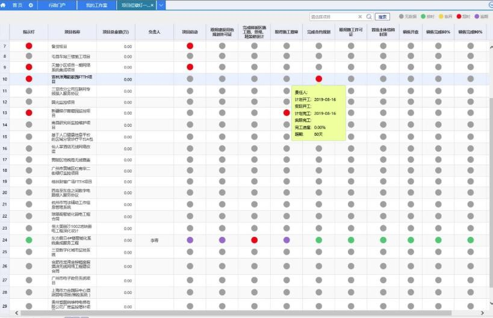

2. 大型可见图表

也称为信息发射源，是一种可见的实物展示工具，可向组织内成员提供度量信息和结果，支持及时的知识共享。

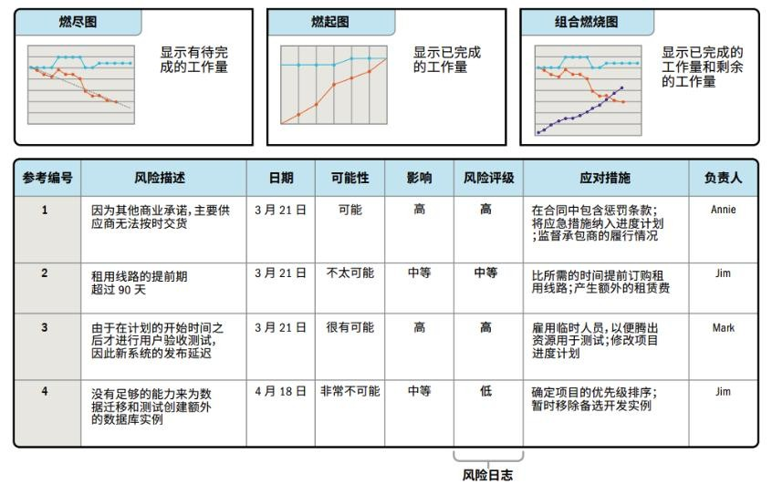

3. 任务板

   帮助项目成员随时了解各项任务的状态。

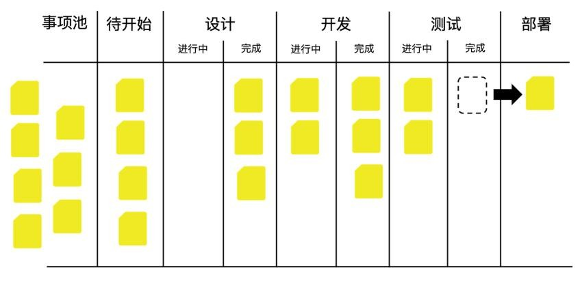

4. 燃烧图

用于显示项目团队的“速度”，此“速度”可度量项目的生产率。燃起图：跟踪已完成

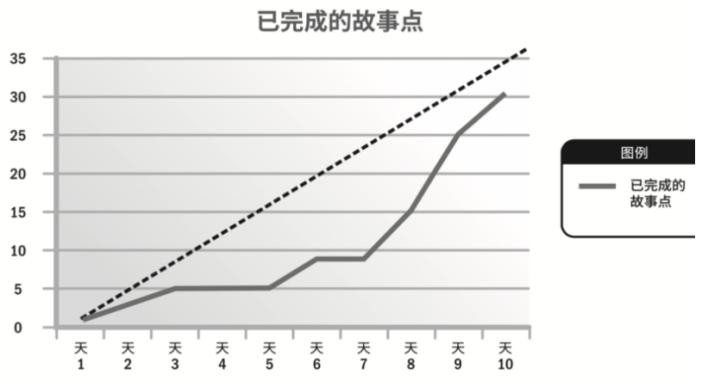

燃尽图：显示剩余工作

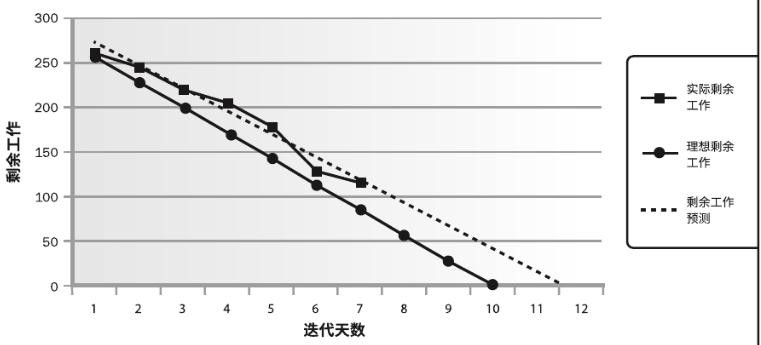

4. 度量陷阱
5. 霍桑效应

   对某一事物进行度量时会对其行为产生影响，因此需要谨慎制定度量指标。
6. 虚荣指标

   对决策没有帮助的度量指标一般属于虚荣指标。
7. 士气低落
8. 误用度量指标
9. 确认偏见
10. 相关性与因果关系混淆 5.基于度量进行诊断

可以针对各种度量指标（如进度、预算、速度和项目特有的其他度量指标）制定临界值，偏差程度将取决于干系人的风险承受力。

6.持续改进

度量、展示度量信息和度量结果的目的是为了持续改进，为了优化项目绩效和效率。度量结果和相关报告有助于：

1. 避免问题或缺陷；
2. 防止绩效下降；
3. 促使项目团队学习，提高能力；
4. 改进产品或项目绩效；
5. 推动决策；
6. 更好地创造价值等。

   二、度量绩效域的预期目标和检查方法

| 预期目标                                                  | 指标及检查方法 |
| --------------------------------------------------------- | -------------- |
| 1.对项目状况充分理解                                      | 度量结果和报告 |
| 2.数据充分，可支持决策                                    | 度量结果       |
| 3.及时采取行动，确保项目最佳绩效                          | 度量结果       |
| 4.能够基于预测和评估作出决策，实 ` `现目标并产生价值 | 工作绩效数据   |

广义的不确定是一种不可知或不可预测的状态，不确定性包括以下意义：

- 风险：与不可知未来事件相关的风险
- 模糊性：与不了解当前或未来状况相关的模糊性
- 复杂性：与具有不可预测结果的动态系统相关的复杂性

一、不确定性绩效域的绩效要点 1.风险

与不可知未来事件相关的风险。 2.模糊性

与不了解当前或未来状况相关的模糊性。概念模糊性：缺乏有效的理解；

情景模糊性：当可能出现多个结果时，就会出现情景模糊性。解决情景模糊性的问题，包括：

1. 渐进明细（2）实验（3）原型法。 3.复杂性

   与具有不可预测结果的动态系统相关的复杂性。
2. 基于系统的复杂性：解耦、模拟；
3. 重新构建的复杂性：多样性、平衡；
4. 基于过程的复杂性：迭代、参与、故障保护。 4.不确定性的应对方法
5. 收集信息：进行研究、专家参与、进行市场分析
6. 为多种结果做好准备：项目团队需要对潜在原因进行分类和评估，估算其发生的可能性
7. 集合设计：权衡包括时间与成本、风险与进度等多种因素
8. 增加韧性：韧性适用于项目团队成员，也适用于组织过程，提高组织和团队的适应型能力二、不确定性绩效域的预期目标和检查方法

配置管理

# 信息系统项目管理师-精讲班-配置管理

第 19 章 配置与变更管理

配置管理定义：应用技术的和管理的指导和监控方法以标识和说明配置项的功能和物理特征，控制这些特征的变更，记录和报告变更处理和实现状态并验证与规定的需求的遵循性。

一、配置项

为配置管理设计的硬件、软件或二者的集合，在配置管理过程中作为一个单个实体来对待。

1. 典型的配置项包括项目计划书、技术解决方案、需求文档、设计文档、源代码、可执行代码、测试 用例、运行软件所需的各种数据、设备型号及其关键部件等。
2. 配置项
   - 基线配置项可能包括所有的设计文档和源程序等
   - 非基线配置项可能包括项目的各类计划和报告等
3. 所有配置项的操作权限应由 CMO（配置管理员）严格管理。
   - 基线配置项向开发人员开放读取的权限
   - 非基线配置项向 PM、CCB 及相关人员开放二、配置项状态

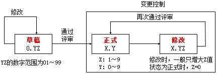

X.YZ：X=0，草稿；Z=0，正式

配置项的状态可分为“草稿”“正式”和“修改”三种。配置项刚建立时，其状态为“草稿”。

配置项通过评审后，其状态变为“正式”。 此后若更改配置项，则其状态变为“修改”。

当配置项修改完毕并重新通过评审时，其状态又变为“正式”。三、配置基线

配置基线由一组配置项组成，这些配置项构成一个相对稳定的逻辑实体，不能被任何人随意修改，对基线的变更必须遵循正式的变更控制程序。

- 拥有唯一标识号的配置项构成一条基线
- 产品的一个测试版本是基线的一个例子
- 一个项目可以有一个或多个基线
- 发行基线：交付给用户使用的基线
- 构造基线：内部过程使用的基线四、配置管理数据库

配置管理数据库是指包含每个配置项及配置项之间重要关系的详细资料的数据库。配置管理数据库主要内容：

1. 发布内容，包括每个配置项及其版本号；
2. 经批准的变更可能影响到的配置项；
3. 与某个配置项有关的所有变更请求；
4. 配置项变更轨迹；
5. 特定的设备和软件；
6. 计划升级、替换或弃用的配置项；
7. 与配置项有关的变更和问题；
8. 来自于特定时期特定供应商的配置项；
9. 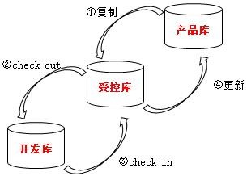受问题影响的所有配置项。五、配置库管理
10. 开发库（动态库、程序员库、工作库）

    用于保存开发人员当前正在开发的配置实体，如：新模块、文档、数据元素或进行修改的已有元素；
11. 受控库（主库）

    当前的基线加上对基线的变更；
12. 产品库（静态库、发行库、软件仓库）

已发布使用的各种基线的存档，被置于完全的配置管理之下。配置库的建库模式：

1. 按配置项的类型分类建库：适用于通用软件的开发组织
2. 按开发任务建库：适用于专业软件的开发组织六、角色与职责

   1.配置管理负责人（配置经理）

   负责管理和决策整个项目生命周期中的配置活动，具体有：
3. 管理所有活动，包括计划、识别、控制、审计和回顾；
4. 负责配置管理过程；
5. 通过审计过程确保配置管理数据库的准确和真实；
6. 审批配置库或配置管理数据库的结构性变更；
7. 定义配置项责任人；
8. 指派配置审计员；
9. 定义配置管理数据库范围、配置项属性、配置项之间关系和配置项状态；
10. 评估配置管理过程并持续改进；
11. 参与变更管理过程评估；
12. 对项目成员进行配置管理培训。 2.配置管理员

    负责在整个项目生命周期中进行配置管理的主要实施活动。
13. 建立和维护配置管理系统；
14. 建立和维护配置库或配置管理数据库；
15. 配置项识别；
16. 建立和管理基线；
17. 版本管理和配置控制；
18. 配置状态报告；
19. 配置审计；
20. 发布管理和交付。 3.配置项负责人

    配置项负责人确保所负责的配置项的准确和真实：
21. 记录所负责配置项的所有变更；
22. 维护配置项之间的关系；
23. 调查审计中发现的配置项差异，完成差异报告；
24. 遵从配置管理过程；
25. 参与配置管理过程评估。

    七、配置管理关键成功因素包括：
26. 所有配置项应该记录；
27. 配置项应该分类；
28. 所有配置项要编号；
29. 应该定期对配置库或配置管理数据库中的配置项信息进行审计；
30. 每个配置项在建立后，应有配置负责人负责；
31. 要关注配置项的变化情况；
32. 应该定期对配置管理进行回顾；
33. 能够与项目的其他管理活动进行关联。八、配置管理活动
34. 制订配置管理计划

配置管理计划是对如何开展项目配置管理工作的规划，是配置管理过程的基础。CCB 负责审批该计划。配置管理计划的主要内容：

1. 配置管理的目标和范围；
2. 配置管理活动主要包括配置项标识、配置项控制、配置状态报告、配置审计、发布管理与交付等；
3. 配置管理角色和责任安排；
4. 实施这些活动的规范和流程，如配置项命名规则；
5. 实施这些活动的进度安排，如日程安排和程序；
6. 与其他管理之间（如变更管理等）的接口控制；
7. 负责实施这些活动的人员或团队，以及他们和其他团队之间的关系；
8. 配置管理信息系统的规划，包括配置数据的存放地点、配置项运行的受控环境、与其他服务管理系统的联系和接口、构建和安装支持工具等；
9. 配置管理的日常事务，包括许可证控制、配置项的存档等；
10. 计划的配置基准线、重大发布、里程碑，以及针对以后每个期间的工作量计划和资源计划。 2.配置项识别

配置项识别是识别所有信息系统组件的关键配置，以及各配置项间的关系和配置文档等结构识别。它包括为配置项分配标识和版本号等。

1. 确定配置项范围
2. 确认和记录配置项属性
3. 为配置项定义标识符
4. 确定配置基准线
5. 确定配置结构
6. 确定配置项命名规则 3.配置项控制

配置项控制即配置项和基线的变更控制，包括：标识和记录变更申请，分析和评价变更、批准或否决申请、实现、验证和发布已修改的配置项等任务。

1. 变更申请
2. 变更评估：CCB 负责组织对变更申请进行评估并确定，CCB 决定是否接受变更，并将决定通知相关人员
3. 通告评估结果
4. 变更实施
5. 变更验证与确认
6. 变更的发布
7. 基于配置库的变更控制 4.配置状态报告

配置状态报告也称配置状态统计，其任务是有效地记录和报告管理配置所需要的信息，目的是及时、准确地给出配置项的当前状况，供相关人员了解，以加强配置管理工作。

配置状态报告主要包含：

1. 每个受控配置项的标识和状态。一旦配置项被置于配置控制下，就应该记录和保存它的每个后继进展的版本和状态；
2. 每个变更申请的状态和已批准的修改的实施状态；
3. 每个基线的当前和过去版本的状态以及各版本的比较；
4. 其他配置管理过程活动的记录等。 5.配置审计

配置审计也称配置审核或配置评价，包括功能配置审计和物理配置审计，分别用以验证当前配置项的一致性和完整性。

1. 功能配置审计：一致性
   - 配置项的开发已圆满完成
   - 配置项已达到配置标识中规定的性能和功能特征
   - 配置项的操作和支持文档已完成并且是符合要求的
2. 物理配置审计：完整性
   - 要交付的配置项是否存在
   - 配置项中是否包含了所有必需的项目 6.配置管理回顾与改进

配置管理回顾与改进即定期回顾配置管理活动的实施情况，发现在配置管理执行过程中有无问题，找到改进点，继而优化配置管理过程。

配置管理回顾及改进活动包括：

1. 对本次配置管理回顾进行准备，设定日期和主题，通知相关人等参加会议。根据配置管理绩效衡量指标，要求配置项责任人提供配置项统计信息；
2. 召开配置管理回顾会议，在设定日期召开回顾会议，对配置管理报告进行汇报，听取各方意见，回顾上次过程改进计划执行情况；
3. 根据会议结论，制订并提交服务改进计划；
4. 根据过程改进计划，协调、落实改进等。

   【真题】以下关于审计的描述，不正确的是（ ）。

   1. 审计软件即使发现不一致的情况，也不允许自动更新配置库或配置管理数据库，必须由有关负责人调查后再进行更新
   2. 配置审计也称配置审核或配置评价，包括功能配置审计和物理配置审计
   3. 功能配置审计是审计配置项的完整性，物理配置审计是审计配置项的一致性
   4. 验证配置项的开发已圆满完成属于功能配置审计

      【答案】C

【解析】配置审计也称配置审核或配置评价，包括功能配置审计和物理配置审计，分别用以验证当前配置项的一致性和完整性。

变更管理

# 信息系统项目管理师-精讲班-变更/文档管理

项目变更管理是指在信息系统项目的实施过程中，由于项目环境或者其他的原因而对项目的功能、性能、架构、技术指标、集成方法、项目进度等方面做出的改变。

- 项目变更管理是项目整体管理的一部分，属于项目整体变更控制的范畴一、变更管理基础
  1. 变更管理与配置管理

如果把项目整体的交付物视作项目的配置项，配置管理可视为对项目完整性管理的一套系统，当用于项目基准调整时，变更管理可视为其一部分。亦可视变更管理与配置管理为相关联的两套机制，变更管理由项目交付或基准配置调整时，由配置管理过程调用，变更管理最终应将对项目的调整结果反馈给配置管理过程，以确保项目执行与项目配置信息相一致。

1. 变更的常见原因
2. 产品范围（成果）定义的过失或者疏忽；
3. 项目范围（工作）定义的过失或者疏忽；
4. 增值变更；
5. 应对风险的紧急计划或回避计划；
6. 项目执行过程与基准要求不一致带来的被动调整；
7. 外部事件。 3.变更的分类
8. 根据变更性质可分为：重大变更、重要变更和一般变更，通过不同审批权限控制；
9. 根据变更的迫切性可分为：紧急变更、非紧急变更。 4.变更管理的原则
10. 基准管理：基准是变更的依据；
11. 变更控制流程化；
12. 明确组织分工；
13. 评估变更的可能影响；
14. 妥善保存变更产生的相关文档：确保其完整、及时、准确和清晰，适当时可以引入配置管理工具。

- 变更程序

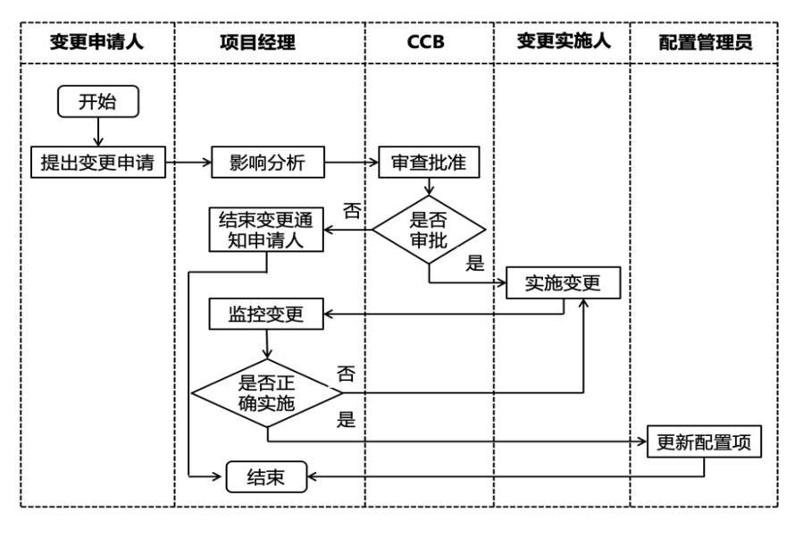

变更程序： 1.变更申请

1. 对变更的初审
2. 变更方案论证
3. 变更审查
4. 发出通知并实施
5. 实施监控
6. 效果评估
7. 变更收尾

   变更管理细节：
8. 项目的任何干系人都可以提出变更申请；
9. 变更申请的提交，首先应当确保覆盖所有变更操作；
10. 所有变更申请都必须以书面形式记录，并纳入变更管理以及配置管理系统中；
11. 每项变更申请都必须由一个责任人批准或否决，这个责任人通常是项目发起人或项目经理；
12. 必要时，应该由变更控制委员会（CCB）进行审查批准；
13. 变更控制委员会是由主要项目干系人的代表组成的一个小组，项目经理可以是其中成员之一，但通 常不是组长。

二、角色与职责 1.变更控制委员会

变更控制委员会（CCB——Change Control Board），是项目的所有者权益代表，负责裁定接受哪些变更。

- CCB 通常包括用户和实施方的决策人员
  - CCB 是决策机构，不是作业机构
  - CCB 的工作是通过评审手段来决定项目基准是否能变更，但不提出变更方案 2.变更管理负责人（变更经理）

    变更管理过程解决方案的负责人。

1. 负责整个变更过程方案的结果；
2. 负责变更管理过程的监控；
3. 负责协调相关的资源，保障所有变更按照预定过程顺利运作；
4. 确定变更类型，组织变更计划和日程安排；
5. 管理变更的日程安排；
6. 变更实施完成之后的回顾和关闭；
7. 承担变更相关责任，并且具有相应权限；
8. 可能以逐级审批形式或团队会议的形式参与变更的风险评估和审批等。 3.变更请求者

   变更请求者负责记录与提交变更请求单，具体为：
9. 提交初步的变更方案和计划；
10. 初步评价变更的风险和影响，给变更请求设定适当的变更类型；
11. 对理解变更过程有能力要求等。 4.变更实施者

变更实施者需要拥有有执行变更方案的内容的技术能力，负责按照实施计划实施具体的变更任务。 5.变更顾问委员会

变更顾问委员会负责对重大变更行使审批，提供专业意见和辅助审批，具体为：

1. 在紧急变更时，其中被授权者行使审批权限；
2. 定期听取变更经理汇报，评估变更管理执行情况，必要时提出改进建议等。

   【真题】监控变更管理过程是（ ）的职责。

   1. 质量经理
   2. 变更经理
   3. 变更请求者
   4. 变更实施者

      【答案】B

【解析】变更管理负责人也称变更经理，通常是变更管理过程解决方案的负责人， 其职责包括监控变更管理过程。

四、版本发布和回退计划

对于很多信息系统开发项目来说，项目变更必须做相应的版本发布，并制定相应的应急回退方案。为确保版本发布的成功，在版本发布前应对每次版本发布进行管理，并做好发布失败后的回退方案。

- 对引起回退的原因进行深入分析、总结经验，避免下次回退发生
  - 对执行回退计划中出现的问题进行分析，完善回退的管理版本发布前的准备工作包括：
    1. 进行相关的回退分析；
    2. 备份版本发布所涉及的存储过程、函数等其他数据的存储及回退管理；
    3. 备份配置数据，包括数据备份的方式；
    4. 备份在线生产平台接口、应用、工作流等版本；
    5. 启动回退机制的触发条件；
    6. 对变更回退的机制职责的说明，如通知相关部门，确定需要回退的关联系统和回退时间点等。回退步骤包括：

1. 通知相关用户系统开始回退；
2. 通知各关联系统进行版本回退；
3. 回退存储过程等数据对象；
4. 配置数据回退；
5. 应用程序、接口程序、工作流等版本回退；
6. 回退完成通知各周边关联系统；
7. 回退后进行相关测试，保证回退系统能够正常运行；
8. 通知用户回退完成等。文档管理

   一、项目文档分类

| 文档分类 | 内容                                                                                                                                                  |
| -------- | ----------------------------------------------------------------------------------------------------------------------------------------------------- |
| 开发文档 | 可行性研究报告、项目任务书 ` `需求规格说明、功能规格说明、设计规格说明 ` `开发计划、软件集成和测试计划、质量保证计划 ` `安全和测试信息 |
| 产品文档 | 培训手册、参考手册和用户指南、软件支持手册、产品手册和信息广告                                                                                        |
| 管理文档 | 开发过程的每个阶段的进度和进度变更的记录、软件变更情况的记录 ` `开发团队的职责定义 ` `项目计划、项目阶段报告、配置管理计划                  |

二、文档质量级别

| 文档级别 | 描述                  | 含义                                                            | 内容                                                          |
| -------- | --------------------- | --------------------------------------------------------------- | ------------------------------------------------------------- |
| 1 级文档 | 最低限度 ` `文档 | 开发工作量低于一个人月的开发者自 ` `用程序                 | 程序清单、开发记录、测试数据和程序简介                        |
| 2 级文档 | 内部文档              | 没有与其他用户共享资源的专用程序                                | 程序清单内足够的注释以帮助用户安装和使 ` `用程序         |
| 3 级文档 | 工作文档              | 同一单位内若干人联合开发的程序或 ` `可被其他单位使用的程序 |                                                               |
| 4 级文档 | 正式文档              | 正式发行供普遍使用的软件产品                                    | 关键性程序或具有重复管理应用性质（如工资 ` `计算）的程序 |

三、文档规则和方法

1. 文档书写规范
2. 图表编号规则
3. 文档目录编写标准
4. 文档管理制度图表编号规则：

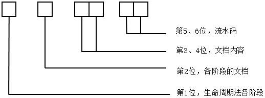
